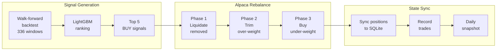

# Alpaca Paper Trading Integration

## Overview
The paper trading pipeline now executes real orders on Alpaca's paper trading platform. When Alpaca API keys are configured, all trades go through Alpaca's paper trading environment. Without keys, it falls back to local simulation.

## Setup

### 1. Create Alpaca Account
Sign up for a free account at https://app.alpaca.markets/signup

### 2. Get Paper Trading API Keys
- Go to Paper Trading in the Alpaca dashboard
- Generate API Key and Secret Key
- Note: Paper keys start with `PK` prefix

### 3. Configure Environment
```bash
export ALPACA_API_KEY=PKxxxxxxxxxxxxxxxxxx
export ALPACA_SECRET_KEY=xxxxxxxxxxxxxxxxxxxxxxxxxxxxxxxxxxxxxxxx
```
Or add to `.env` file in the project root.

### 4. Install Dependencies
```bash
pip install alpaca-py
```

## Usage

### Daily Trading Cycle
```bash
# Run with Alpaca (auto-detected when keys are set)
python scripts/paper_trading.py run --watchlist tech_giants

# Force local simulation (no real orders)
python scripts/paper_trading.py run --watchlist tech_giants --local
```

### View Portfolio
```bash
# Portfolio status (shows Alpaca positions when connected)
python scripts/paper_trading.py status

# Alpaca account details
python scripts/paper_trading.py account
```

### Manage Positions
```bash
# Close all positions
python scripts/paper_trading.py liquidate

# View trade history
python scripts/paper_trading.py history --last 30
```

### Automate Daily Runs
```bash
# Get cron setup command
python scripts/paper_trading.py setup-cron
```

## Architecture

### Execution Flow



1. Signal generation (ML model + walk-forward backtest)
2. Target weights computed (top N stocks, equal-weight, max 20% each)
3. Orders placed via `AlpacaBroker.rebalance_portfolio()` in 3 phases
4. Alpaca handles order routing, fills, settlement (fractional shares, market orders)
5. Account state synced back to local SQLite for dashboard

### Key Files
- `src/trading/alpaca_broker.py` — Alpaca Trading API wrapper
- `src/data/alpaca_client.py` — Alpaca Historical Data API (price downloads)
- `scripts/paper_trading.py` — Main trading pipeline + CLI
- `src/app/dashboard/pages/paper_trading.py` — Streamlit dashboard

### Local Simulation Fallback
When Alpaca keys are not set:
- Trades are simulated in SQLite
- Transaction costs applied (0.1% default)
- Same position sizing and rebalancing logic
- Useful for backtesting without API access

## Configuration
From `config/config.yaml`:
| Setting | Value | Description |
|---------|-------|-------------|
| `top_n` | 5 | Number of stocks to hold |
| `max_position_weight` | 0.20 | Max 20% in any stock |
| `transaction_cost` | 0.001 | 0.1% (local only; Alpaca paper is free) |
| `stop_loss_pct` | -0.15 | Cut position at -15% |

## Per-Ticker Optimization

Per-ticker Bayesian-optimized MACD/RSI params are stored in `config/tickers/{TICKER}.yaml` and `output/best_params_{TICKER}.json`. These are for the trigger backtest signal source (not the ML pipeline).

To re-optimize all tickers:
```bash
python scripts/optimize_all_tickers.py --n-calls 40 --metric sharpe
```

See [Daily Run Guide — Two Signal Sources](daily-run.md#two-signal-sources-architecture-note) for details.

## Alpaca Paper Trading Notes
- Paper trading has no commissions or fees
- Supports fractional shares and notional orders
- Market hours: 9:30 AM - 4:00 PM ET (extended hours available)
- Paper account starts with $100,000 by default
- Reset paper account via Alpaca dashboard if needed
- Account number and status visible via `account` command
