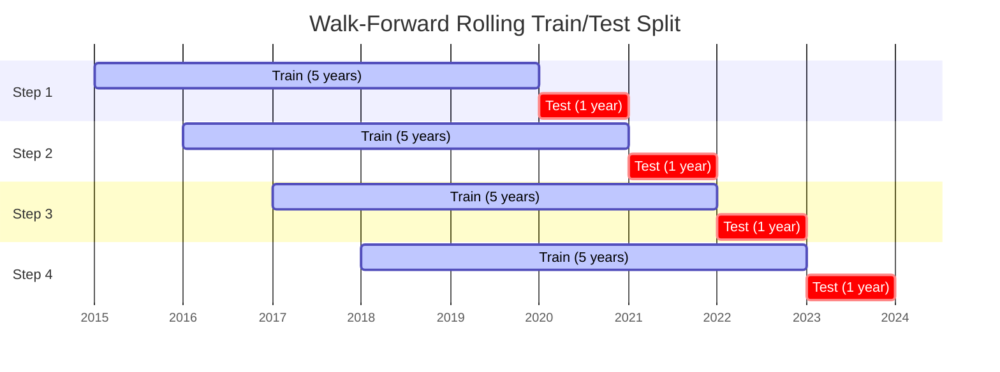

# Backtesting & Performance Evaluation

> [← Back to Documentation Index](README.md)
> **Part of**: [Mid-term Stock Planner Design](design.md)
> 
> This document covers walk-forward backtesting, performance metrics, and overfitting control.

## Related Documents

- [design.md](design.md) - Main overview and architecture
- [model-training.md](model-training.md) - Model training for each window
- [risk-management.md](risk-management.md) - Risk metrics details
- [visualization-analytics.md](visualization-analytics.md) - Performance visualization

---

## Walk-Forward Window Visualization



Each step rolls the window forward by `step_value` (default: 1 year). The model is trained only on the training window, then scored on the test window. Test results from all steps are concatenated to produce the final backtest equity curve.

---

## 1. Walk-Forward Framework

```
┌─────────────────────────────────────────────────────────────────────────────┐
│                       WALK-FORWARD BACKTEST                                  │
└─────────────────────────────────────────────────────────────────────────────┘

                         TIME ──────────────────────────────────────────────▶
                         
Year:      2015    2016    2017    2018    2019    2020    2021    2022    2023
           │       │       │       │       │       │       │       │       │
           
STEP 1:    ├───────────────────────────────┤
           │      TRAIN (5 years)          │ TEST │
           └───────────────────────────────┴──────┘
                                           2019   2020
                                           
STEP 2:            ├───────────────────────────────┤
                   │      TRAIN (5 years)          │ TEST │
                   └───────────────────────────────┴──────┘
                                                   2020   2021
                                                   
STEP 3:                    ├───────────────────────────────┤
                           │      TRAIN (5 years)          │ TEST │
                           └───────────────────────────────┴──────┘
                                                           2021   2022
                                                           
STEP 4:                            ├───────────────────────────────┤
                                   │      TRAIN (5 years)          │ TEST │
                                   └───────────────────────────────┴──────┘
                                                                   2022   2023
```

### 1.1 Key Principles

```
┌─────────────────────────────────────────────────────────────────────────────┐
│                           KEY PRINCIPLES                                     │
├─────────────────────────────────────────────────────────────────────────────┤
│                                                                              │
│   ✅ NEVER use future data for training                                      │
│   ✅ Each step: train on past, test on future                                │
│   ✅ Hyperparameter tuning ONLY within training window                       │
│   ✅ Aggregate all test results for final metrics                            │
│   ✅ Include transaction costs in P&L                                        │
│                                                                              │
│   ❌ Don't peek at test data during training                                 │
│   ❌ Don't optimize hyperparams using full backtest results                  │
│   ❌ Don't ignore transaction costs                                          │
│                                                                              │
└─────────────────────────────────────────────────────────────────────────────┘
```

---

## 2. Backtest Configuration

### 2.1 BacktestConfig Dataclass

```python
@dataclass
class BacktestConfig:
    """Configuration for walk-forward backtesting."""
    
    # Window settings
    train_years: float = 5.0           # Training window in years
    test_years: float = 1.0            # Test window in years
    step_value: float = 1.0            # Step size (see step_unit)
    step_unit: str = "years"            # hours, days, months, years
    
    # Rebalancing
    rebalance_freq: str = "MS"         # MS=month start, M=month end, "4h" for hourly
    
    # Portfolio construction
    top_n: Optional[int] = None        # Number of stocks to hold
    top_pct: float = 0.1               # Top fraction by score
    min_stocks: int = 5                # Minimum stocks in portfolio
    
    # Transaction costs
    transaction_cost: float = 0.001    # 0.1% per trade
    
    # Optional date constraints
    start_date: Optional[str] = None   # YYYY-MM-DD
    end_date: Optional[str] = None     # YYYY-MM-DD
    
    # IC (Information Coefficient) gating
    ic_min_threshold: Optional[float] = None  # e.g. 0.01 or 0.02; None = disabled
    ic_action: str = "warn"            # "warn" | "off" when |IC| < ic_min_threshold
```

### 2.2 Configuration Options

| Parameter | Default | Description |
|-----------|---------|-------------|
| `train_years` | 5.0 | Training window in years |
| `test_years` | 1.0 | Test window in years |
| `step_value` | 1.0 | Step size between walk-forward windows |
| `step_unit` | "years" | Step unit: `hours`, `days`, `months`, `years` |
| `rebalance_freq` | "MS" | Rebalance frequency: "MS" (month start), "M" (month end), "4h" (4-hourly for intraday) |
| `top_n` | 10 | Number of top stocks to hold |
| `top_pct` | 0.1 | Top fraction by score (alternative to top_n) |
| `min_stocks` | 5 | Minimum stocks in portfolio |
| `transaction_cost` | 0.001 | Per-trade cost (0.1%) |
| `ic_min_threshold` | None | If set (e.g. 0.01 or 0.02), log a warning when \|IC\| &lt; threshold in a window. See [IC threshold](#ic-information-coefficient-per-window). |
| `ic_action` | "warn" | When \|IC\| &lt; ic_min_threshold: `warn` = log warning; `off` = no action |
| `overfit_sharpe_ratio_threshold` | 2.0 | When max(train_sharpe/test_sharpe) ≥ this, a verbose overfitting warning is printed. See [Overfitting detection](#24-overfitting-detection-walk-forward). |

### 2.3 IC (Information Coefficient) per window

For each walk-forward window, the pipeline computes the **Information Coefficient** and **Rank IC**:

```
IC      = Pearson(predictions, actual_excess_returns)
Rank IC = Spearman(rank(predictions), rank(actual_returns))
```

These are stored in `window_results[].ic` and `window_results[].rank_ic`. Aggregate metrics added when IC is computed:

- **mean_ic** — Mean IC across windows (in `backtest_results.metrics` and `run_info.json` / `backtest_metrics.json`).
- **mean_rank_ic** — Mean Rank IC across windows.
- **windows_below_ic_threshold** — Count of windows where \|IC\| &lt; `ic_min_threshold` (only when `ic_min_threshold` is set).

Set `backtest.ic_min_threshold` (e.g. `0.01` or `0.02`) in `config/config.yaml` to enable per-window warnings when \|IC\| is below the threshold. See [quantaalpha-implementation-guide.md](quantaalpha-implementation-guide.md) for recommended thresholds.

### 2.4 Overfitting detection (walk-forward)

For each walk-forward window, the pipeline computes **train-period** and **test-period** portfolio Sharpe ratios. These are stored in `window_results[].train_sharpe` and `window_results[].test_sharpe`. When both are available and test Sharpe &gt; 0, the ratio `train_sharpe / test_sharpe` is computed per window.

- **max_train_test_sharpe_ratio** — Maximum of (train_sharpe / test_sharpe) across windows (in `backtest_results.metrics` and run outputs).
- **Verbose warning** — When this ratio is ≥ `overfit_sharpe_ratio_threshold` (default **2.0**), a warning is printed suggesting regularization or a shorter train window.

Optional config (e.g. in `config/config.yaml` under `backtest` or per-ticker): `overfit_sharpe_ratio_threshold: 2.0`. See [quantaalpha-implementation-guide.md](quantaalpha-implementation-guide.md) §8.

### 2.5 VIX-Based Exposure Scaling

When enabled, the backtest dynamically scales portfolio exposure based on realized benchmark volatility, reducing position sizes during high-volatility regimes.

```
realized_vol = std(benchmark_returns[-21:]) * sqrt(252) * 100

if vol >= vix_extreme_threshold (40) -> scale = vix_extreme_scale (0.3)
elif vol >= vix_high_threshold (30)  -> scale = vix_high_scale (0.6)
else                                 -> scale = 1.0
```

| Parameter | Default | Description |
|-----------|---------|-------------|
| `vix_scale_enabled` | `false` | Enable VIX-based exposure scaling |
| `vix_high_threshold` | 30 | Realized vol level for high-vol regime |
| `vix_extreme_threshold` | 40 | Realized vol level for extreme-vol regime |
| `vix_high_scale` | 0.6 | Exposure multiplier during high-vol regime |
| `vix_extreme_scale` | 0.3 | Exposure multiplier during extreme-vol regime |

### 2.6 Stop-Loss Logic

Positions are monitored for cumulative drawdown from entry price. When a position's cumulative return breaches the stop-loss threshold, it is excluded from the portfolio until the next rebalance date.

```
cumulative_return = (current_price - entry_price) / entry_price
if cumulative_return <= stop_loss_pct -> exclude from portfolio until next rebalance
```

### 2.7 Global vs Per-Ticker Config

Backtest parameters can be set globally in `config/config.yaml` or **per ticker** in `config/tickers/{TICKER}.yaml`. When running analysis for a single ticker, the pipeline uses per-ticker overrides when present. See [Section 11: Per-Ticker Configuration](#11-per-ticker-configuration).

---

## 3. Backtest Function

### 3.1 API

```python
# src/backtest/rolling.py

def run_walk_forward_backtest(
    training_data: pd.DataFrame,
    benchmark_data: pd.DataFrame,
    price_data: pd.DataFrame,
    feature_cols: List[str],
    config: BacktestConfig,
    model_config: Optional[ModelConfig] = None
) -> BacktestResults:
    """
    Run walk-forward backtest.
    
    Args:
        training_data: Full training dataset with features and target
        benchmark_data: Benchmark price data
        price_data: Stock price data for returns
        feature_cols: Feature column names
        config: Backtest configuration
        model_config: Model training configuration
    
    Returns:
        BacktestResults with equity curves, metrics, and holdings
    """
```

### 3.2 Backtest Flow

```
┌─────────────────────────────────────────────────────────────────────────────┐
│                         BACKTEST FLOW                                        │
└─────────────────────────────────────────────────────────────────────────────┘

                    ┌─────────────────────┐
                    │   Initialize        │
                    │   - Set start date  │
                    │   - Initial capital │
                    └──────────┬──────────┘
                               │
                               ▼
              ┌────────────────────────────────┐
              │     FOR EACH WALK-FORWARD      │◄─────────────┐
              │           WINDOW               │              │
              └────────────────┬───────────────┘              │
                               │                              │
                               ▼                              │
              ┌────────────────────────────────┐              │
              │  1. Get training window data   │              │
              └────────────────┬───────────────┘              │
                               │                              │
                               ▼                              │
              ┌────────────────────────────────┐              │
              │  2. Train model on window      │              │
              │     (See: model-training.md)   │              │
              └────────────────┬───────────────┘              │
                               │                              │
                               ▼                              │
              ┌────────────────────────────────┐              │
              │  3. FOR EACH REBALANCE DATE    │              │
              │     in test window:            │              │
              │     - Score universe           │              │
              │     - Build portfolio (top N)  │              │
              │     - Apply constraints        │              │
              │     - Calculate turnover       │              │
              │     - Deduct costs             │              │
              │     - Track P&L                │              │
              └────────────────┬───────────────┘              │
                               │                              │
                               ▼                              │
              ┌────────────────────────────────┐              │
              │  4. Save window results        │              │
              └────────────────┬───────────────┘              │
                               │                              │
                               ▼                              │
                    ┌─────────────────────┐                   │
                    │   More windows?     │───── YES ─────────┘
                    └──────────┬──────────┘
                               │ NO
                               ▼
              ┌────────────────────────────────┐
              │  5. Aggregate results          │
              │     - Equity curve             │
              │     - Performance metrics      │
              │     - Holdings history         │
              └────────────────┬───────────────┘
                               │
                               ▼
                    ┌─────────────────────┐
                    │  Return Results     │
                    └─────────────────────┘
```

---

## 4. Transaction Costs & Slippage

```
┌─────────────────────────────────────────────────────────────────────────────┐
│                    TRANSACTION COST MODEL                                    │
└─────────────────────────────────────────────────────────────────────────────┘

                    Trade Execution
                          │
          ┌───────────────┼───────────────┐
          │               │               │
          ▼               ▼               ▼
   ┌────────────┐  ┌────────────┐  ┌────────────┐
   │ Commission │  │  Slippage  │  │  Market    │
   │   (bps)    │  │   (bps)    │  │  Impact    │
   └─────┬──────┘  └─────┬──────┘  └─────┬──────┘
         │               │               │
         │    ┌──────────┘               │
         │    │                          │
         ▼    ▼                          │
   ┌────────────────┐                    │
   │  Total Cost    │◄───────────────────┘
   │  per Trade     │
   │  = comm + slip │
   │  + impact      │
   └────────┬───────┘
            │
            ▼
   ┌────────────────────────────────────┐
   │    P&L_net = P&L_gross - costs     │
   └────────────────────────────────────┘
```

### 4.1 Cost Calculation

```python
def calculate_transaction_costs(
    trade_value: float,
    commission_bps: float = 5.0,
    slippage_bps: float = 3.0
) -> float:
    """
    Calculate transaction costs for a trade.
    
    Example:
        Trade Value: $10,000
        Commission:  5 bps  =  $5
        Slippage:    3 bps  =  $3
        Total Cost:  8 bps  =  $8
    """
    total_bps = commission_bps + slippage_bps
    return trade_value * (total_bps / 10000)
```

### 4.2 Turnover Calculation

```
┌─────────────────────────────────────────────────────────────────────────────┐
│                         TURNOVER CALCULATION                                 │
└─────────────────────────────────────────────────────────────────────────────┘

  Previous Portfolio        New Portfolio           Turnover
  ┌─────────┬───────┐      ┌─────────┬───────┐    
  │ AAPL    │  10%  │      │ AAPL    │  10%  │     0%  (no change)
  │ NVDA    │  10%  │      │ NVDA    │   5%  │     5%  (reduce)
  │ MSFT    │  10%  │      │ MSFT    │  10%  │     0%  (no change)
  │ AMD     │  10%  │      │ AMD     │   0%  │    10%  (exit)
  │ INTC    │  10%  │      │ AMZN    │  10%  │    10%  (new)
  └─────────┴───────┘      └─────────┴───────┘   ─────────
                                                  25% turnover
                                                  
  Turnover = sum(|new_weight - old_weight|) / 2
```

---

## 5. Performance Metrics

```
┌─────────────────────────────────────────────────────────────────────────────┐
│                       PERFORMANCE METRICS                                    │
└─────────────────────────────────────────────────────────────────────────────┘

┌─────────────────┬─────────────────┬─────────────────┬─────────────────┐
│    RETURNS      │      RISK       │   RISK-ADJ.     │   OPERATIONAL   │
├─────────────────┼─────────────────┼─────────────────┼─────────────────┤
│                 │                 │                 │                 │
│ • Total Return  │ • Volatility    │ • Sharpe Ratio  │ • Turnover      │
│ • Ann. Return   │ • Max Drawdown  │ • Sortino Ratio │ • Hit Rate      │
│ • Excess Return │ • VaR (95%)     │ • Calmar Ratio  │ • Avg Holding   │
│ • Alpha         │ • CVaR          │ • Info Ratio    │ • Trade Count   │
│                 │ • Beta          │                 │                 │
└─────────────────┴─────────────────┴─────────────────┴─────────────────┘
```

### 5.1 Return Metrics

| Metric | Formula | Description |
|--------|---------|-------------|
| Total Return | `(final_value / initial_value) - 1` | Cumulative return |
| Annualized Return | `(1 + total_return)^(252/days) - 1` | Annualized compound return |
| Excess Return | `portfolio_return - benchmark_return` | Alpha over benchmark |
| Alpha | `jensen_alpha` | Risk-adjusted excess return |

### 5.2 Risk Metrics

| Metric | Formula | Description |
|--------|---------|-------------|
| Volatility | `std(returns) * sqrt(252)` | Annualized standard deviation |
| Max Drawdown | `max(peak - trough) / peak` | Worst peak-to-trough decline |
| VaR (95%) | `percentile(returns, 5)` | Value at Risk |
| CVaR | `mean(returns < VaR)` | Conditional VaR (Expected Shortfall) |
| Beta | `cov(port, bench) / var(bench)` | Market sensitivity |

> **See Also**: [risk-management.md](risk-management.md) for detailed risk calculations.

### 5.3 Risk-Adjusted Metrics

| Metric | Formula | Description |
|--------|---------|-------------|
| Sharpe Ratio | `(return - rf) / volatility` | Return per unit of risk |
| Sortino Ratio | `(return - rf) / downside_dev` | Return per unit of downside risk |
| Calmar Ratio | `annualized_return / max_drawdown` | Return per unit of drawdown |
| Information Ratio | `excess_return / tracking_error` | Alpha per unit of active risk |

### 5.4 Operational Metrics

| Metric | Description |
|--------|-------------|
| Turnover | Average portfolio turnover per rebalance |
| Hit Rate | % of periods where portfolio beats benchmark |
| Avg Holding Period | Average days a stock is held |
| Trade Count | Total number of trades |

---

## 6. BacktestResults

### 6.1 Results Dataclass

```python
@dataclass
class BacktestResults:
    """Results from a walk-forward backtest."""
    
    # Equity curves
    equity_curve: pd.DataFrame        # Daily portfolio values
    benchmark_curve: pd.DataFrame     # Daily benchmark values
    
    # Holdings history
    holdings: pd.DataFrame            # Per-rebalance holdings
    
    # Period returns
    period_returns: pd.DataFrame      # Per-period returns
    
    # Aggregate metrics
    metrics: Dict[str, float]         # Performance metrics
    
    # Per-window results
    window_results: List[WindowResult]
    
    # Configuration
    config: BacktestConfig
```

### 6.2 Output Files

```
runs/{run_id}/
├── config.yaml           # Configuration snapshot
├── summary.json          # Key metrics
├── equity_curve.csv      # Daily portfolio values
├── holdings.csv          # Per-period holdings
├── metrics.csv           # Detailed metrics
└── window_results/       # Per-window details
    ├── window_1.json
    ├── window_2.json
    └── ...
```

---

## 7. Regime Analysis

```
┌─────────────────────────────────────────────────────────────────────────────┐
│                       REGIME ANALYSIS                                        │
├─────────────────────────────────────────────────────────────────────────────┤
│                                                                              │
│  BULL MARKET          BEAR MARKET         HIGH VOL           LOW VOL        │
│  (SPY > 200d MA)      (SPY < 200d MA)     (VIX > 20)         (VIX < 15)     │
│                                                                              │
│  ┌─────────┐          ┌─────────┐          ┌─────────┐       ┌─────────┐   │
│  │ Return: │          │ Return: │          │ Return: │       │ Return: │   │
│  │  +15%   │          │  -5%    │          │  +8%    │       │  +12%   │   │
│  │ Sharpe: │          │ Sharpe: │          │ Sharpe: │       │ Sharpe: │   │
│  │  1.2    │          │  0.3    │          │  0.6    │       │  1.5    │   │
│  └─────────┘          └─────────┘          └─────────┘       └─────────┘   │
│                                                                              │
└─────────────────────────────────────────────────────────────────────────────┘
```

### 7.1 Regime Classification

```python
def classify_regime(
    benchmark_df: pd.DataFrame,
    vix_df: Optional[pd.DataFrame] = None
) -> pd.Series:
    """
    Classify market regimes.
    
    Regimes:
    - bull: SPY > 200-day MA
    - bear: SPY < 200-day MA
    - high_vol: VIX > 20 (if available)
    - low_vol: VIX < 15 (if available)
    """
```

### 7.2 Regime Performance Split

```python
def analyze_regime_performance(
    results: BacktestResults,
    regime_series: pd.Series
) -> Dict[str, Dict[str, float]]:
    """
    Split performance by regime.
    
    Returns:
        Dict mapping regime name to performance metrics
    """
```

---

## 8. Troubleshooting Backtest Errors

### 8.1 "No predictions generated" Error

If you encounter the error `ValueError: No predictions generated. Check data availability and date ranges.`, the enhanced error message will now provide detailed diagnostics:

```
No predictions generated. Check data availability and date ranges.

Data range: 2015-01-01 to 2023-12-31
Training window: 1825 days (5.0 years)
Test window: 365 days (1.0 years)
Step size: 365 days (1.0 years)
Total windows attempted: 3
Windows skipped: 3

Skipped windows:
  Window 1: Insufficient data (train=0, test=0)
  Window 2: Test window extends beyond available data
  Window 3: Error training model: ...

Possible causes:
  1. Date range too short for walk-forward windows
  2. Training window too long relative to available data
  3. All windows skipped due to insufficient data
  4. Model training failures in all windows
```

### 8.2 Diagnostic Script

Use the diagnostic script to check your data before running a backtest:

```bash
python scripts/diagnose_backtest_data.py
```

This script will:
- ✅ Check data date ranges
- ✅ Validate window size requirements
- ✅ Test training dataset creation
- ✅ Identify date filter issues
- ✅ Provide specific recommendations

**Example Output:**
```
📊 Configuration:
   Training years: 5.0
   Test years: 1.0
   Step: 1.0 years

📅 Date Ranges:
   Price data: 2015-01-01 to 2023-12-31 (8.9 years)
   Benchmark data: 2015-01-01 to 2023-12-31 (8.9 years)

📏 Window Requirements:
   Training window: 5.0 years
   Test window: 1.0 years
   Minimum data needed: 6.0 years
   ✅ Data span (8.9 years) is sufficient
```

### 8.3 Common Solutions

| Issue | Solution |
|-------|----------|
| **Data range too short** | Reduce `train_years` in config.yaml (e.g., 5.0 → 3.0) |
| **All windows skipped** | Check date filters (`start_date`/`end_date` in config) |
| **Training failures** | Verify feature data quality and model config |
| **Insufficient test data** | Reduce `test_years` (e.g., 1.0 → 0.5) |

### 8.4 Quick Fixes

**Reduce window sizes:**
```yaml
backtest:
  train_years: 3.0   # Reduce from 5.0
  test_years: 0.5    # Reduce from 1.0
  step_value: 1.0
  step_unit: years
  rebalance_freq: MS
```

**Remove date filters:**
```yaml
backtest:
  start_date: null  # Remove if set
  end_date: null    # Remove if set
```

**Download more historical data:**
```bash
python scripts/download_prices.py --watchlist your_watchlist --start-date 2010-01-01
```

### 8.5 Transfer & Robustness Testing

Run the same backtest config on a primary and transfer universe to assess strategy robustness:

```bash
python scripts/transfer_report.py --watchlist nasdaq_100 --transfer-watchlist sp500 --output output/transfer.json
```

- Uses zero-shot transfer (no re-optimization).
- Compares Total Return, Sharpe, Max DD, Hit Rate side-by-side.
- See [configuration-cli.md](configuration-cli.md#54-transfer-report-transfer--robustness-testing) for full usage.

---

## 9. Overfitting Control

### 8.1 Signs of Overfitting

```
┌─────────────────────────────────────────────────────────────────────────────┐
│                         OVERFITTING WARNING SIGNS                            │
└─────────────────────────────────────────────────────────────────────────────┘

  ⚠️  Train performance >> Test performance
  ⚠️  Performance degrades in recent periods
  ⚠️  High sensitivity to hyperparameters
  ⚠️  Strategy works only in specific market regime
  ⚠️  Very high turnover
  ⚠️  Concentrated in few features
```

### 8.2 Mitigation Strategies

| Strategy | Implementation |
|----------|----------------|
| **Walk-forward validation** | Never use future data for training |
| **Out-of-sample testing** | Reserve final period for true OOS test |
| **Regularization** | Use L1/L2 in model (reg_alpha, reg_lambda) |
| **Feature selection** | Use economically motivated features only |
| **Ensemble** | Average multiple model configurations |
| **Simplicity** | Prefer simpler models with fewer features |

---

## 10. Usage Example

```python
from src.backtest.rolling import run_walk_forward_backtest, BacktestConfig
from src.data.loader import load_price_data, load_benchmark_data
from src.features.engineering import compute_all_features, make_training_dataset

# Load data
price_df = load_price_data("data/prices.csv")
benchmark_df = load_benchmark_data("data/benchmark.csv")
fundamental_df = load_fundamental_data("data/fundamentals.csv")

# Prepare training data
feature_df = compute_all_features(price_df, fundamental_df, config)
training_data = make_training_dataset(feature_df, benchmark_df)

# Configure backtest
backtest_config = BacktestConfig(
    train_years=5.0,
    test_years=1.0,
    step_value=1.0,
    step_unit="years",
    rebalance_freq="MS",
    top_n=10,
    transaction_cost=0.001
)

# Run backtest
results = run_walk_forward_backtest(
    training_data=training_data,
    benchmark_data=benchmark_df,
    price_data=price_df,
    feature_cols=feature_cols,
    config=backtest_config
)

# View results
print(f"Sharpe Ratio: {results.metrics['sharpe_ratio']:.2f}")
print(f"Max Drawdown: {results.metrics['max_drawdown']:.2%}")
print(f"Annual Return: {results.metrics['annual_return']:.2%}")
```

---

## 11. Per-Ticker Configuration

Each ticker can have its own YAML file at `config/tickers/{TICKER}.yaml` that overrides global settings for that ticker. This applies to:

- **Trigger parameters** (RSI, MACD, Bollinger) for the trigger backtester
- **Time forward windows** (horizon_days, return_periods, volatility_windows, volume_window) for feature engineering
- **Walk-forward backtest** (train_years, test_years, step_value, step_unit, rebalance_freq)

### 11.1 Per-Ticker YAML Schema

```yaml
ticker: AMD

# RSI, MACD, Bollinger (trigger backtest)
trigger:
  rsi_period: 15
  rsi_oversold: 20
  rsi_overbought: 69
  macd_fast: 6
  macd_slow: 57
  macd_signal: 13
  bb_period: 20
  bb_std: 2.0
  # Optional: volume_trigger (CMF), macro_factors (VIX, DXY, GSR, volume_surge_min, obv_slope_positive) — see Section 12.4 and [macro-indicators.md](macro-indicators.md)

# Time forward windows (feature engineering)
horizon_days: 63
return_periods: [21, 63, 126, 252]
volatility_windows: [20, 60]
volume_window: 20

# Walk-forward backtest
backtest:
  train_years: 1.0
  test_years: 0.25
  step_value: 1.0
  step_unit: days
  rebalance_freq: 4h
```

### 11.2 When Per-Ticker Config Applies

| Component | Per-Ticker Override |
|-----------|---------------------|
| **Trigger Backtester (GUI)** | Uses `trigger` section; sliders default to per-ticker values |
| **Live backtest script** | Uses `trigger` section per ticker |
| **Walk-forward pipeline** | Uses `backtest` section when universe has exactly one ticker |
| **Feature engineering** | Uses `horizon_days`, `return_periods`, `volatility_windows`, `volume_window` when wired |

### 11.3 API

```python
from src.config.config import load_ticker_config, get_backtest_config_for_ticker

# Load full per-ticker config
ticker_cfg = load_ticker_config("AMD")  # Returns dict or None

# Get per-ticker backtest config (for walk-forward)
backtest_cfg = get_backtest_config_for_ticker("AMD", base_config.backtest)
```

---

## 12. Trigger Backtester & Bayesian Optimization

The **Trigger Backtester** is a separate backtesting mode for single-stock RSI/MACD/Bollinger strategies. It uses different parameters than the walk-forward portfolio backtest.

### 12.1 Trigger Parameters

| Parameter | Default | Description |
|-----------|---------|-------------|
| `rsi_period` | 14 | RSI lookback period |
| `rsi_oversold` | 30 | RSI level for buy signal (oversold) |
| `rsi_overbought` | 70 | RSI level for sell signal (overbought) |
| `macd_fast` | 12 | MACD fast EMA period |
| `macd_slow` | 26 | MACD slow EMA period |
| `macd_signal` | 9 | MACD signal line period |
| `bb_period` | 20 | Bollinger Band period |
| `bb_std` | 2.0 | Bollinger Band standard deviation |

### 12.2 Bayesian Optimization

Use `scripts/optimize_macd_rsi_bayesian.py` to find optimal RSI/MACD parameters per ticker:

```bash
# Optimize for AMD, save to JSON
python scripts/optimize_macd_rsi_bayesian.py --tickers AMD --save output/best_params_AMD.json

# Optimize for multiple tickers (finds best params across all)
python scripts/optimize_macd_rsi_bayesian.py --tickers AMD SLV --n-calls 50 --metric sharpe

# Metrics: sharpe, return, sharpe_dd (Sharpe + drawdown penalty)
```

**Parameter search space:**

| Parameter | Range |
|-----------|-------|
| MACD fast | 5–20 |
| MACD slow | 20–60 |
| MACD signal | 5–20 |
| RSI period | 7–21 |
| RSI overbought | 60–80 |
| RSI oversold | 20–40 |

**VIX optimization** (with `--optimize-vix`):

| Parameter | Range | Constraint |
|-----------|-------|------------|
| vix_buy_max | 15–35 | — |
| vix_sell_min | 20–45 | ≥ vix_buy_max + 5 |

**DXY optimization** (with `--optimize-dxy`):

| Parameter | Range | Constraint |
|-----------|-------|------------|
| dxy_buy_max | 96–104 | — |
| dxy_sell_min | 100–110 | ≥ dxy_buy_max + 4 |

```bash
# Optimize including VIX thresholds
python scripts/optimize_macd_rsi_bayesian.py --optimize-vix --tickers AMD --n-calls 60
```

### 12.3 Applying Optimized Params

1. **Global:** Set `optimized_params_path: output/best_params.json` in `config/config.yaml`; the loader applies it to all tickers.
2. **Per-ticker:** Copy optimized values into `config/tickers/{TICKER}.yaml` under the `trigger` section. Per-ticker YAML overrides global config.

> **Note:** Validate optimized parameters on a separate out-of-sample period not used in optimization.

### 12.4 Volume & Macro Factors

> **Full documentation**: [macro-indicators.md](macro-indicators.md) — CMF, GSR, DXY, VIX formulas, logic, YAML schema, and visual charts.

**Combined signal + macro flow:** RSI, MACD (and optionally BB, CMF) vote to produce a raw BUY/SELL. Macro filters (GSR, DXY, VIX) then gate that signal: they block BUY or SELL when macro conditions are unfavorable, but never generate signals themselves. See [macro-indicators.md — How Macro Indicators Work](macro-indicators.md#how-macro-indicators-work-with-combined-rsi--macd-signals).

#### Chaikin Money Flow (CMF)

CMF measures buying vs selling pressure over a rolling window using volume and price range. It oscillates between -1 and +1.

**Formula:**
```
MFM = (2×close - high - low) / (high - low)
CMF = sum(MFM × volume) / sum(volume)  over window
```

**Usage:**
- **Standalone signal** (`signal_type: cmf`): BUY when CMF crosses above `cmf_buy_threshold`, SELL when it crosses below `cmf_sell_threshold`.
- **Combined mode**: Set `combined_use_cmf: true` in per-ticker YAML to include CMF as a fourth indicator in the voting logic.

**Per-ticker YAML:**
```yaml
trigger:
  volume_trigger:
    cmf_window: 20
    cmf_buy_threshold: 0.0
    cmf_sell_threshold: 0.0
  combined_use_cmf: false
```

#### Gold-Silver Ratio (GSR) Macro Filter

For commodities like SLV (silver), the Gold-Silver Ratio can act as a macro filter: BUY only when silver is cheap relative to gold (GSR high), SELL when silver is expensive (GSR low).

**Formula:** `GSR = gold_close / silver_close` (e.g. GLD/SLV)

**Logic:**
- BUY allowed when `GSR >= gsr_buy_threshold` (e.g. 90) — silver cheap
- SELL allowed when `GSR <= gsr_sell_threshold` (e.g. 70) — silver expensive
- When GSR is between thresholds, existing signals pass through; the filter only blocks BUY when GSR is low and SELL when GSR is high.

**Per-ticker YAML (e.g. SLV):**
```yaml
trigger:
  macro_factors:
    gsr_enabled: true
    gold_ticker: GLD
    gsr_buy_threshold: 90
    gsr_sell_threshold: 70
```

**Data:** When `macro_gsr_enabled` is true, the pipeline fetches the gold ticker (e.g. GLD) via yfinance (live mode) or from `data/prices.csv` (CSV mode) and merges it by date to compute GSR.

#### Dollar Index (DXY) Macro Filter

DXY measures the US dollar strength vs a basket of currencies. A weak dollar can support risk assets; a strong dollar can pressure them.

**Logic:**
- BUY allowed when `DXY <= dxy_buy_max` (e.g. 102) — weak dollar
- SELL allowed when `DXY >= dxy_sell_min` (e.g. 106) — strong dollar

**Per-ticker YAML:**
```yaml
trigger:
  macro_factors:
    dxy_enabled: true
    dxy_buy_max: 102
    dxy_sell_min: 106
```

#### VIX (Volatility Index) Macro Filter

VIX measures implied volatility (fear). High VIX can block new BUY signals; low VIX allows entries.

**Logic:**
- BUY allowed when `VIX <= vix_buy_max` (e.g. 25) — low fear
- SELL allowed when `VIX >= vix_sell_min` (e.g. 30) — high fear

**Per-ticker YAML:**
```yaml
trigger:
  macro_factors:
    vix_enabled: true
    vix_buy_max: 25
    vix_sell_min: 30
```

**Charts:** The Trigger Backtester displays DXY and VIX as separate visual indicator charts below the main results, with BUY/SELL bands (horizontal dashed lines) when macro filters are configured. The price chart shows blocked-by-macro signals (hollow markers) when macro filters are enabled.

**Trade log:** When DXY or VIX filters are enabled, the Trade Log tab includes DXY and VIX values at each trade.

**Regime metrics:** When VIX data is available (live mode), the backtest reports performance by VIX regime (low_vol, normal, high_vol). See [macro-indicators.md](macro-indicators.md#5-regime-based-performance-split).

**Validate macro influence:** Run `python scripts/validate_macro_influence.py --ticker SLV` to verify macro filters affect trades. See [macro-indicators.md §10](macro-indicators.md#10-validate-macro-influence).

---

## Related Documents

- **Previous**: [model-training.md](model-training.md) - Model training details
- **Risk Metrics**: [risk-management.md](risk-management.md) - Detailed risk calculations
- **Visualization**: [visualization-analytics.md](visualization-analytics.md) - Performance charts
- **Macro Indicators**: [macro-indicators.md](macro-indicators.md) - CMF, GSR, DXY, VIX for Trigger Backtester
- **QuantaAlpha Proposal**: [quantaalpha-feature-proposal.md](quantaalpha-feature-proposal.md) - Evolutionary optimizer, diversified templates, lineage

### Related Scripts

| Script | Purpose |
|--------|---------|
| `scripts/diagnose_backtest_data.py` | Backtest data diagnostic tool |
| `scripts/transfer_report.py` | Same config, different universe robustness check |
| `scripts/optimize_macd_rsi_bayesian.py` | Optimize RSI/MACD (and VIX/DXY) params for trigger backtest |
| `scripts/evolutionary_backtest.py` | Evolutionary optimizer: mutate/crossover backtest params, fitness=Sharpe. `--complexity-penalty`, `--reject-complexity-above` for factor complexity control |
| `scripts/diversified_backtest.py` | Run strategy templates, correlation matrix, select diversified subset |
| `scripts/lineage_report.py` | DAG of runs from run_info.json, highlight best branches |
| **Per-Ticker Config**: `config/tickers/README.md` | Per-ticker YAML schema and usage |
| **Back to**: [design.md](design.md) | Main overview |
