# Daily Run Guide

**Updated**: 2026-03-16
**Script**: `scripts/paper_trading.py`
**Database**: `data/paper_trading.db`

---

## Overview

The daily run pipeline generates trading signals and tracks simulated portfolio performance without risking real money. It runs after market close each day:

1. **Refresh data** — Download latest daily prices
2. **Retrain model** — Walk-forward backtest on updated data
3. **Generate signals** — Rank all stocks, identify top 5 to buy
4. **Execute trades** — Place orders via Alpaca paper trading (or simulate locally)
5. **Track P&L** — Log portfolio value, positions, and returns to SQLite

---

## Pipeline Flowchart

```mermaid
flowchart TD
    START(["⏰ 5:30 PM ET / Manual Trigger"]) --> RUN["python scripts/paper_trading.py run\n--watchlist tech_giants"]

    RUN --> INIT["PaperTradingEngine.__init__()"]
    INIT --> LOAD_CFG["Load config/config.yaml\n• Features: MACD, Bollinger, ATR, ADX\n• Portfolio: top_n=5, max_weight=20%\n• Model: LightGBM (regularized)"]
    LOAD_CFG --> DETECT{Alpaca API\nkeys set?}
    DETECT -->|Yes| ALPACA_CONN["Connect AlpacaBroker\npaper=true"]
    DETECT -->|No| LOCAL["Local simulation\nSQLite + 0.1% cost"]

    ALPACA_CONN --> REFRESH
    LOCAL --> REFRESH

    subgraph P1["Phase 1 — Data Refresh"]
        REFRESH["refresh_data()"] --> DL["Download latest daily prices\n• Alpaca Historical API primary\n• yfinance fallback\n• Append to data/prices_daily.csv"]
    end

    DL --> FEAT

    subgraph P2["Phase 2 — Feature Engineering"]
        FEAT["_load_data()"] --> FILTER["Filter by watchlist\n13 tech_giants tickers"]
        FILTER --> COMPUTE["compute_all_features_extended()\n• Returns, volatility, volume\n• MACD histogram + signal\n• Bollinger %B + bandwidth\n• ATR 14-period\n• ADX 14-period\n• 39 features total"]
        COMPUTE --> DATASET["make_training_dataset()\n• 63-day forward excess return\n• Merge features + SPY benchmark"]
    end

    DATASET --> WF

    subgraph P3["Phase 3 — Signal Generation"]
        WF["run_walk_forward_backtest()"] --> WINDOWS["336 walk-forward windows\n• Train: 3yr, Test: 6mo, Step: 7d\n• 11 parallel processes"]
        WINDOWS --> LGBM["LightGBM per window\nn_est=200, lr=0.03\nmax_depth=6, leaves=15"]
        LGBM --> SCORES["Extract final predictions\nCross-sectional stock ranking"]
        SCORES --> RANK["Top 5 → BUY\nRest → SELL / HOLD"]
    end

    RANK --> EXEC

    subgraph P4["Phase 4 — Trade Execution"]
        EXEC{Alpaca or\nLocal?}
        EXEC -->|Alpaca| ALP["rebalance_portfolio()\n1. Liquidate removed positions\n2. Trim over-weight\n3. Buy under-weight\n• Market orders\n• Fractional shares"]
        EXEC -->|Local| LOC["Simulate at close price\n• Apply transaction cost\n• Update cash + positions"]
    end

    ALP --> SYNC
    LOC --> SYNC

    subgraph P5["Phase 5 — Record & Sync"]
        SYNC["Write to paper_trading.db"] --> T1["trades table"]
        SYNC --> T2["positions table"]
        SYNC --> T3["daily_snapshots table"]
        SYNC --> T4["signals table"]
    end

    T1 --> DONE
    T2 --> DONE
    T3 --> DONE
    T4 --> DONE
    DONE(["✅ Done — review with 'status'"])
```



---

## Quick Start

```bash
# First run — generates signals and creates initial portfolio ($100K paper money)
python scripts/paper_trading.py run --watchlist tech_giants

# Check your portfolio
python scripts/paper_trading.py status

# View trade history
python scripts/paper_trading.py history --last 30

# Automate (runs 5:30 PM ET every weekday)
python scripts/paper_trading.py setup-cron
```

---

## Commands

### `run` — Daily Signal Generation

```bash
python scripts/paper_trading.py run --watchlist tech_giants
```

This is the main command. Run it once per trading day after market close.

**What it does:**
1. Downloads latest price data for the watchlist (appends to `data/prices_daily.csv`)
2. Computes features using the optimal set (MACD, Bollinger Bands, ATR, ADX — RSI/momentum/OBV disabled)
3. Runs walk-forward backtest to train the LightGBM ranking model
4. Extracts the latest predictions and ranks all stocks
5. Identifies top 5 stocks (BUY signals) and bottom stocks (SELL signals)
6. Simulates execution: sells positions not in top 5, buys new top-5 stocks
7. Applies position sizing: 20% max per stock, 15% stop-loss, VIX-based exposure scaling
8. Logs everything to `data/paper_trading.db`

**Options:**
- `--watchlist tech_giants` — Which stocks to trade (default: tech_giants = 13 US tech stocks)
- `--skip-refresh` — Skip data download (use existing data)
- `--capital 100000` — Starting capital (default: $100,000)

**Output example:**
```
============================================================
Paper Trading - 2026-03-15 17:30
============================================================
Refreshing price data...
Data refreshed: 13 rows appended.

Generating signals...
Computing features for 13 tickers...
Running walk-forward backtest (24 features)...
Backtest complete in 142s. Sharpe=1.34

Top signals:
  BUY  NVDA    score=0.8421  rank=1
  BUY  AMD     score=0.7834  rank=2
  BUY  META    score=0.6912  rank=3
  BUY  MSFT    score=0.6501  rank=4
  BUY  AAPL    score=0.5890  rank=5
  SELL INTC    score=0.1234  rank=6
  SELL ORCL    score=0.0987  rank=7
  ...

Executing trades...
  BUY  NVDA : 15.2 shares @ $892.40 (weight: 20.0%)
  BUY  AMD  : 82.1 shares @ $178.30 (weight: 18.5%)
  BUY  META : 28.4 shares @ $523.10 (weight: 19.2%)
  BUY  MSFT : 31.7 shares @ $412.80 (weight: 17.8%)
  BUY  AAPL : 57.3 shares @ $198.50 (weight: 15.5%)

Portfolio: $100,000.00 (return: +0.00%)
Cash: $9,012.45 | Invested: $90,987.55
Positions: 5 | Trades today: 5

Done.
```

### `status` — Portfolio Status

```bash
python scripts/paper_trading.py status
```

Shows current holdings, P&L, and recent performance.

**Output example:**
```
============================================================
Paper Trading Portfolio Status
============================================================
Portfolio Value: $103,421.50
Cash:           $9,012.45
Invested:       $94,409.05
Total Return:   +3.42%
Initial Value:  $100,000.00
Last Updated:   2026-03-15T17:30:00

Positions (5):
Ticker    Shares    Entry  Current        PnL   Weight
------------------------------------------------------------
NVDA        15.2  $892.40  $921.30   +$439.69    20.0%
AMD         82.1  $178.30  $185.20   +$566.49    18.5%
META        28.4  $523.10  $531.80   +$247.08    19.2%
MSFT        31.7  $412.80  $418.50   +$180.69    17.8%
AAPL        57.3  $198.50  $195.20   -$189.09    15.5%

Recent Performance:
Date          Value     Daily  Cumulative
--------------------------------------------------
2026-03-15  $103,421   +0.82%      +3.42%
2026-03-14  $102,578   +1.23%      +2.58%
2026-03-13  $101,325   -0.41%      +1.33%
```

### `history` — Trade History

```bash
python scripts/paper_trading.py history --last 30
```

Shows recent trades with prices and costs.

### `refresh` — Data Only

```bash
python scripts/paper_trading.py refresh --watchlist tech_giants
```

Downloads latest prices without generating signals or trading. Useful for debugging data issues.

### `setup-cron` — Automate Daily Runs

```bash
python scripts/paper_trading.py setup-cron
```

Prints the crontab line to add. Runs at 5:30 PM ET every weekday (after market close).

---

## Configuration

The paper trading pipeline reads from `config/config.yaml`. Key settings:

### Feature Set (what the model uses)

```yaml
features:
  include_technical: true      # MACD, Bollinger, ATR, ADX (always on)
  include_rsi: false           # Disabled — hurts cross-sectional model
  include_obv: false           # Disabled — hurts cross-sectional model
  include_momentum: false      # Disabled — hurts cross-sectional model
  include_mean_reversion: false # Disabled — adds noise
```

These were validated by regression test `reg_20260315_152332` on tech_giants:
- Bollinger: +0.64 Sharpe (best feature)
- MACD: +0.15 Sharpe
- ADX: +0.08 Sharpe
- RSI: -0.28, Momentum: -0.24, OBV: -0.18 (all disabled)

### Portfolio Construction

```yaml
backtest:
  top_n: 5                     # Hold top 5 stocks
  max_position_weight: 0.25    # Max 25% in any single stock (concentration cap)
  stop_loss_pct: -0.15         # Exit if stock drops 15% from entry
  transaction_cost: 0.001      # 0.1% per trade (bid-ask + commission)
  vix_scale_enabled: true      # Reduce exposure during high volatility
  vix_high_threshold: 30.0     # VIX > 30 → reduce to 60% exposure
  vix_extreme_threshold: 40.0  # VIX > 40 → reduce to 30% exposure
```

### Risk Management (RiskManager)

| Rule | Threshold | Action |
|------|-----------|--------|
| Drawdown-from-peak | 30% retracement (when profit > 5%) | Liquidate all positions |
| Daily loss limit | -5% daily P&L | Halt trading for the day |
| Concentration cap | 25% max per stock | Redistribute excess weight |

### Accuracy Calibration

The system tracks signal accuracy over time:
- After each trading day, evaluates BUY signals from 5 days ago against actual returns
- Computes hit rate (% of BUY signals with positive return)
- Calibration factor = hit_rate / 0.5 (clamped to [0.5, 1.5])
- Factor > 1.0 → model is accurate → increase exposure
- Factor < 1.0 → model underperforming → reduce exposure
- Requires 30+ samples before activating (returns 1.0 until then)

### Confidence-Based Position Sizing

Replaces equal-weight allocation:
- Weights are proportional to LightGBM prediction scores
- Higher-ranked stocks get larger positions
- Calibration factor scales total exposure
- Concentration cap enforced after sizing

### Model (LightGBM)

```yaml
model:
  params:
    n_estimators: 200
    learning_rate: 0.03
    max_depth: 6
    num_leaves: 15
    min_child_samples: 50
    reg_alpha: 0.3
    reg_lambda: 0.5
    subsample: 0.7
    colsample_bytree: 0.7
    early_stopping_rounds: 30
```

---

## How Signals Are Generated

The pipeline uses a **cross-sectional ranking model** (ML-based):

1. **Walk-forward backtest**: Train on 3 years of daily data, test on 6 months, step forward 7 days. This creates ~336 overlapping windows.

2. **Per window**: LightGBM learns to predict which stocks will have the highest excess returns (vs SPY benchmark) over the next 63 trading days.

3. **Final scores**: The latest window's predictions are extracted. Each stock gets a score — higher = more likely to outperform.

4. **Portfolio**: Top 5 stocks by score are selected with equal weights, capped at 20%.

5. **Position sizing** (confidence-based):
   - Weights are proportional to prediction scores (higher score = larger position)
   - Calibration factor adjusts total exposure based on historical accuracy (hit rate over 30+ samples)
   - Max position weight: 25% (concentration cap)

6. **Risk controls** (enforced before trading):
   - **Drawdown-from-peak close**: If portfolio retraces 30% from peak equity (when profit > 5%), all positions liquidated
   - **Daily loss limit**: If daily P&L < -5%, trading halted for the day
   - **Concentration cap**: No stock exceeds 25% of portfolio
   - **Stop-loss**: If a stock drops 15% from entry, it's sold
   - **VIX scaling**: When VIX > 30, exposure reduced to 60%. Above 40, reduced to 30%.

### Two Signal Sources (Architecture Note)

| Signal Source | Description | Per-ticker params? | Status |
|---|---|---|---|
| **ML walk-forward** (LightGBM) | Cross-sectional stock ranking model. Uses global MACD/Bollinger params for feature engineering — correct since the model needs consistent features across stocks. | No (global) | **Active** — used in daily pipeline |
| **Trigger backtest** (RSI/MACD rules) | Rule-based buy/sell signals from per-ticker optimized MACD/RSI thresholds. Bayesian-optimized per ticker. | **Yes** — `config/tickers/*.yaml` | Available for ensemble/standalone use |

**Per-ticker Bayesian optimization** (`scripts/optimize_all_tickers.py`) tunes MACD fast/slow/signal and RSI period/overbought/oversold for each ticker independently. Results are stored in:
- `output/best_params_{TICKER}.json` — JSON with optimized params and performance
- `config/tickers/{TICKER}.yaml` — YAML config loaded by `load_ticker_config()`

To re-run optimization:
```bash
python scripts/optimize_all_tickers.py --n-calls 40 --metric sharpe
python scripts/optimize_all_tickers.py --tickers AAPL MSFT --n-calls 50  # specific tickers
```

---

## Database Schema

All paper trading state lives in `data/paper_trading.db`:

| Table | Purpose |
|-------|---------|
| `portfolio_state` | Cash balance, initial value, last update time |
| `positions` | Active and closed positions (ticker, shares, entry/exit price, PnL) |
| `trades` | Every simulated trade (date, action, shares, price, cost) |
| `daily_snapshots` | End-of-day portfolio value, returns, positions, signals |
| `signals` | Every signal generated (ticker, prediction score, rank, action) |
| `accuracy_log` | Signal accuracy tracking (predicted rank/score vs actual 5-day return) |
| `risk_events` | Risk rule triggers (drawdown close, daily loss halt, concentration cap) |

---

## Watchlists

Available watchlists (defined in `config/watchlists.yaml`):

| Watchlist | Stocks | Description |
|-----------|--------|-------------|
| `tech_giants` | 13 | AAPL, MSFT, GOOGL, AMZN, META, NVDA, TSLA, AMD, INTC, ORCL, CRM, ADBE, NFLX |
| `semiconductors` | 18 | NVDA, AMD, INTC, TSM, ASML, AVGO, QCOM, MU, LRCX, AMAT, KLAC, MRVL, ON, SMCI, TXN, SMH, ARM, TEL + 7 more |
| `precious_metals` | 31 | GLD, SLV, GDX, NEM, GOLD, FNV, WPM, AEM, KGC + miners/ETFs |
| `moby_picks` | 56 | Moby analytics platinum/gold/silver tiers (cross-sector) |
| `sp500` | ~500 | S&P 500 constituents |
| `nasdaq_100` | ~100 | NASDAQ-100 constituents |

Default: `tech_giants` (validated by regression testing).

---

## Interpreting Results

### What a Good Day Looks Like

- **Daily return > 0**: Portfolio gained value
- **Excess return > 0**: Portfolio beat SPY
- **Low turnover**: Few trades means the model's conviction is stable

### Warning Signs

- **Consecutive negative days**: Model may be in a regime shift — check IC regime detection
- **High turnover**: Many trades per day = model is uncertain, transaction costs are eating returns
- **All positions hitting stop-loss**: Market crash or model breakdown — consider pausing

### Expected Performance

Based on the regression test (tech_giants, 2016-2026, reg_20260315_152332):
- **Sharpe ratio**: ~1.34 (optimal feature set: baseline + MACD + Bollinger + ADX)
- **Total return**: ~959% over 10 years
- **Max drawdown**: -55% to -72% (this is the main risk — position sizing helps but doesn't eliminate it)
- **Turnover**: Moderate (monthly rebalancing)
- **Walk-forward Sharpe** (336 windows, daily data): ~6.7

**Per-ticker Bayesian optimization results** (2026-03-16, trigger backtest):

| Ticker | Sharpe | Return | MaxDD | MACD | RSI |
|--------|--------|--------|-------|------|-----|
| META | 2.059 | 155% | -10% | 9/37/12 | 17/65/26 |
| AMZN | 1.573 | 147% | -18% | 17/60/17 | 7/71/31 |
| ORCL | 1.295 | 230% | -36% | 9/31/7 | 18/61/32 |
| NVDA | 1.126 | 7350% | -61% | 15/20/7 | 14/80/40 |
| MSFT | 1.004 | 55% | -13% | 5/60/6 | 7/76/20 |
| INTC | 0.868 | 1103% | -59% | 16/56/5 | 15/63/32 |
| CRM | 0.722 | 42% | -24% | 20/28/16 | 13/65/20 |

**Important**: Paper trading results will differ from backtest because:
1. Backtest has look-ahead bias in target construction
2. Real-time data may have gaps or delays
3. Walk-forward retraining uses all available history, not fixed windows

---

## Troubleshooting

### "No signals generated"

- Check that `data/prices_daily.csv` has recent data
- Run `python scripts/paper_trading.py refresh` to update data
- Verify the watchlist has tickers present in the price data

### "Data refresh failed"

- Check internet connection
- Alpaca API key may have expired (see `scripts/download_prices.py`)
- yfinance fallback may be rate-limited — try again in a few minutes

### "No new data downloaded"

- Markets are closed (weekends, holidays)
- Run on the next trading day

---

## When to Re-run Regression Tests

Regression tests (`scripts/run_regression_test.py`) validate which features help or hurt the model's Sharpe ratio. They are expensive (~40-120 min per watchlist) and only needed when something structural changes.

### Re-run when

- **Feature set changes** — Adding or removing indicators (RSI, OBV, momentum, etc.)
- **Model hyperparameter changes** — LightGBM depth, learning rate, regularization, etc.
- **New watchlist/universe** — First time testing a watchlist you haven't validated before
- **Walk-forward parameter changes** — Train/test window size, step size, top_n
- **Regime shift suspected** — If paper trading accuracy drops for 2+ consecutive weeks

### Don't need to re-run when

- Adding new tickers to an already-tested watchlist
- Changing position sizing, risk rules, or execution logic (paper trading layer)
- Running Bayesian optimization (that tunes the trigger backtest, not the ML model)
- Daily paper trading (walk-forward already retrains the model each run)
- Changing Alpaca settings or switching between local/Alpaca execution

### Recommended cadence

- **Quarterly** as a routine health check
- **On-demand** when making model or feature changes
- **After major market events** (regime shifts) if live accuracy degrades

### How to run

```bash
# Run for a specific watchlist
python scripts/run_regression_test.py run --watchlist tech_giants

# Run with feature parameter tuning
python scripts/run_regression_test.py run --watchlist semiconductors --tune

# View previous results
python scripts/run_regression_test.py list
python scripts/run_regression_test.py leaderboard
```

### What regression tests validate vs daily paper trading

| Aspect | Regression Test | Daily Paper Trading |
|--------|----------------|---------------------|
| Purpose | Validate feature selection | Generate live signals |
| Frequency | Quarterly / on-demand | Daily after market close |
| Duration | 40-120 min | ~2 min (signal generation) |
| Output | Feature leaderboard, Sharpe per step | Trades, portfolio P&L |
| Model retraining | No (fixed walk-forward) | Yes (walk-forward retrains daily) |
| Live accuracy tracking | No | Yes (accuracy calibration loop) |

The **accuracy calibration loop** (built into the daily pipeline) is the live equivalent of regression testing — it tracks whether BUY signals actually produce positive returns over 5-day windows and adjusts position sizing accordingly.

---

### Resetting the Paper Portfolio

Delete the database to start fresh:
```bash
rm data/paper_trading.db
python scripts/paper_trading.py run --watchlist tech_giants --capital 100000
```

---

## Alpaca Paper Trading Execution

When Alpaca API keys are configured, the `run` command places real orders on Alpaca's paper trading platform instead of simulating locally.

### How It Works

- Set `ALPACA_API_KEY` and `ALPACA_SECRET_KEY` environment variables (or add to `.env`)
- The pipeline auto-detects Alpaca credentials and routes orders through `AlpacaBroker`
- Alpaca handles order routing, fills, and settlement; account state syncs back to local SQLite
- Use `--local` flag to force local simulation even when keys are set

### Alpaca-Specific Commands

```bash
# View Alpaca account info (buying power, equity, etc.)
python scripts/paper_trading.py account

# Liquidate all Alpaca positions
python scripts/paper_trading.py liquidate
```

### Key Differences from Local Simulation

| Aspect | Local Simulation | Alpaca Paper |
|--------|-----------------|--------------|
| Transaction costs | 0.1% applied | Free (no commissions) |
| Order fills | Instant at close price | Realistic market simulation |
| Fractional shares | Yes | Yes |
| Market hours | Any time | 9:30 AM - 4:00 PM ET |
| Starting capital | Configurable | $100,000 (reset via dashboard) |

For full setup instructions, see [Alpaca Paper Trading Integration](alpaca-paper-trading.md).

---

## Automation

### macOS/Linux (cron)

```bash
# Generate the cron line
python scripts/paper_trading.py setup-cron

# Add to crontab
crontab -e
# Paste the line, save, and exit
```

Runs at 5:30 PM ET (22:30 UTC) every weekday. Logs go to `logs/paper_trading.log`.

### Manual Daily Routine

If you prefer running manually:

```bash
# After market close (~4:30 PM ET)
cd /path/to/midterm-stock-planner

# 1. Update data
python scripts/paper_trading.py refresh

# 2. Generate signals and execute
python scripts/paper_trading.py run --watchlist tech_giants --skip-refresh

# 3. Review
python scripts/paper_trading.py status
```
