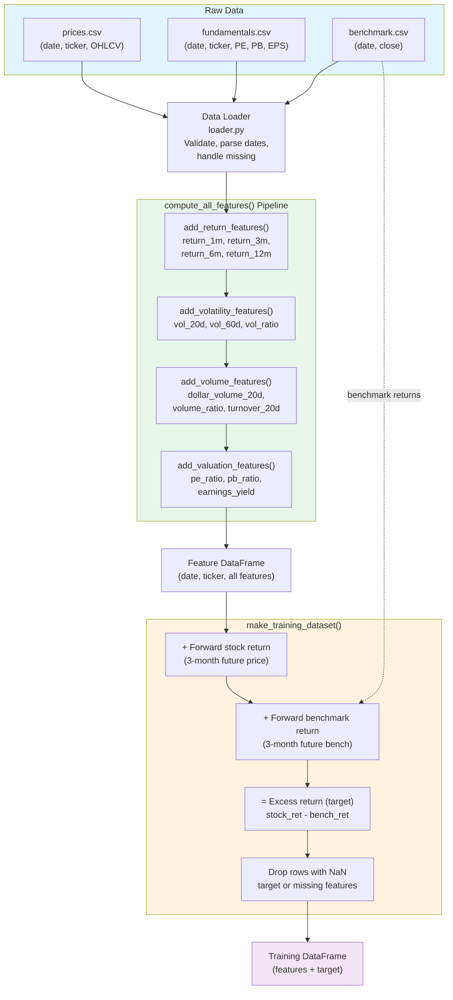

# Data & Feature Engineering

> [← Back to Documentation Index](README.md)
> **Part of**: [Mid-term Stock Planner Design](design.md)
> 
> This document covers data loading, feature engineering, and dataset assembly.

## Related Documents

- [design.md](design.md) - Main overview and architecture
- [model-training.md](model-training.md) - Uses the datasets created here
- [technical-indicators.md](technical-indicators.md) - Extended technical features
- [fundamental-data.md](fundamental-data.md) - SEC filings and fundamental data

---

## Feature Engineering Data Flow

The following diagram shows the sequential feature engineering pipeline from raw CSV through the final training DataFrame.



---

## 1. Data Architecture

```
┌─────────────────────────────────────────────────────────────────────────────┐
│                         DATA ARCHITECTURE                                    │
└─────────────────────────────────────────────────────────────────────────────┘

┌─────────────────┐    ┌─────────────────┐    ┌─────────────────┐
│   PRICE DATA    │    │  FUNDAMENTALS   │    │   BENCHMARK     │
│    (Panel)      │    │   (Periodic)    │    │    (Series)     │
├─────────────────┤    ├─────────────────┤    ├─────────────────┤
│ date            │    │ date            │    │ date            │
│ ticker          │    │ ticker          │    │ close           │
│ open            │    │ PE              │    └─────────────────┘
│ high            │    │ PB              │
│ low             │    │ EPS             │
│ close           │    │ EPS_growth      │
│ volume          │    │ ...             │
└────────┬────────┘    └────────┬────────┘
         │                      │
         └──────────┬───────────┘
                    │
                    ▼
         ┌─────────────────────┐
         │   DATA LOADER       │
         │   (loader.py)       │
         ├─────────────────────┤
         │ • Validate columns  │
         │ • Parse dates       │
         │ • Check data types  │
         │ • Handle missing    │
         └──────────┬──────────┘
                    │
                    ▼
         ┌─────────────────────┐
         │  PANEL DATAFRAME    │
         │  (date, ticker)     │
         └─────────────────────┘
```

### 1.1 Data Sources

`DataConfig` specifies paths and settings:

| Data Type | Format | Required Columns |
|-----------|--------|------------------|
| **Price Data** | CSV | `date, ticker, open, high, low, close, volume` |
| **Fundamentals** | CSV | `date, ticker, PE, PB, EPS, EPS_growth, ...` |
| **Benchmark** | CSV | `date, close` (or `benchmark_close`) |
| **Sector Data** | CSV/JSON | `ticker, sector, industry` (cached from yfinance) |

### 1.2 Sector Classification

Sector data is fetched from Yahoo Finance and cached locally:

```bash
# Fetch sectors for all watchlist stocks
python scripts/fetch_sector_data.py

# Force refresh all sectors
python scripts/fetch_sector_data.py --force
```

**Cache Files:**
- `data/sectors.csv` - Full sector data with industry
- `data/sectors.json` - Quick ticker→sector lookup

**API:** `scripts/fetch_sector_data.py`
```python
from scripts.fetch_sector_data import get_sector_mapping

sector_map = get_sector_mapping()  # Returns dict: {'AAPL': 'Technology', ...}
```

### 1.3 Data Loader API

```python
# src/data/loader.py

def load_price_data(path: str | Path) -> pd.DataFrame:
    """Load and validate price data."""
    
def load_fundamental_data(path: str | Path) -> pd.DataFrame:
    """Load and validate fundamental data."""
    
def load_benchmark_data(path: str | Path) -> pd.DataFrame:
    """Load and validate benchmark data."""
```

### 1.4 Data Validation & Download

Before running analysis, validate data coverage:

```bash
# Validate data for a watchlist
python scripts/download_prices.py --watchlist everything --validate-only

# Download missing data
python scripts/download_prices.py --watchlist everything

# Full download with date range
python scripts/download_prices.py --watchlist tech_giants --start 2015-01-01 --end 2025-12-31
```

**Benchmark data** (required for backtest target = excess return vs benchmark):

```bash
# Extend benchmark (SPY) to cover full backtest range (train_years + test_years)
python scripts/download_benchmark.py --start 2010-01-01 --no-merge
```

If the benchmark CSV is too short, backtests fail with "No predictions generated" because the target requires aligned benchmark forward returns.

**Validation Checks:**
- Missing tickers (not in prices.csv)
- Date range coverage
- Data quality (gaps, anomalies)
- Coverage percentage

**Output:**
- `output/data_validation_{watchlist}_{timestamp}.json` - Structured report
- `output/data_validation_{watchlist}_{timestamp}.md` - Human-readable report

---

## 2. Data Quality & Leakage Prevention

```
┌─────────────────────────────────────────────────────────────────────────────┐
│                    DATA QUALITY & LEAKAGE PREVENTION                         │
└─────────────────────────────────────────────────────────────────────────────┘

  ❌ LOOK-AHEAD BIAS                        ✅ CORRECT APPROACH
  
  Report Date: Jan 15                       Report Date: Jan 15
       │                                         │
       │  ← Using data immediately               │
       │                                         │  + Reporting Lag (X days)
       ▼                                         │
  ┌─────────┐                                    ▼
  │ Jan 15  │  WRONG!                       ┌─────────┐
  │ Use PE  │                               │ Jan 25  │  CORRECT
  └─────────┘                               │ Use PE  │
                                            └─────────┘
                                            
  ════════════════════════════════════════════════════════════════════════
  
                    FORWARD-FILL AFTER EFFECTIVE DATE
                    
  Q1 Report  Q2 Report  Q3 Report  Q4 Report
     │          │          │          │
     ▼          ▼          ▼          ▼
  ───●──────────●──────────●──────────●─────────▶ Time
     │          │          │          │
     └──ffill──▶└──ffill──▶└──ffill──▶└──ffill──▶
```

### 2.1 Design Principles

| Principle | Implementation |
|-----------|----------------|
| **Corporate Actions** | Prices adjusted for splits and dividends |
| **Survivorship Bias** | Support historical membership lists (future) |
| **Time Alignment** | Consistent time zone and date conventions |
| **Fundamental Lag** | Apply reporting lag before using fundamentals |
| **Forward-Fill** | Only after effective date to avoid look-ahead |
| **Target Labeling** | Forward return computed from future prices |

### 2.2 Validation Checks

```python
# Validation in loader.py

# Required columns check
required_cols = ["date", "ticker", "close"]
if not all(col in df.columns for col in required_cols):
    raise DataValidationError(f"Missing required columns: {required_cols}")

# Date parsing
df["date"] = pd.to_datetime(df["date"])

# Numeric validation
df["close"] = pd.to_numeric(df["close"], errors="coerce")
```

---

## 3. Feature Categories

```
┌─────────────────────────────────────────────────────────────────────────────┐
│                         FEATURE TAXONOMY                                     │
└─────────────────────────────────────────────────────────────────────────────┘

┌─────────────┐   ┌─────────────┐   ┌─────────────┐   ┌─────────────┐   ┌─────────────┐
│   RETURNS   │   │ VOLATILITY  │   │   VOLUME    │   │ VALUATION   │   │ GAP/OVERN   │
│   (Core)    │   │   (Core)    │   │   (Core)    │   │   (Core)    │   │  (Extended)  │
├─────────────┤   ├─────────────┤   ├─────────────┤   ├─────────────┤   ├─────────────┤
│ • 1M return │   │ • 20d std   │   │ • $ volume  │   │ • PE ratio  │   │ • overnight  │
│ • 3M return │   │ • 60d std   │   │ • turnover  │   │ • PB ratio  │   │   _gap_pct   │
│ • 6M return │   │ • ATR       │   │ • vol ratio │   │ • EPS yield │   │ • gap_vs_tr  │
│ • 12M return│   │             │   │             │   │             │   │ • gap_accept │
└──────┬──────┘   └──────┬──────┘   └──────┬──────┘   └──────┬──────┘   └──────┬──────┘
       │                 │                 │                 │                 │
       └─────────────────┴─────────────────┴─────────────────┴─────────────────┴─────────────┘
                                   │
                         ┌─────────┴─────────┐
                         │  MVP FEATURES     │
                         └─────────┬─────────┘
                                   │
       ┌───────────────────────────┴───────────────────────────┐
       │                                                       │
┌──────┴──────┐   ┌─────────────┐   ┌─────────────┐   ┌───────┴─────┐
│  TECHNICAL  │   │  MOMENTUM   │   │ MEAN REVERT │   │ FUNDAMENTAL │
│  (Extended) │   │ (Extended)  │   │ (Extended)  │   │  (Extended) │
├─────────────┤   ├─────────────┤   ├─────────────┤   ├─────────────┤
│ • RSI       │   │ • Score     │   │ • Z-score   │   │ • SEC 10-K  │
│ • MACD      │   │ • Rel Str   │   │ • MA dist   │   │ • ROE, ROA  │
│ • BB        │   │ • 52w H/L   │   │ • Oversold  │   │ • Growth    │
│ • ADX, OBV  │   │ • Trend Str │   │ • RSI Div   │   │ • Quality   │
└─────────────┘   └─────────────┘   └─────────────┘   └─────────────┘

     See: technical-indicators.md              See: fundamental-data.md
```

### 3.1 Return Features

```python
def add_return_features(df: pd.DataFrame) -> pd.DataFrame:
    """Add return features for multiple lookback periods."""
    # Features created:
    # - return_1m:  21-day rolling return
    # - return_3m:  63-day rolling return
    # - return_6m:  126-day rolling return
    # - return_12m: 252-day rolling return
```

| Feature | Window | Calculation |
|---------|--------|-------------|
| `return_1m` | 21 days | `close / close.shift(21) - 1` |
| `return_3m` | 63 days | `close / close.shift(63) - 1` |
| `return_6m` | 126 days | `close / close.shift(126) - 1` |
| `return_12m` | 252 days | `close / close.shift(252) - 1` |

### 3.1.1 bars_per_day Scaling

When using intraday data (e.g., hourly bars), lookback windows expressed in trading days must be scaled by the number of bars per day. The `bars_per_day` parameter adjusts all rolling window lengths accordingly:

```
effective_window = window_in_days * bars_per_day
```

For example, with hourly data (`bars_per_day = 7`), a 21-day return lookback becomes `21 * 7 = 147` bars. This ensures features computed on intraday data represent the same calendar duration as daily features.

### 3.1.2 min_periods for Rolling Windows

All rolling window calculations use a minimum number of observations before producing a value, to avoid unreliable estimates from too few data points:

```
min_periods = window / 2
```

For a 20-day rolling window, at least 10 observations are required before the first non-NaN value is emitted.

### 3.2 Volatility Features

```python
def add_volatility_features(
    df: pd.DataFrame,
    short_window: int = 20,
    long_window: int = 60
) -> pd.DataFrame:
    """Add volatility features."""
    # Features created:
    # - vol_20d: 20-day rolling std of daily returns
    # - vol_60d: 60-day rolling std of daily returns
    # - vol_ratio: vol_20d / vol_60d (vol regime indicator)
```

### 3.3 Volume Features

```python
def add_volume_features(
    df: pd.DataFrame,
    lookback_days: int = 20
) -> pd.DataFrame:
    """Add volume/liquidity features."""
    # Features created:
    # - dollar_volume_20d: Average dollar volume
    # - volume_ratio: Current volume / 20d avg
    # - turnover_20d: Volume coefficient of variation (see formula below)
```

**Turnover feature formula:**

```
turnover_20d = std(volume[20d]) / mean(volume[20d])
```

This is the coefficient of variation of volume over a 20-day window, capturing how erratic trading activity is. Higher values indicate more variable (potentially event-driven) volume patterns.

### 3.4 Valuation Features

```python
def add_valuation_features(
    df: pd.DataFrame,
    fundamental_df: pd.DataFrame
) -> pd.DataFrame:
    """Add valuation features from fundamentals."""
    # Features created:
    # - pe_ratio: Forward-filled PE (point-in-time via merge_asof)
    # - pb_ratio: Forward-filled PB (point-in-time via merge_asof)
    # - earnings_yield: 1/PE
```

**Point-in-time join with `merge_asof`:**

Valuation data (PE, PB, etc.) is reported periodically (quarterly filings) and arrives with a lag. To prevent look-ahead bias, the pipeline uses `pd.merge_asof` to join fundamental data to price data by the most recent available report date that is on or before each trading date:

```python
merged = pd.merge_asof(
    price_df.sort_values("date"),
    fundamental_df.sort_values("date"),
    on="date",
    by="ticker",
    direction="backward"   # use most recent report <= current date
)
```

This ensures each row only sees fundamental data that was actually available at that point in time, preventing future information from leaking into features.

---

## 4. Feature Engineering Pipeline

```
┌─────────────────────────────────────────────────────────────────────────────┐
│                    FEATURE ENGINEERING PIPELINE                              │
└─────────────────────────────────────────────────────────────────────────────┘

┌────────────┐   ┌────────────┐   ┌────────────┐
│ Price CSV  │   │ Fund. CSV  │   │ Bench. CSV │
└─────┬──────┘   └─────┬──────┘   └─────┬──────┘
      │                │                │
      └────────────────┼────────────────┘
                       │
                       ▼
              ┌────────────────┐
              │  Data Loader   │
              └───────┬────────┘
                      │
                      ▼
┌─────────────────────────────────────────────────────────────────────────────┐
│                       compute_all_features()                                 │
│  ┌─────────────────────────────────────────────────────────────────────┐    │
│  │ Step 1: add_return_features()                                        │    │
│  │         └─▶ return_1m, return_3m, return_6m, return_12m             │    │
│  └─────────────────────────────────────────────────────────────────────┘    │
│                               │                                             │
│                               ▼                                             │
│  ┌─────────────────────────────────────────────────────────────────────┐    │
│  │ Step 2: add_volatility_features()                                    │    │
│  │         └─▶ vol_20d, vol_60d, vol_ratio                             │    │
│  └─────────────────────────────────────────────────────────────────────┘    │
│                               │                                             │
│                               ▼                                             │
│  ┌─────────────────────────────────────────────────────────────────────┐    │
│  │ Step 3: add_volume_features()                                        │    │
│  │         └─▶ dollar_volume_20d, volume_ratio, turnover_20d           │    │
│  └─────────────────────────────────────────────────────────────────────┘    │
│                               │                                             │
│                               ▼                                             │
│  ┌─────────────────────────────────────────────────────────────────────┐    │
│  │ Step 4: add_valuation_features()                                     │    │
│  │         └─▶ pe_ratio, pb_ratio, earnings_yield                      │    │
│  └─────────────────────────────────────────────────────────────────────┘    │
└─────────────────────────────────┬───────────────────────────────────────────┘
                                  │
                                  ▼
                      ┌────────────────────┐
                      │  Feature DataFrame │
                      │  (date, ticker,    │
                      │   features...)     │
                      └────────────────────┘
```

### 4.1 Core Functions

```python
# src/features/engineering.py

def compute_all_features(
    price_df: pd.DataFrame,
    fundamental_df: pd.DataFrame,
    feature_config: FeatureConfig
) -> pd.DataFrame:
    """
    Orchestrate all feature computation.
    
    Args:
        price_df: Price data (date, ticker, OHLCV)
        fundamental_df: Fundamental data
        feature_config: Feature configuration
    
    Returns:
        DataFrame with all computed features
    """
    df = price_df.copy()
    df = add_return_features(df)
    df = add_volatility_features(df)
    df = add_volume_features(df)
    df = add_valuation_features(df, fundamental_df)
    return df
```

### 4.2 Extended Features

For extended features, see:
- [technical-indicators.md](technical-indicators.md) - RSI, MACD, Bollinger Bands, etc.
- [fundamental-data.md](fundamental-data.md) - SEC filings, financial ratios

```python
def compute_all_features_extended(
    price_df: pd.DataFrame,
    fundamental_df: pd.DataFrame,
    benchmark_df: pd.DataFrame,
    feature_config: FeatureConfig
) -> pd.DataFrame:
    """
    Compute all features including extended indicators.
    
    Adds:
    - Technical indicators (RSI, MACD, BB, ATR, ADX)
    - Momentum features (score, relative strength, trend)
    - Mean reversion features (z-scores, MA distance)
    """
```

---

## 5. Training Dataset Assembly

```
┌─────────────────────────────────────────────────────────────────────────────┐
│                    TRAINING DATASET ASSEMBLY                                 │
└─────────────────────────────────────────────────────────────────────────────┘

┌────────────────────┐
│  Feature DataFrame │
│  (date, ticker,    │
│   features...)     │
└─────────┬──────────┘
          │
          ▼
┌──────────────────────────────────┐
│    make_training_dataset()       │
│  ┌────────────────────────────┐  │
│  │ + Forward stock return     │  │
│  │   (3-month future price)   │  │
│  └────────────────────────────┘  │
│              │                   │
│              ▼                   │
│  ┌────────────────────────────┐  │
│  │ + Forward benchmark return │  │
│  │   (3-month future bench)   │  │
│  └────────────────────────────┘  │
│              │                   │
│              ▼                   │
│  ┌────────────────────────────┐  │
│  │ = Excess return (target)   │  │
│  │   stock_ret - bench_ret    │  │
│  └────────────────────────────┘  │
│              │                   │
│              ▼                   │
│  ┌────────────────────────────┐  │
│  │ Drop rows with NaN target  │  │
│  │ or missing critical feat.  │  │
│  └────────────────────────────┘  │
└─────────────────┬────────────────┘
                  │
                  ▼
        ┌────────────────────┐
        │ Training Dataset   │
        │ (features + target)│
        └────────────────────┘
```

### 5.1 Training Dataset Function

```python
def make_training_dataset(
    feature_df: pd.DataFrame,
    benchmark_df: pd.DataFrame,
    horizon_days: int = 63,
    target_col: str = "target"
) -> pd.DataFrame:
    """
    Create training dataset with target (excess return).
    
    Args:
        feature_df: DataFrame with computed features
        benchmark_df: Benchmark price data
        horizon_days: Forward return horizon (default 63 = 3 months)
        target_col: Name for target column
    
    Returns:
        DataFrame with features and target column
    """
```

### 5.2 Target Calculation

```
┌─────────────────────────────────────────────────────────────────────────────┐
│                         TARGET CALCULATION                                   │
└─────────────────────────────────────────────────────────────────────────────┘

         T (today)                    T + 63 days (3 months)
              │                              │
              ▼                              ▼
  ────────────●──────────────────────────────●────────────────▶ Time
              │                              │
              │      FORWARD RETURN          │
              └──────────────────────────────┘
              
  Stock Forward Return:     (price_T+63 / price_T) - 1
  Benchmark Forward Return: (bench_T+63 / bench_T) - 1
  
  Excess Return (TARGET):   stock_forward_ret - bench_forward_ret
```

---

## 6. Inference Dataset

```python
def prepare_inference_dataset(
    feature_df: pd.DataFrame,
    as_of_date: str | pd.Timestamp
) -> pd.DataFrame:
    """
    Prepare dataset for inference (no target).
    
    Args:
        feature_df: DataFrame with computed features
        as_of_date: Date to score
    
    Returns:
        DataFrame with features only, filtered to as_of_date
    """
```

---

## 7. Pipeline Helpers

```
┌─────────────────────────────────────────────────────────────────────────────┐
│                         PIPELINE ARCHITECTURE                                │
└─────────────────────────────────────────────────────────────────────────────┘

┌─────────────────────────────────────────────────────────────────────────────┐
│                      prepare_training_data()                                 │
│                                                                              │
│   DataConfig ─────┐                                                          │
│   FeatureConfig ──┼───▶ ┌──────────┐   ┌──────────┐   ┌──────────────┐      │
│                   │     │  Loader  │──▶│ Features │──▶│ Training Set │      │
│                   │     └──────────┘   └──────────┘   └──────────────┘      │
└─────────────────────────────────────────────────────────────────────────────┘

┌─────────────────────────────────────────────────────────────────────────────┐
│                      prepare_inference_data()                                │
│                                                                              │
│   DataConfig ─────┐                                                          │
│   FeatureConfig ──┼───▶ ┌──────────┐   ┌──────────┐   ┌──────────────┐      │
│   as_of_date ─────┘     │  Loader  │──▶│ Features │──▶│ Inference Set│      │
│                         │ (recent) │   │ (no tgt) │   │ (scorable)   │      │
│                         └──────────┘   └──────────┘   └──────────────┘      │
└─────────────────────────────────────────────────────────────────────────────┘
```

### 7.1 Pipeline Functions

```python
# src/pipeline.py

def prepare_training_data(
    data_config: DataConfig,
    feature_config: FeatureConfig
) -> Tuple[pd.DataFrame, List[str]]:
    """
    Full pipeline to prepare training data.
    
    Returns:
        Tuple of (training_df, feature_columns)
    """
    # 1. Load data
    price_df = load_price_data(data_config.price_path)
    fundamental_df = load_fundamental_data(data_config.fundamental_path)
    benchmark_df = load_benchmark_data(data_config.benchmark_path)
    
    # 2. Compute features
    feature_df = compute_all_features(price_df, fundamental_df, feature_config)
    
    # 3. Create training dataset
    training_df = make_training_dataset(
        feature_df, benchmark_df, 
        horizon_days=feature_config.horizon_days
    )
    
    return training_df, feature_columns

def prepare_inference_data(
    data_config: DataConfig,
    feature_config: FeatureConfig,
    as_of_date: str
) -> pd.DataFrame:
    """Prepare data for inference."""
```

---

## 8. Feature Summary Table

| Category | Feature | Lookback | Description |
|----------|---------|----------|-------------|
| **Returns** | `return_1m` | 21d | 1-month return |
| | `return_3m` | 63d | 3-month return |
| | `return_6m` | 126d | 6-month return |
| | `return_12m` | 252d | 12-month return |
| **Volatility** | `vol_20d` | 20d | Short-term volatility |
| | `vol_60d` | 60d | Long-term volatility |
| | `vol_ratio` | - | vol_20d / vol_60d |
| **Volume** | `dollar_volume_20d` | 20d | Average dollar volume |
| | `volume_ratio` | 20d | Volume vs average |
| | `turnover_20d` | 20d | `std(volume) / mean(volume)` |
| **Valuation** | `pe_ratio` | - | Price/Earnings |
| | `pb_ratio` | - | Price/Book |
| | `earnings_yield` | - | 1/PE |

> **Extended Features**: See [technical-indicators.md](technical-indicators.md) and [fundamental-data.md](fundamental-data.md)

---

## Related Documents

- **Next**: [model-training.md](model-training.md) - How the training dataset is used
- **Backtesting**: [backtesting.md](backtesting.md) - Walk-forward backtest, feature usage
- **Extended Features**: [technical-indicators.md](technical-indicators.md)
- **Fundamental Data**: [fundamental-data.md](fundamental-data.md)
- **Back to**: [design.md](design.md) - Main overview
