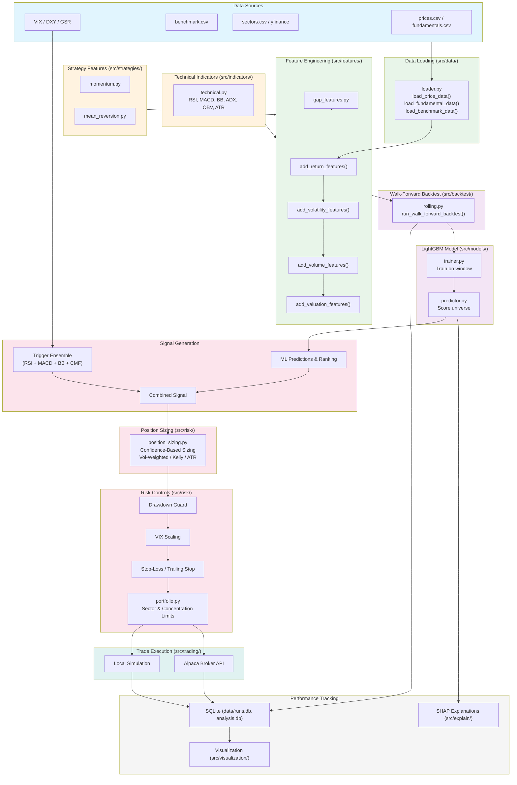

# DESIGN.md – Mid-term Stock Planner

> [← Back to Documentation Index](README.md)
> **Main Design Document** - This document provides the high-level overview of the system.
> For detailed specifications, see the linked documents below.

## Document Index

| Document | Description |
|----------|-------------|
| [design.md](design.md) | Main overview, goals, architecture (this document) |
| [data-engineering.md](data-engineering.md) | Data loading, feature engineering, dataset assembly |
| [model-training.md](model-training.md) | Model training, prediction, persistence |
| [backtesting.md](backtesting.md) | Walk-forward backtest, performance metrics, costs |
| [explainability.md](explainability.md) | SHAP explanations, interpretability |
| [risk-management.md](risk-management.md) | Risk metrics, position sizing, portfolio risk |
| [risk-parity.md](risk-parity.md) | Volatility-aware allocation, risk parity, beta control |
| [garch-design.md](garch-design.md) | GARCH volatility modeling design and implementation plan |
| [report-templates-guide.md](report-templates-guide.md) | **NEW** Custom report template engine (v3.11) |
| [v3.11-complete-summary.md](v3.11-complete-summary.md) | **NEW** v3.11 performance features summary |
| [technical-indicators.md](technical-indicators.md) | Technical indicators, strategy features |
| [visualization-analytics.md](visualization-analytics.md) | Charts, performance visualization, analytics |
| [fundamental-data.md](fundamental-data.md) | SEC filings, fundamental data fetching |
| [sentiment.md](sentiment.md) | News sentiment analysis, A/B comparison |
| [comparison.md](comparison.md) | Feature comparison: Stockbot vs Mid-term Stock Planner |
| [configuration-cli.md](configuration-cli.md) | Configuration, CLI commands, run tracking |
| **New in v3.0** | |
| [portfolio-builder.md](portfolio-builder.md) | **NEW** Personalized portfolio construction |
| [domain-analysis.md](domain-analysis.md) | **NEW** Vertical/horizontal stock selection |
| [ai-insights.md](ai-insights.md) | Gemini-powered AI analysis and recommendations |
| [dashboard.md](dashboard.md) | Streamlit web dashboard for browsing results |
| [analytics-database.md](analytics-database.md) | SQLite database schema and management |
| [api-configuration.md](api-configuration.md) | API key setup and configuration |
| [data-validation.md](data-validation.md) | Data quality validation for AI insights |
| [portfolio-comparison.md](portfolio-comparison.md) | Comparison of Purchase Triggers vs Portfolio Builder methods |
| [analysis-improvements.md](analysis-improvements.md) | Roadmap for enhancing analytical capabilities |
| [comprehensive-analysis-system.md](comprehensive-analysis-system.md) | Performance attribution, benchmark comparison, factor exposure, rebalancing, style analysis |
| [quantaalpha-feature-proposal.md](quantaalpha-feature-proposal.md) | Evolutionary optimizer, diversified templates, lineage, complexity control |
| [macro-indicators.md](macro-indicators.md) | DXY, VIX, GSR for Trigger Backtester |
| [risk-analysis-guide.md](risk-analysis-guide.md) | Tail risk, VaR, stress testing, conscience filters |

---

## System Architecture Diagram

The following diagram shows the end-to-end pipeline from data ingestion through trade execution, along with the data flow between source modules.



**Module data flow summary:**
- `src/data/` --> `src/features/` --> `src/models/` --> `src/backtest/`
- `src/indicators/` --> `src/features/`
- `src/risk/` <-- `src/backtest/`
- `src/trading/` <-- `src/backtest/`

---

## 1. Goal & Investment Spec

### 1.1 Goal

Build an interpretable stock ranking and backtesting system for a ~3‑month horizon, suitable for a mid‑term investor who rebalances monthly and cares about:

- Reasonable risk (controlled drawdown, diversification).
- Transparent drivers of performance (explainable factors, not black‑box noise).

### 1.2 Investment Profile

```
┌─────────────────────────────────────────────────────────────────────┐
│                    INVESTMENT PROFILE                                │
├─────────────────────────────────────────────────────────────────────┤
│  Horizon:        3 months forward return                            │
│  Rebalance:      Monthly (option for bi-weekly)                     │
│  Universe:       Liquid large/mid-cap US stocks                     │
│  Benchmark:      S&P 500 / MSCI World                               │
│  Objective:      Risk-adjusted outperformance (Sharpe/Sortino)      │
└─────────────────────────────────────────────────────────────────────┘
```

- **Horizon**: 3 months forward return
- **Rebalance frequency**: Monthly (with option for bi-weekly)
- **Universe**: Liquid large/mid‑cap stocks (configurable)
- **Benchmark**: Broad equity index (S&P 500, MSCI World)
- **Objective**: Risk-adjusted outperformance with controlled drawdowns

### 1.3 Risk & Portfolio Constraints

```
┌─────────────────────────────────────────────────────────────────────┐
│                    PORTFOLIO CONSTRAINTS                             │
├───────────────────────────┬─────────────────────────────────────────┤
│  Max Single Stock Weight  │  ≤ 5%                                   │
│  Max Sector Weight        │  ≤ 25%                                  │
│  Max Turnover/Rebalance   │  ≤ 30%                                  │
│  Max Drawdown Tolerance   │  Configurable threshold                 │
│  Cash Buffer (optional)   │  ~5%                                    │
└───────────────────────────┴─────────────────────────────────────────┘
```

> **See Also**: [risk-management.md](risk-management.md) for detailed risk metrics and position sizing.

---

## 2. Core Use‑Cases

### Use Case Flow Diagram

```
┌──────────────────────────────────────────────────────────────────────────────┐
│                              USE CASES                                        │
└──────────────────────────────────────────────────────────────────────────────┘
                                     │
         ┌───────────────────────────┼───────────────────────────┐
         │                           │                           │
         ▼                           ▼                           ▼
┌─────────────────┐       ┌─────────────────┐       ┌─────────────────┐
│   UC1: RANK     │       │ UC2: PORTFOLIO  │       │  UC3: EXPLAIN   │
│    STOCKS       │       │  SUGGESTION     │       │    FACTORS      │
├─────────────────┤       ├─────────────────┤       ├─────────────────┤
│ Predict 3-month │       │ Long-only top N │       │ Per-stock SHAP  │
│ excess return   │       │ or top decile   │       │ contributions   │
│ vs benchmark    │       │ equal-weight    │       │                 │
└────────┬────────┘       └────────┬────────┘       └────────┬────────┘
         │                         │                         │
         └─────────────────────────┼─────────────────────────┘
                                   │
         ┌─────────────────────────┼─────────────────────────┐
         │                         │                         │
         ▼                         ▼                         ▼
┌─────────────────┐       ┌─────────────────┐       ┌─────────────────┐
│  UC4: BACKTEST  │       │  UC5: TRACK     │       │  UC6: COMPARE   │
│   WALK-FORWARD  │       │    RUNS         │       │   STRATEGIES    │
├─────────────────┤       ├─────────────────┤       ├─────────────────┤
│ Sharpe, Sortino │       │ Store configs,  │       │ Multiple model  │
│ Max DD, turnover│       │ metrics, equity │       │ versions side   │
│ hit rate        │       │ curves          │       │ by side         │
└─────────────────┘       └─────────────────┘       └─────────────────┘
```

| Use Case | Description | Related Document |
|----------|-------------|------------------|
| UC1: Rank Stocks | Predict 3‑month excess return vs benchmark | [model-training.md](model-training.md) |
| UC2: Portfolio Suggestion | Long‑only top N equal‑weight | [risk-management.md](risk-management.md) |
| UC3: Explain Factors | Per‑stock SHAP contributions | [explainability.md](explainability.md) |
| UC4: Backtest | Walk‑forward evaluation | [backtesting.md](backtesting.md) |
| UC5: Track Runs | Store configs, metrics | [configuration-cli.md](configuration-cli.md) |
| UC6: Compare Strategies | Side‑by‑side model comparison | [visualization-analytics.md](visualization-analytics.md) |

---

## 3. System Architecture Overview

```
┌─────────────────────────────────────────────────────────────────────────────┐
│                    SYSTEM ARCHITECTURE OVERVIEW                              │
└─────────────────────────────────────────────────────────────────────────────┘

┌─────────────────────────────────────────────────────────────────────────────┐
│                              CLI LAYER                                       │
│  ┌─────────────────────────────────────────────────────────────────────┐    │
│  │  run-backtest              score-latest              compare-runs    │    │
│  └─────────────────────────────────────────────────────────────────────┘    │
│                                                                              │
│  See: configuration-cli.md                                                   │
└──────────────────────────────────┬──────────────────────────────────────────┘
                                   │
                                   ▼
┌─────────────────────────────────────────────────────────────────────────────┐
│                           PIPELINE LAYER                                     │
│  ┌─────────────────┐    ┌─────────────────┐    ┌─────────────────┐          │
│  │ prepare_train() │    │prepare_infer()  │    │ run_backtest()  │          │
│  └─────────────────┘    └─────────────────┘    └─────────────────┘          │
│                                                                              │
│  See: data-engineering.md, backtesting.md                                    │
└──────────────────────────────────┬──────────────────────────────────────────┘
                                   │
                                   ▼
┌─────────────────────────────────────────────────────────────────────────────┐
│                            CORE MODULES                                      │
│                                                                              │
│  ┌──────────┐   ┌──────────┐   ┌──────────┐   ┌──────────┐   ┌──────────┐  │
│  │  Loader  │   │ Engineer │   │ Trainer  │   │Predictor │   │  SHAP    │  │
│  │          │   │          │   │          │   │          │   │ Explain  │  │
│  └──────────┘   └──────────┘   └──────────┘   └──────────┘   └──────────┘  │
│                                                                              │
│  ┌──────────┐   ┌──────────┐   ┌──────────┐   ┌──────────┐                  │
│  │ Backtest │   │   Risk   │   │Analytics │   │ Visualize│                  │
│  │          │   │          │   │          │   │          │                  │
│  └──────────┘   └──────────┘   └──────────┘   └──────────┘                  │
│                                                                              │
│  See: model-training.md, explainability.md, risk-management.md               │
└──────────────────────────────────┬──────────────────────────────────────────┘
                                   │
                                   ▼
┌─────────────────────────────────────────────────────────────────────────────┐
│                          EXTENDED MODULES                                    │
│                                                                              │
│  ┌──────────┐   ┌──────────┐   ┌──────────┐   ┌──────────┐                  │
│  │Technical │   │ Strategy │   │ Position │   │Fundament │                  │
│  │Indicators│   │ Features │   │  Sizing  │   │  (SEC)   │                  │
│  └──────────┘   └──────────┘   └──────────┘   └──────────┘                  │
│                                                                              │
│  See: technical-indicators.md, fundamental-data.md                           │
└──────────────────────────────────┬──────────────────────────────────────────┘
                                   │
                                   ▼
┌─────────────────────────────────────────────────────────────────────────────┐
│                            DATA LAYER                                        │
│                                                                              │
│  ┌──────────────┐   ┌──────────────┐   ┌──────────────┐                     │
│  │  prices.csv  │   │ fundament.csv│   │benchmark.csv │                     │
│  └──────────────┘   └──────────────┘   └──────────────┘                     │
│                                                                              │
│  ┌──────────────┐   ┌──────────────┐                                        │
│  │    models/   │   │    runs/     │                                        │
│  └──────────────┘   └──────────────┘                                        │
│                                                                              │
│  See: data-engineering.md                                                    │
└─────────────────────────────────────────────────────────────────────────────┘
```

---

## 4. Module Directory Structure

```
src/
├── __init__.py
├── exceptions.py              # Custom exceptions
├── pipeline.py                # Pipeline helpers
│
├── data/                      # Data loading
│   ├── __init__.py            # See: data-engineering.md
│   └── loader.py
│
├── features/                  # Feature engineering
│   ├── __init__.py            # See: data-engineering.md
│   ├── engineering.py        # Core features (returns, vol, volume, valuation)
│   └── gap_features.py       # Gap/overnight features (QuantaAlpha-inspired)
│
├── models/                    # Model training & prediction
│   ├── __init__.py            # See: model-training.md
│   ├── trainer.py
│   └── predictor.py
│
├── backtest/                  # Backtesting
│   ├── __init__.py            # See: backtesting.md
│   └── rolling.py
│
├── explain/                   # Explainability
│   ├── __init__.py            # See: explainability.md
│   └── shap_explain.py
│
├── risk/                      # Risk management
│   ├── __init__.py            # See: risk-management.md
│   ├── metrics.py
│   ├── position_sizing.py
│   └── portfolio.py
│
├── indicators/                # Technical indicators
│   ├── __init__.py            # See: technical-indicators.md
│   └── technical.py
│
├── strategies/                # Strategy features
│   ├── __init__.py            # See: technical-indicators.md
│   ├── momentum.py
│   └── mean_reversion.py
│
├── fundamental/               # Fundamental data
│   ├── __init__.py            # See: fundamental-data.md
│   ├── sec_filings.py
│   └── data_fetcher.py
│
├── visualization/             # Visualization
│   ├── __init__.py            # See: visualization-analytics.md
│   ├── charts.py
│   └── performance.py
│
├── analytics/                 # Analytics
│   ├── __init__.py            # See: visualization-analytics.md, comprehensive-analysis-system.md
│   ├── performance.py
│   ├── performance_attribution.py
│   ├── benchmark_comparison.py
│   ├── factor_exposure.py
│   ├── rebalancing_analysis.py
│   ├── style_analysis.py
│   ├── comprehensive_analysis.py
│   ├── analysis_service.py
│   ├── data_loader.py
│   └── analysis_models.py
│
├── config/                    # Configuration
│   ├── __init__.py            # See: configuration-cli.md
│   └── config.py
│
└── app/                       # CLI Application
    ├── __init__.py            # See: configuration-cli.md
    └── cli.py
```

---

## 5. Data Flow Overview

```
┌─────────────────────────────────────────────────────────────────────────────┐
│                         END-TO-END DATA FLOW                                 │
└─────────────────────────────────────────────────────────────────────────────┘

    ┌─────────────┐     ┌─────────────┐     ┌─────────────┐
    │ prices.csv  │     │fundament.csv│     │benchmark.csv│
    └──────┬──────┘     └──────┬──────┘     └──────┬──────┘
           │                   │                   │
           └───────────────────┼───────────────────┘
                               │
                               ▼
                    ┌─────────────────────┐
                    │    DATA LOADER      │  ← data-engineering.md
                    │   (loader.py)       │
                    └──────────┬──────────┘
                               │
                               ▼
                    ┌─────────────────────┐
                    │ FEATURE ENGINEERING │  ← data-engineering.md
                    │  (engineering.py)   │
                    └──────────┬──────────┘
                               │
                               ▼
                    ┌─────────────────────┐
                    │ TRAINING DATASET    │  ← data-engineering.md
                    │ (features + target) │
                    └──────────┬──────────┘
                               │
           ┌───────────────────┼───────────────────┐
           │                   │                   │
           ▼                   ▼                   ▼
    ┌─────────────┐     ┌─────────────┐     ┌─────────────┐
    │   TRAIN     │     │   PREDICT   │     │  BACKTEST   │
    │   MODEL     │     │   SCORES    │     │   WALK-FWD  │
    │             │     │             │     │             │
    │ model-      │     │ model-      │     │ backtesting │
    │ training.md │     │ training.md │     │ .md         │
    └──────┬──────┘     └──────┬──────┘     └──────┬──────┘
           │                   │                   │
           ▼                   ▼                   ▼
    ┌─────────────┐     ┌─────────────┐     ┌─────────────┐
    │   MODEL     │     │   RANKED    │     │  BACKTEST   │
    │   + META    │     │   STOCKS    │     │   RESULTS   │
    └─────────────┘     └──────┬──────┘     └──────┬──────┘
                               │                   │
                               ▼                   ▼
                    ┌─────────────────────┐ ┌─────────────────┐
                    │      EXPLAIN        │ │    VISUALIZE    │
                    │   (SHAP values)     │ │   (charts)      │
                    │                     │ │                 │
                    │  explainability.md  │ │ visualization-  │
                    │                     │ │ analytics.md    │
                    └─────────────────────┘ └─────────────────┘
```

---

## 6. Prediction Model Architecture

```
┌─────────────────────────────────────────────────────────────────────────────┐
│                    CROSS-SECTIONAL PREDICTION MODEL                          │
└─────────────────────────────────────────────────────────────────────────────┘

                    ┌─────────────────────────────┐
                    │    FOR EACH (date, ticker)  │
                    └──────────────┬──────────────┘
                                   │
                                   ▼
┌───────────────────────────────────────────────────────────────────────────┐
│                         FEATURE VECTOR                                     │
│  ┌──────────┐ ┌──────────┐ ┌──────────┐ ┌──────────┐ ┌──────────┐        │
│  │ Returns  │ │Volatility│ │  Volume  │ │Valuation │ │Technical │        │
│  │ 1,3,6,12M│ │ 20d, 60d │ │ $ Volume │ │ PE, PB   │ │ RSI,MACD │        │
│  └────┬─────┘ └────┬─────┘ └────┬─────┘ └────┬─────┘ └────┬─────┘        │
│       │            │            │            │            │               │
│  data-engineering.md       data-engineering.md      technical-indicators.md│
│       └────────────┴────────────┴────────────┴────────────┘              │
│                                 │                                         │
└─────────────────────────────────┼─────────────────────────────────────────┘
                                  │
                                  ▼
                    ┌─────────────────────────────┐
                    │      LIGHTGBM MODEL         │  ← model-training.md
                    │   (Gradient Boosted Trees)  │
                    └──────────────┬──────────────┘
                                   │
                                   ▼
                    ┌─────────────────────────────┐
                    │     PREDICTED SCORE         │
                    │  (3-month excess return)    │
                    └──────────────┬──────────────┘
                                   │
                                   ▼
                    ┌─────────────────────────────┐
                    │   CROSS-SECTIONAL RANK      │
                    │   (1 = best, N = worst)     │
                    └─────────────────────────────┘
```

> **See Also**: [model-training.md](model-training.md) for full training pipeline details.

---

## 7. Scope & Priorities

### Development Roadmap

```
┌─────────────────────────────────────────────────────────────────────────────┐
│                         DEVELOPMENT ROADMAP                                  │
└─────────────────────────────────────────────────────────────────────────────┘

         MVP (Phase 1)              Phase 2                  Phase 3
              │                        │                        │
              ▼                        ▼                        ▼
┌─────────────────────────┐ ┌─────────────────────────┐ ┌─────────────────────┐
│ ✅ Data loading         │ │ ✅ Extended indicators  │ │ ☐ Time-series       │
│ ✅ Core features        │ │ ✅ Portfolio SHAP       │ │   overlay           │
│ ✅ LightGBM model       │ │ ✅ Regime analysis      │ │ ☐ Live data         │
│ ✅ Walk-forward BT      │ │ ✅ Risk module         │ │   integration       │
│ ✅ SHAP explanations    │ │ ✅ Position sizing     │ │ ☐ Broker connect    │
│ ✅ CLI                  │ │ ✅ Sentiment module    │ │                      │
│ ✅ Run tracking         │ │ ✅ Risk Parity         │ │                      │
│                         │ │ ✅ AI Insights         │ │                      │
│                         │ │ ✅ Web Dashboard       │ │                      │
│                         │ │ ✅ Analytics DB        │ │                      │
└─────────────────────────┘ └─────────────────────────┘ └─────────────────────┘

              │                        │                        │
              │     CURRENT STATE      │                        │
              └────────────────────────┼────────────────────────┘
                                       │
                                Phase 2 complete ✅
```

### Phase Details

| Phase | Features | Status | Documents |
|-------|----------|--------|-----------|
| **MVP (Phase 1)** | Data loading, Core features, LightGBM, Walk-forward BT, SHAP, CLI, Run tracking | ✅ Complete | [data-engineering.md](data-engineering.md), [model-training.md](model-training.md), [backtesting.md](backtesting.md) |
| **Phase 2** | Extended indicators, Portfolio SHAP, Risk module, Position sizing, Risk Parity, AI Insights, Dashboard, Analytics DB, Comprehensive Analysis | ✅ Complete | [technical-indicators.md](technical-indicators.md), [risk-management.md](risk-management.md), [risk-parity.md](risk-parity.md), [ai-insights.md](ai-insights.md), [dashboard.md](dashboard.md), [comprehensive-analysis-system.md](comprehensive-analysis-system.md) |
| **Phase 3** | Time-series overlay, Live data integration, Broker connection | ☐ Planned | - |

---

## 8. Performance Optimization Architecture (v3.11)

The v3.11 release introduces a multi-layered performance optimization system across the UI, API, data processing, and caching layers.

### 8.1 Architecture Overview

```
┌─────────────────────────────────────────────────────────────────────────────┐
│                    PERFORMANCE OPTIMIZATION LAYERS                           │
└─────────────────────────────────────────────────────────────────────────────┘

┌─────────────────────────────────────────────────────────────────────────────┐
│                           UI LAYER                                           │
│  ┌──────────────────┐  ┌──────────────────┐  ┌──────────────────┐          │
│  │  Lazy DataFrames │  │ Progressive      │  │ Paginated        │          │
│  │  (on-demand load)│  │ Charts (batch/   │  │ Tables (virtual  │          │
│  │                  │  │ sequential)      │  │ scrolling)       │          │
│  └──────────────────┘  └──────────────────┘  └──────────────────┘          │
│  See: components/lazy_dataframes.py, components/progressive_charts.py       │
└──────────────────────────────────┬──────────────────────────────────────────┘
                                   │
                                   ▼
┌─────────────────────────────────────────────────────────────────────────────┐
│                        API & DATA LAYER                                      │
│  ┌──────────────────┐  ┌──────────────────┐  ┌──────────────────┐          │
│  │ Request Batching │  │ Parallel         │  │ Smart Cache      │          │
│  │ (rate-limited,   │  │ Processing       │  │ (TTL, compress,  │          │
│  │ batch_size=10)   │  │ (ThreadPool/     │  │ 5-min default)   │          │
│  │                  │  │ ProcessPool)     │  │                  │          │
│  └──────────────────┘  └──────────────────┘  └──────────────────┘          │
│  See: utils/request_batching.py, utils/parallel.py, utils/cache.py         │
└──────────────────────────────────┬──────────────────────────────────────────┘
                                   │
                                   ▼
┌─────────────────────────────────────────────────────────────────────────────┐
│                      REPORT GENERATION LAYER                                 │
│  ┌──────────────────┐  ┌──────────────────┐  ┌──────────────────┐          │
│  │ Report Template  │  │ Batch Generation │  │ Parallel Report  │          │
│  │ Engine (SQLAlch) │  │ (multi-run)      │  │ Analysis Fetch   │          │
│  └──────────────────┘  └──────────────────┘  └──────────────────┘          │
│  See: analytics/report_templates.py                                         │
└─────────────────────────────────────────────────────────────────────────────┘
```

### 8.2 Key Components

| Module | Location | Purpose |
|--------|----------|---------|
| Lazy DataFrames | `src/app/dashboard/components/lazy_dataframes.py` | On-demand DataFrame loading with pagination and virtual scrolling |
| Progressive Charts | `src/app/dashboard/components/progressive_charts.py` | Sequential/batch chart loading with automatic downsampling (>1000 pts) |
| Request Batching | `src/app/dashboard/utils/request_batching.py` | API request batching with configurable rate limits |
| Parallel Processing | `src/app/dashboard/utils/parallel.py` | Thread/process pool execution with progress monitoring |
| Query Cache | `src/app/dashboard/utils/cache.py` | TTL-based cache with automatic compression for large data |
| Report Templates | `src/analytics/report_templates.py` | SQLAlchemy-backed report template engine with batch generation |

### 8.3 Report Template System

The report template engine supports:
- **Template storage**: SQLAlchemy models for template definitions and generation records
- **5 default sections**: Executive summary, performance metrics, portfolio composition, risk analysis, recommendations
- **4 output formats**: PDF, Excel, CSV, JSON
- **10 analysis types**: Attribution, benchmark, factor exposure, rebalancing, style, event, tax, Monte Carlo, turnover, earnings
- **Batch generation**: Generate reports for multiple runs in parallel using `parallel_analysis()`
- **Scheduling**: Optional schedule configuration per template

---

## 9. Non‑functional Constraints

- **Performance**:
  - Training: may take minutes for thousands of stocks over years
  - Scoring: must finish within ~10 seconds for a few hundred stocks
- **Code Quality**:
  - Modular, testable functions
  - Clear interfaces and type hints
- **Safety**:
  - No live trading or broker integration in MVP
  - Outputs are research signals only

---

## 10. Quick Start Guide

### 1. Run a Backtest

```bash
python -m src.app.cli run-backtest --config config/config.yaml
```

> See [configuration-cli.md](configuration-cli.md) for CLI details.

### 2. Score Current Universe

```bash
python -m src.app.cli score-latest \
    --config config/config.yaml \
    --model models/latest \
    --date 2024-01-15
```

### 3. Generate Visualizations

```python
from src.visualization.performance import plot_equity_curve
from src.visualization.charts import plot_price_with_indicators

# See visualization-analytics.md for full API
```

---

## 11. Related Documents

### Core Documentation
- **[data-engineering.md](data-engineering.md)** - Data loading, feature engineering, dataset assembly
- **[model-training.md](model-training.md)** - Model training, prediction, persistence
- **[backtesting.md](backtesting.md)** - Walk-forward backtest, performance metrics, costs
- **[explainability.md](explainability.md)** - SHAP explanations, interpretability
- **[risk-management.md](risk-management.md)** - Risk metrics, position sizing, portfolio risk
- **[technical-indicators.md](technical-indicators.md)** - Technical indicators, strategy features
- **[visualization-analytics.md](visualization-analytics.md)** - Charts, performance visualization
- **[fundamental-data.md](fundamental-data.md)** - SEC filings, fundamental data fetching
- **[sentiment.md](sentiment.md)** - News sentiment analysis, A/B comparison
- **[configuration-cli.md](configuration-cli.md)** - Configuration, CLI commands, run tracking

### New Features (Phase 2)
- **[risk-parity.md](risk-parity.md)** - Volatility-aware allocation, risk parity, sector constraints
- **[ai-insights.md](ai-insights.md)** - Gemini-powered AI analysis and recommendations
- **[dashboard.md](dashboard.md)** - Streamlit web dashboard for browsing results
- **[analytics-database.md](analytics-database.md)** - SQLite database schema and management
- **[api-configuration.md](api-configuration.md)** - API key setup and configuration
- **[comprehensive-analysis-system.md](comprehensive-analysis-system.md)** - Performance attribution, benchmark comparison, factor exposure, rebalancing, style analysis

### Performance & Reports (v3.11)
- **[report-templates-guide.md](report-templates-guide.md)** - Custom report template engine
- **[v3.11-complete-summary.md](v3.11-complete-summary.md)** - Complete v3.11 release notes
- **[migration-guide-v3.11.md](migration-guide-v3.11.md)** - Upgrading from v3.10 to v3.11

---

## See Also

- [Data loading and feature engineering](data-engineering.md)
- [LightGBM training and prediction](model-training.md)
- [Walk-forward backtesting](backtesting.md)
- [Risk metrics and position sizing](risk-management.md)
- [SHAP explanations](explainability.md)
- [Complete API reference](api-documentation.md)
