# AI Agent System Prompt: midterm_stock_planner

**Version**: 3.11.2
**Last Updated**: 2026-02-20
**Branch**: main
**Purpose**: Comprehensive context for AI agents working with the midterm_stock_planner stock ranking and portfolio optimization system

**Warning: All work on this project is managed through [beads](https://github.com/steveyegge/beads)**
- Run `bd ready` at the start of every session to find available tasks
- Always claim tasks before starting work: `bd update <task-id> --claim --status in_progress`
- Update task status and add notes as work progresses
- Mark tasks as `closed` only when fully complete

---

## Project Overview

### Basic Information
- **Name**: midterm_stock_planner
- **Version**: 3.11.2
- **Type**: Python Streamlit web application with CLI interface
- **Purpose**: ML-driven stock ranking and portfolio optimization system for mid-term investors (~3 month horizon) with monthly rebalancing. Combines gradient-boosted tree models, technical analysis, sentiment analysis, and comprehensive risk management to generate stock rankings, build personalized portfolios, and run walk-forward backtests.
- **Language**: Python 3.11+

### Project Size
- **Total Source Files**: ~130+ Python files
- **Lines of Code**: ~49,000 lines (Python)
- **Modules/Components**: 17 main modules under `src/`
- **Test Coverage**: 208+ automated tests (100% pass rate)

### Key Capabilities
1. **ML Stock Ranking**: LightGBM gradient-boosted trees for cross-sectional stock ranking with SHAP explainability
2. **Walk-Forward Backtesting**: Rolling walk-forward backtest with realistic transaction costs, monthly rebalancing, and comprehensive performance metrics
3. **Portfolio Optimization**: Personalized portfolio construction with risk tolerance profiles (conservative/moderate/aggressive), sector constraints, and position limits
4. **Sentiment Analysis**: Multi-source sentiment using Google Gemini LLM, news aggregation, and per-ticker daily sentiment scoring
5. **Comprehensive Analytics**: Performance attribution, benchmark comparison, factor exposure, Monte Carlo simulation, tax optimization, turnover analysis
6. **Risk Management**: VaR/CVaR, stress testing, risk parity allocation, drawdown analysis, position sizing
7. **Interactive Dashboard**: Streamlit-based web UI with 27+ pages, dark mode, keyboard shortcuts, and real-time monitoring
8. **AI Insights**: Google Gemini-powered executive summaries, sector analysis, stock recommendations, and portfolio commentary

---

## Codebase Architecture

### Module Structure

```
midterm-stock-planner/
├── run_dashboard.py              # Dashboard launcher
├── config/
│   ├── config.yaml               # Main application configuration
│   └── watchlists.yaml           # Stock watchlist definitions
│
├── src/                           # Main source code (~49,000 LOC)
│   ├── app/                       # Web UI and CLI (22,578 LOC)
│   │   ├── app.py                # Streamlit entry point
│   │   ├── cli.py                # Command-line interface
│   │   ├── dashboard.py          # Dashboard data loading
│   │   ├── config.py             # Dashboard configuration and CSS
│   │   ├── export.py             # PDF/Excel export
│   │   ├── dashboard/
│   │   │   ├── components/       # UI components (18 files)
│   │   │   ├── pages/            # Dashboard pages (27 files)
│   │   │   └── utils/            # Dashboard utilities (6 files)
│   │   └── ...
│   │
│   ├── analytics/                 # Analysis engine (11,632 LOC)
│   │   ├── comprehensive_analysis.py  # Analysis orchestrator
│   │   ├── analysis_service.py   # Database service
│   │   ├── ai_insights.py        # LLM-based insights
│   │   ├── data_loader.py        # Data loading with caching
│   │   ├── models.py             # SQLAlchemy ORM models
│   │   ├── performance_attribution.py
│   │   ├── benchmark_comparison.py
│   │   ├── factor_exposure.py
│   │   ├── monte_carlo.py
│   │   ├── tax_optimization.py
│   │   ├── turnover_analysis.py
│   │   ├── event_analysis.py
│   │   ├── earnings_calendar.py
│   │   ├── realtime_monitoring.py
│   │   ├── alert_system.py
│   │   ├── report_templates.py
│   │   └── ...
│   │
│   ├── analysis/                  # Domain analysis (2,995 LOC)
│   │   ├── domain_analysis.py    # Vertical/horizontal stock analysis
│   │   ├── portfolio_optimizer.py # Portfolio construction
│   │   └── gemini_commentary.py  # AI commentary generation
│   │
│   ├── backtest/                  # Backtesting engine (903 LOC)
│   │   └── rolling.py            # Walk-forward backtest
│   │
│   ├── models/                    # ML models (437 LOC)
│   │   ├── trainer.py            # LightGBM training
│   │   └── predictor.py          # Prediction and ranking
│   │
│   ├── features/                  # Feature engineering (652 LOC)
│   │   └── engineering.py        # Technical and fundamental features
│   │
│   ├── indicators/                # Technical indicators (449 LOC)
│   │   └── technical.py          # RSI, MACD, ADX, Bollinger, ATR
│   │
│   ├── sentiment/                 # Sentiment analysis (2,517 LOC)
│   │   ├── model.py              # Sentiment classification
│   │   ├── multi_source.py       # Multi-source aggregation
│   │   ├── news_loader.py        # News data loading
│   │   ├── llm_analyzer.py       # Gemini sentiment analysis
│   │   └── aggregator.py         # Daily sentiment aggregation
│   │
│   ├── risk/                      # Risk management (1,977 LOC)
│   │   ├── metrics.py            # Sharpe, Sortino, VaR, CVaR
│   │   ├── portfolio_analyzer.py # Portfolio risk analysis
│   │   ├── position_sizer.py     # Position sizing
│   │   └── risk_parity.py        # Risk parity allocation
│   │
│   ├── fundamental/               # Fundamental data (1,487 LOC)
│   │   ├── fetcher.py            # yfinance data fetching
│   │   ├── multi_source.py       # Multi-source aggregation
│   │   └── sec_filings.py        # SEC filing parsing
│   │
│   ├── data/                      # Data loading (545 LOC)
│   │   ├── loader.py             # Price/benchmark/fundamental data
│   │   └── watchlists.py         # Watchlist management
│   │
│   ├── config/                    # Configuration (522 LOC)
│   │   └── settings.py           # AppConfig, ModelConfig, BacktestConfig
│   │
│   ├── validation/                # Validation (605 LOC)
│   │   └── safeguards.py         # Portfolio and data validation
│   │
│   ├── explain/                   # Explainability (445 LOC)
│   │   └── shap_explain.py       # SHAP value computation
│   │
│   ├── visualization/             # Charts (684 LOC)
│   │   ├── charts.py             # Plotly chart generation
│   │   └── performance.py        # Performance visualization
│   │
│   ├── strategies/                # Trading strategies (436 LOC)
│   │   ├── momentum.py           # Momentum strategies
│   │   └── mean_reversion.py     # Mean reversion strategies
│   │
│   └── exceptions/                # Custom exceptions (605 LOC)
│
├── scripts/                       # Utility scripts (55 files)
│   ├── download_prices.py        # Price data download
│   ├── download_fundamentals.py  # Fundamental data download
│   ├── run_comprehensive_analysis.py  # Batch analysis
│   ├── run_portfolio_optimizer.py     # Portfolio optimization
│   ├── full_analysis_workflow.py      # Full pipeline
│   ├── stress_testing.py         # Stress test scenarios
│   ├── comprehensive_risk_analysis.py # VaR, CVaR, drawdown
│   └── ...
│
├── tests/                         # Test suite (19 files, 208+ tests)
├── data/                          # Data files
│   ├── analysis.db               # SQLite analytics database
│   ├── sectors.json              # Sector classifications
│   └── benchmark.csv             # Benchmark data (SPY, QQQ)
│
├── output/                        # Analysis run outputs
│   └── run_{id}/                 # Per-run output folders
│
├── models/                        # Trained ML models
├── docs/                          # Documentation (66 files)
├── knowledgebase/                 # AI agent context
├── skills/                        # AI documentation skills
└── prompt/                        # Design document templates
```

### Module Responsibilities

| Module | Purpose | Key Files | LOC |
|--------|---------|-----------|-----|
| **app** | Web dashboard, CLI, UI components | app.py, cli.py, 27 pages | ~22,600 |
| **analytics** | Analysis engine, database, AI insights | comprehensive_analysis.py, ai_insights.py | ~11,600 |
| **analysis** | Domain analysis, portfolio optimization | domain_analysis.py, portfolio_optimizer.py | ~3,000 |
| **sentiment** | Multi-source sentiment analysis | model.py, llm_analyzer.py, aggregator.py | ~2,500 |
| **risk** | Risk metrics, parity, position sizing | metrics.py, risk_parity.py | ~2,000 |
| **fundamental** | Fundamental data from multiple sources | fetcher.py, multi_source.py, sec_filings.py | ~1,500 |
| **backtest** | Walk-forward backtesting engine | rolling.py | ~900 |
| **visualization** | Chart generation | charts.py, performance.py | ~700 |
| **features** | Feature engineering for ML | engineering.py | ~650 |
| **validation** | Data and portfolio safeguards | safeguards.py | ~600 |
| **config** | Configuration management | settings.py | ~500 |
| **data** | Data loading and watchlists | loader.py, watchlists.py | ~550 |
| **indicators** | Technical indicator calculations | technical.py | ~450 |
| **explain** | SHAP explainability | shap_explain.py | ~450 |
| **models** | ML training and prediction | trainer.py, predictor.py | ~440 |
| **strategies** | Trading strategy implementations | momentum.py, mean_reversion.py | ~440 |

### Architecture Diagram

```mermaid
graph TB
    subgraph "Entry Points"
        Dashboard[run_dashboard.py<br/>Streamlit Dashboard]
        CLI[src/app/cli.py<br/>Command Line]
        Scripts[scripts/<br/>Batch Scripts]
    end

    subgraph "Web UI Layer"
        App[app.py<br/>Page Router]
        Pages[27 Dashboard Pages<br/>Overview, Analysis, Portfolio...]
        Components[UI Components<br/>Charts, Cards, Tables]
    end

    subgraph "Analytics Engine"
        CompAnalysis[ComprehensiveAnalysisRunner<br/>Orchestrator]
        PerfAttrib[Performance Attribution]
        BenchComp[Benchmark Comparison]
        FactorExp[Factor Exposure]
        MonteCarlo[Monte Carlo Simulation]
        TaxOpt[Tax Optimization]
        Turnover[Turnover Analysis]
        AIInsights[AIInsightsGenerator<br/>Gemini LLM]
    end

    subgraph "Core ML Pipeline"
        Features[Feature Engineering<br/>Technical + Fundamental]
        Indicators[Technical Indicators<br/>RSI, MACD, ADX, ATR]
        Trainer[LightGBM Trainer<br/>Model Training]
        Predictor[Predictor<br/>Ranking + SHAP]
        Backtest[Walk-Forward Backtest<br/>Rolling Windows]
    end

    subgraph "Data Layer"
        DataLoader[Data Loader<br/>Prices, Benchmarks]
        FundFetcher[Fundamentals Fetcher<br/>yfinance, SEC]
        Sentiment[Sentiment Analysis<br/>News, LLM]
        Watchlists[Watchlist Manager]
    end

    subgraph "Portfolio Construction"
        DomainAnalysis[Domain Analyzer<br/>Vertical + Horizontal]
        PortOpt[Portfolio Optimizer<br/>Risk-Aware Allocation]
        RiskParity[Risk Parity<br/>Inverse Vol, Equal Risk]
    end

    subgraph "Risk & Validation"
        RiskMetrics[Risk Metrics<br/>VaR, CVaR, Sharpe]
        PositionSizer[Position Sizer]
        Safeguards[Validation Safeguards]
    end

    subgraph "Storage"
        DB[(SQLite Database<br/>analysis.db)]
        OutputFiles[Output Files<br/>CSV, JSON, MD]
        Models[Trained Models<br/>LightGBM .pkl]
    end

    Dashboard --> App
    App --> Pages
    Pages --> Components
    CLI --> Backtest
    Scripts --> CompAnalysis

    Pages --> CompAnalysis
    Pages --> AIInsights
    CompAnalysis --> PerfAttrib
    CompAnalysis --> BenchComp
    CompAnalysis --> FactorExp
    CompAnalysis --> MonteCarlo
    CompAnalysis --> TaxOpt
    CompAnalysis --> Turnover

    Backtest --> Features
    Features --> Indicators
    Features --> Trainer
    Trainer --> Predictor
    Predictor --> Backtest

    DataLoader --> Features
    FundFetcher --> Features
    Sentiment --> Features
    Watchlists --> DataLoader

    Backtest --> DomainAnalysis
    DomainAnalysis --> PortOpt
    PortOpt --> RiskParity

    RiskMetrics --> CompAnalysis
    PositionSizer --> PortOpt
    Safeguards --> Backtest

    CompAnalysis --> DB
    AIInsights --> DB
    Backtest --> OutputFiles
    Trainer --> Models
```



---

## Core Processing Pipeline

### Analysis Workflow

The system follows a 4-stage pipeline:

```
Stage 1: Backtest (always available)
    ├── Load price data from watchlist
    ├── Compute features (technical + fundamental)
    ├── Train LightGBM model per window
    ├── Generate stock rankings with SHAP
    └── Output: metrics, returns, positions CSV files

Stage 2: Enrichment (requires Stage 1)
    ├── Sector breakdown and classification
    ├── Risk metrics (Sharpe, VaR, drawdown)
    ├── Diversification scoring
    └── Output: enriched metrics JSON

Stage 3: Domain Analysis (requires Stage 1)
    ├── Vertical analysis (within-sector ranking)
    ├── Horizontal analysis (cross-sector allocation)
    ├── Portfolio optimization with constraints
    └── Output: candidate CSVs, portfolio CSV

Stage 4: AI Analysis (requires Stage 1)
    ├── Executive summary (Gemini LLM)
    ├── Sector analysis and rotation guidance
    ├── Stock recommendations
    └── Output: commentary MD, recommendations JSON
```

### Walk-Forward Backtest (src/backtest/rolling.py)

The `RollingWalkForwardBacktest` class implements the core backtesting logic:

**Configuration** (config/config.yaml):
- `train_years`: Training window size (default: 3 years)
- `test_months`: Test window size (default: 3 months)
- `step_months`: Step size between windows (default: 1 month)
- `top_n`: Number of stocks to hold (default: 10)
- `rebalance_freq`: Rebalancing frequency (default: monthly)

**Backtest Loop**:
```
For each walk-forward window:
    1. Split data into train/test sets
    2. Compute features for training data
    3. Train LightGBM regressor on training data
    4. Predict scores on test data
    5. Rank stocks by predicted score
    6. Select top_n stocks
    7. Apply position sizing (equal weight, vol-weighted, etc.)
    8. Calculate returns with transaction costs
    9. Track positions and trades
    10. Compute SHAP explanations
```

### Threading Model

| Component | Threading | Purpose |
|-----------|-----------|---------|
| **Streamlit** | Main thread | Web UI rendering and user interaction |
| **Parallel Downloads** | ThreadPoolExecutor (8 workers) | Batch price/fundamental data downloads |
| **Parallel Analysis** | ThreadPoolExecutor (4 workers) | Independent analysis modules |
| **Database** | Connection pool (5 + 10 overflow) | Thread-safe SQLite access |
| **Cache** | In-memory with TTL | Query result caching |

---

## Comprehensive Analysis System

### ComprehensiveAnalysisRunner (src/analytics/comprehensive_analysis.py)

Orchestrates all analysis modules in a single run:

| Module | Class | Purpose |
|--------|-------|---------|
| Performance Attribution | `PerformanceAttributionAnalyzer` | Decomposes returns into factor/sector/selection/timing |
| Benchmark Comparison | `BenchmarkComparison` | Compare vs SPY, QQQ with alpha/beta/tracking error |
| Factor Exposure | `FactorExposureAnalyzer` | Market, size, value, momentum, quality, low vol factors |
| Rebalancing Analysis | `RebalancingAnalyzer` | Portfolio drift, turnover, optimal rebalance frequency |
| Style Analysis | `StyleAnalyzer` | Growth vs value, large vs small cap classification |
| Monte Carlo | `MonteCarloSimulator` | VaR, CVaR, confidence intervals, stress scenarios |
| Tax Optimization | `TaxOptimizer` | Tax-loss harvesting, wash sale detection |
| Turnover Analysis | `TurnoverAnalyzer` | Churn rate, holding periods, position stability |
| Event Analysis | `EventAnalyzer` | Performance around Fed meetings, earnings, macro events |
| Earnings Calendar | `EarningsCalendarAnalyzer` | Earnings date tracking and exposure analysis |
| Real-Time Monitoring | `RealtimeMonitor` | Alerts for drawdown, price changes, volume spikes |

---

## Key Data Structures

### AppConfig (src/config/settings.py)
Top-level configuration containing:
- `ModelConfig`: LightGBM parameters, feature selection
- `BacktestConfig`: Train/test windows, rebalance frequency, top_n
- `DataConfig`: Data paths, price sources
- `FeatureConfig`: Feature engineering settings
- `SentimentConfig`: Sentiment analysis configuration

### InvestorProfile (src/analysis/portfolio_optimizer.py)
User investment preferences:
- `risk_tolerance`: conservative / moderate / aggressive
- `target_return`: Expected annual return percentage
- `max_drawdown`: Maximum acceptable drawdown
- `max_volatility`: Maximum acceptable portfolio volatility
- `portfolio_size`: Number of stocks to hold
- `min_weight` / `max_weight`: Position size limits
- `max_sector_weight`: Sector concentration limit
- `style_preference`: value / growth / blend
- `dividend_preference`: income / neutral / growth
- `time_horizon`: short / medium / long

### BacktestResults (src/backtest/rolling.py)
Backtest output containing:
- `returns`: pd.Series of portfolio returns
- `positions`: pd.DataFrame of position weights over time
- `trades`: List of trade records
- `metrics`: Dict of performance metrics (Sharpe, max DD, etc.)
- `shap_values`: SHAP explanations per window

### RunRecord / StockScore (src/analytics/models.py)
SQLAlchemy ORM models:
- `RunRecord`: Analysis run metadata (id, watchlist, status, config, metrics)
- `StockScore`: Per-stock scores (ticker, score, sector, features)
- `AnalysisResult`: Stored analysis outputs
- `AIInsight`: LLM-generated insights
- `Recommendation`: AI recommendations with tracking

---

## Documentation Structure

### Folder Organisation

```
docs/
├── design.md                      # System architecture
├── user-guide.md                  # User guide
├── quick-start-guide.md           # Getting started
├── api-documentation.md           # API reference
├── backtesting.md                 # Backtest documentation
├── risk-management.md             # Risk management guide
├── risk-parity.md                 # Risk parity allocation
├── sentiment.md                   # Sentiment analysis
├── ai-insights.md                 # AI insights integration
├── dashboard.md                   # Dashboard pages guide
├── portfolio-builder.md           # Portfolio builder guide
├── domain-analysis.md             # Vertical/horizontal analysis
├── analytics-database.md          # Database schema
├── api-configuration.md           # API key setup
├── configuration-cli.md           # CLI configuration
├── technical-indicators.md        # Indicator reference
├── fundamental-data.md            # Fundamental data sources
├── explainability.md              # SHAP explainability
├── data-engineering.md            # Data pipeline
├── comparison.md                  # Feature comparison
├── REQUIREMENTS.md                # Software requirements
└── ... (66 total documentation files)
```

### Documentation Standards

- **API Reference**: Markdown with code examples
- **User Guides**: Step-by-step with screenshots/examples
- **Design Docs**: Follow `prompt/documentation_guidelines.md`
  - Use Document IDs: `MSP-CD-[COMPONENT]-NNN`
  - Include Mermaid diagrams
  - Add I/O tables, processing flows, error handling

---

## Task Management with Beads

### What is Beads?

[Beads](https://github.com/steveyegge/beads) is a distributed, git-backed issue tracker designed for AI coding agents:

- **Persistent memory**: Tasks survive across sessions
- **Dependency tracking**: Visual task graphs with blockers
- **Hash-based IDs**: Prevent merge conflicts (e.g., `bd-a1b2c3`)
- **Git-backed**: Stored in `.beads/` as JSONL files
- **Multi-agent safe**: Coordination between multiple AI agents

### Common Beads Commands

```bash
# View tasks
bd ready              # Show tasks with no blockers
bd list               # Show all tasks
bd status             # Show project progress
bd show <task-id>     # View task details

# Create tasks
bd create "Task description" --priority 0
bd create "Subtask" --parent <parent-id>

# Update tasks
bd update <task-id> --claim --status in_progress
bd update <task-id> --notes "Progress update"
bd update <task-id> --status closed

# Add dependencies (child blocks parent)
bd dep add <child-id> <parent-id>

# Check progress
bd status <epic-id>
```

### AI Agent Workflow with Beads

**Every Session Must Follow This**:
1. **`bd ready`** - Find tasks with no blockers (first command every session)
2. **`bd update <task-id> --claim --status in_progress`** - Claim task before starting
3. **Load context** - Read `knowledgebase/AGENT_PROMPT.md` (THIS FILE)
4. **Use skill** - Follow instructions from `skills/` folder (task-specific guides)
5. **Execute task** - Write code, documentation, tests, etc.
6. **Update progress** - `bd update <task-id> --notes "Progress update"` (as needed)
7. **Complete task** - `bd update <task-id> --status closed` (only when fully finished)
8. **`bd ready`** - Find next task and repeat

**Critical Rules**:
- ALWAYS check `bd ready` before starting work
- ALWAYS claim tasks before working on them
- ONLY mark tasks as `closed` when 100% complete (no partial completions)
- If blocked, create a new blocker task instead of abandoning
- NEVER work on tasks that have dependencies/blockers
- NEVER mark tasks as closed if tests fail or errors remain

---

## Common Workflows

### Workflow 1: Document a Module

**Goal**: Create complete documentation for a module/component

**Steps**:
1. **Analyse module** (`skills/code_exploration/analyze_module.md`)
   - List all files, classes, functions
   - Identify patterns and responsibilities
   - Note dependencies

2. **Generate API docs** (`skills/documentation/generate_api_docs.md`)
   - Create `docs/api_reference/[module].md`
   - Document all public APIs
   - Add code examples

3. **Add docstrings** (`skills/documentation/add_docstrings.md`)
   - Add Google-style docstrings to Python files
   - Use consistent format

4. **Validate coverage** (`skills/validation/check_doc_coverage.md`)
   - Verify >= 80% coverage
   - Check all public APIs documented

### Workflow 2: Create Component Design

**Goal**: Document component architecture and design decisions

**Steps**:
1. **Analyse architecture** (`skills/code_exploration/analyze_module.md`)
2. **Create component design** (`skills/documentation/generate_component_design.md`)
   - Create `docs/design/2_component_designs/[component].md`
   - Include Document ID (e.g., `MSP-CD-BACKTEST-001`)
   - Add Mermaid diagrams, I/O tables, processing flows
3. **Create algorithm designs** (`skills/documentation/generate_algorithm_design.md`)
   - For walk-forward backtest, risk parity, feature engineering algorithms

### Workflow 3: Run Full Analysis

**Goal**: Execute complete stock analysis pipeline

**Steps**:
1. Download latest price data: `python scripts/download_prices.py`
2. Download fundamentals: `python scripts/download_fundamentals.py`
3. Run full workflow: `python scripts/full_analysis_workflow.py --watchlist default`
4. Run comprehensive analysis: `python scripts/run_comprehensive_analysis.py --run-id <id>`
5. View results in dashboard: `python run_dashboard.py`

---

## Code Patterns and Conventions

### Python Code Style

- **Standard**: Python 3.11+
- **Formatting**: PEP 8 conventions
- **Type Hints**: Used where they add clarity
- **Docstring Format**: Google-style docstrings
- **UI Framework**: Streamlit with custom CSS
- **ORM**: SQLAlchemy 2.0

### Common Patterns

1. **Service layer**: `AnalysisService` provides database abstraction over SQLAlchemy
2. **Configuration dataclasses**: `ModelConfig`, `BacktestConfig`, `InvestorProfile` for type-safe config
3. **Pipeline pattern**: `full_analysis_workflow.py` chains stages with dependency guards
4. **Caching**: `@st.cache_data` for Streamlit, `QueryCache` for database queries
5. **Parallel processing**: `ThreadPoolExecutor` for I/O-bound operations (downloads, analysis)
6. **Factory loaders**: `DataLoader` creates appropriate data sources
7. **Retry logic**: `retry_on_failure` decorator with exponential backoff
8. **Component architecture**: Each Streamlit page is a self-contained module

### Key Data Types

- **pd.DataFrame**: Price data, feature matrices, positions, returns
- **pd.Series**: Time series returns, individual stock scores
- **Dict[str, float]**: Portfolio weights (ticker -> weight)
- **BacktestResults**: Complete backtest output bundle
- **InvestorProfile**: User preference configuration
- **RunRecord**: Database record for analysis run
- **StockScore**: Database record for per-stock scores

---

## Domain Knowledge

### Key Concepts

1. **Walk-Forward Backtest**: Rolling window approach where model is trained on historical data and tested on forward period, then window slides forward. Prevents look-ahead bias.
2. **Cross-Sectional Ranking**: Ranking stocks relative to each other at each point in time, rather than predicting absolute returns.
3. **Monthly Rebalancing**: Adjusting portfolio weights each month to match model predictions.
4. **SHAP Explainability**: Using SHAP (SHapley Additive exPlanations) to understand which features drive individual stock predictions.
5. **Risk Parity**: Portfolio allocation where each position contributes equally to total portfolio risk.
6. **Factor Exposure**: Portfolio sensitivity to systematic risk factors (market, size, value, momentum, quality, volatility).
7. **Performance Attribution**: Decomposing portfolio return into contributions from factor selection, sector allocation, stock selection, and timing.
8. **Sentiment Analysis**: Quantifying market sentiment from news articles and social media using NLP and LLM analysis.

### Terminology

See `knowledgebase/glossary.md` for complete terminology reference.

Common terms:
- **Alpha**: Excess return over benchmark
- **Beta**: Sensitivity to market returns
- **Sharpe Ratio**: Risk-adjusted return metric
- **Max Drawdown**: Largest peak-to-trough decline
- **VaR**: Value at Risk (worst expected loss at confidence level)
- **CVaR**: Conditional VaR (expected loss beyond VaR threshold)
- **LightGBM**: Light Gradient Boosting Machine (tree-based ML model)
- **SHAP**: SHapley Additive exPlanations (model interpretability)

---

## Best Practices

### Documentation

- Document ALL public Python APIs (classes, methods, key functions)
- Include Google-style docstrings in source files
- Use Mermaid diagrams for architecture and data flow
- Link related documentation between modules
- Don't duplicate information across files
- Don't document private/internal APIs unless complex

### Task Management

- Create beads tasks BEFORE starting work
- Keep task descriptions clear and actionable
- Add dependencies to prevent blocked work
- Update task status promptly

### Code Quality

- Follow existing patterns in the codebase
- Ensure tests pass with pytest
- Use type hints where they add clarity
- Prefer small, composable functions
- Use pandas/numpy for data operations
- Avoid breaking existing interfaces

---

## File Path Reference

### Critical Directories

```
midterm-stock-planner/
├── src/                    # Main source code
├── config/                 # Configuration files
├── scripts/                # Utility and analysis scripts
├── tests/                  # Test suite
├── data/                   # Data files and database
├── output/                 # Analysis run outputs
├── models/                 # Trained ML models
├── docs/                   # Documentation
├── knowledgebase/          # AI agent context
├── skills/                 # Documentation skills
├── prompt/                 # Design doc templates
└── .beads/                 # Task tracking
```

### Important Files

- **Dashboard**: `run_dashboard.py`
- **CLI**: `src/app/cli.py`
- **Config**: `config/config.yaml`, `config/watchlists.yaml`
- **Database**: `data/analysis.db`
- **Full Pipeline**: `scripts/full_analysis_workflow.py`
- **Tests**: `tests/` (run with `pytest tests/`)

---

## Build & Run

### Setup Commands

```bash
# Create virtual environment
python -m venv venv
source venv/bin/activate

# Install dependencies
pip install -r requirements.txt

# Setup environment variables
cp .env.example .env
# Edit .env with your API keys (GEMINI_API_KEY, etc.)
```

### Run Commands

```bash
# Launch dashboard
python run_dashboard.py
# or: streamlit run src/app/app.py

# Run full analysis pipeline
python scripts/full_analysis_workflow.py --watchlist default

# Run backtest only
python -m src.app.cli --watchlist default

# Run comprehensive analysis
python scripts/run_comprehensive_analysis.py --run-id <run-id>

# Download latest data
python scripts/download_prices.py
python scripts/download_fundamentals.py

# Run tests
pytest tests/ -v
```

### Key Dependencies

| Package | Version | Purpose |
|---------|---------|---------|
| streamlit | >= 1.28.0 | Web dashboard framework |
| lightgbm | >= 4.0.0 | Gradient-boosted tree models |
| pandas | >= 2.0.0 | Data manipulation |
| numpy | >= 1.24.0 | Numerical computing |
| shap | >= 0.42.0 | Model explainability |
| plotly | >= 5.17.0 | Interactive charts |
| yfinance | >= 0.2.28 | Stock data from Yahoo Finance |
| google-generativeai | >= 0.3.0 | Gemini LLM for AI insights |
| sqlalchemy | >= 2.0.0 | Database ORM |
| scipy | >= 1.10.0 | Scientific computing |
| scikit-learn | >= 1.3.0 | ML utilities |
| reportlab | >= 4.0.0 | PDF export |
| openpyxl | >= 3.1.0 | Excel export |

---

## Quick Reference

### Module Sizes

| Module | Files | LOC | Complexity |
|--------|-------|-----|------------|
| app (dashboard + pages) | 64 | ~22,600 | HIGH |
| analytics | 29 | ~11,600 | HIGH |
| analysis | 4 | ~3,000 | MEDIUM |
| sentiment | 11 | ~2,500 | MEDIUM |
| risk | 5 | ~2,000 | MEDIUM |
| fundamental | 5 | ~1,500 | MEDIUM |
| backtest | 3 | ~900 | MEDIUM |
| visualization | 3 | ~700 | LOW |
| features | 2 | ~650 | MEDIUM |
| validation | 2 | ~600 | LOW |

### Key Dependencies

| Module A | Depends On | Purpose |
|----------|-----------|---------|
| app/pages | analytics | Runs analysis and displays results |
| analytics | data, models, risk | Loads data, runs models, computes risk |
| backtest | features, models, data | Feature engineering and model training |
| features | indicators, data | Technical indicator computation |
| analysis | backtest, risk | Portfolio optimization from backtest results |
| risk | data | Risk metrics from price data |

---

## Maintenance

### Updating This File

When to update:
- New analysis module added -> Update "Comprehensive Analysis System" table
- Architecture changes -> Update Mermaid diagram
- New workflow discovered -> Add to "Common Workflows"
- Dependencies changed -> Update "Key Dependencies"
- New features added -> Update "Key Capabilities"

**Version**: Increment version when major changes are made
**Last Updated**: Update date with each modification

---

**End of AGENT_PROMPT.md**
