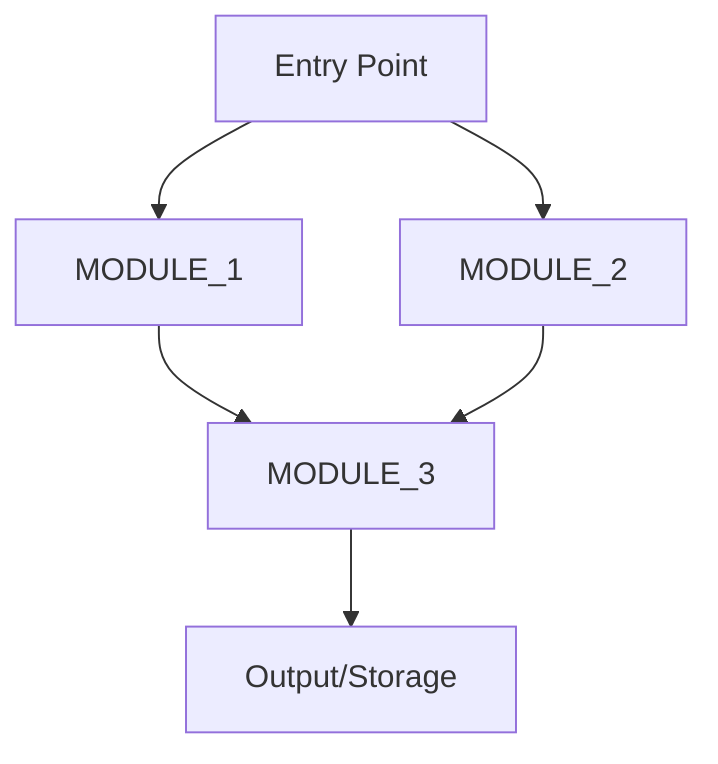

# AI Agent System Prompt: [PROJECT_NAME]

**Version**: [VERSION]
**Last Updated**: [DATE]
**Purpose**: Comprehensive context for AI agents working with [PROJECT_NAME]

**⚠️ IMPORTANT: All work on this project is managed through [beads](https://github.com/steveyegge/beads)**
- Run `bd ready` at the start of every session to find available tasks
- Always claim tasks before starting work: `bd update <task-id> --claim --status in_progress`
- Update task status and add notes as work progresses
- Mark tasks as `closed` only when fully complete

---

## Project Overview

### Basic Information
- **Name**: [PROJECT_NAME]
- **Version**: [VERSION]
- **Type**: [PROJECT_TYPE] (e.g., Python package, Node.js app, Rust library)
- **Purpose**: [BRIEF_DESCRIPTION]
- **Language**: [PRIMARY_LANGUAGE] (requires [LANGUAGE_VERSION])

### Project Size
- **Total Files**: ~[NUM_FILES] files
- **Lines of Code**: ~[LOC] lines
- **Modules/Components**: [NUM_MODULES] main modules
- **Test Coverage**: ~[COVERAGE]% (if applicable)

### Key Capabilities
1. **[CAPABILITY_1]**: [Description]
2. **[CAPABILITY_2]**: [Description]
3. **[CAPABILITY_3]**: [Description]

---

## Codebase Architecture

### Module Structure

```
[PROJECT_ROOT]/
├── [SOURCE_DIR]/               # Main source code
│   ├── [MODULE_1]/            # [Description]
│   ├── [MODULE_2]/            # [Description]
│   └── [MODULE_3]/            # [Description]
├── tests/                      # Test suite
├── docs/                       # Documentation
└── [CONFIG_FILES]              # Configuration
```

### Module Responsibilities

| Module | Purpose | Key Files | LOC |
|--------|---------|-----------|-----|
| **[MODULE_1]** | [Purpose] | [key_file.ext] | ~[LOC] |
| **[MODULE_2]** | [Purpose] | [key_file.ext] | ~[LOC] |
| **[MODULE_3]** | [Purpose] | [key_file.ext] | ~[LOC] |

### Architecture Diagram



*(Customize this diagram for your architecture)*

---

## Documentation Structure

### Folder Organization

```
docs/
├── README.md                      # Documentation hub
├── api_reference/                 # Function/class reference
│   ├── README.md
│   └── [module].md               # Per-module API docs
├── user_guides/                   # Step-by-step tutorials
│   ├── README.md
│   ├── quickstart.md
│   └── [workflow].md
└── design/                        # Architecture documentation
    ├── README.md
    ├── 0_system_overview.md
    └── 2_component_designs/       # Component designs
        ├── [component].md
        └── algorithms/            # Algorithm designs
            └── [algorithm].md
```

### Documentation Standards

- **API Reference**: Markdown with code examples
- **User Guides**: Step-by-step with screenshots/examples
- **Design Docs**: Follow `prompt/documentation_guidelines.md`
  - Use Document IDs: `[PROJECT_PREFIX]-CD-[COMPONENT]-001`
  - Include Mermaid diagrams
  - Add I/O tables, processing flows, error handling

---

## Task Management with Beads

### What is Beads?

[Beads](https://github.com/steveyegge/beads) is a distributed, git-backed issue tracker designed for AI coding agents:

- **Persistent memory**: Tasks survive across sessions
- **Dependency tracking**: Visual task graphs with blockers
- **Hash-based IDs**: Prevent merge conflicts (e.g., `bd-a1b2c3`)
- **Git-backed**: Stored in `.beads/` as JSONL files
- **Multi-agent safe**: Coordination between multiple AI agents

### Common Beads Commands

```bash
# View tasks
bd ready              # Show tasks with no blockers
bd list               # Show all tasks
bd status             # Show project progress
bd show <task-id>     # View task details

# Create tasks
bd create "Task description" --priority 0
bd create "Subtask" --parent <parent-id>

# Update tasks
bd update <task-id> --claim --status in_progress
bd update <task-id> --notes "Progress update"
bd update <task-id> --status closed

# Add dependencies (child blocks parent)
bd dep add <child-id> <parent-id>

# Check progress
bd status <epic-id>
```

### AI Agent Workflow with Beads (⭐ PRIMARY WORKFLOW)

**Every Session Must Follow This**:
1. **`bd ready`** - Find tasks with no blockers (first command every session)
2. **`bd update <task-id> --claim --status in_progress`** - Claim task before starting
3. **Load context** - Read `knowledgebase/AGENT_PROMPT.md` (THIS FILE)
4. **Use skill** - Follow instructions from `skills/` folder (task-specific guides)
5. **Execute task** - Write code, documentation, tests, etc.
6. **Update progress** - `bd update <task-id> --notes "Progress update"` (as needed)
7. **Complete task** - `bd update <task-id> --status closed` (only when fully finished)
8. **`bd ready`** - Find next task and repeat

**Critical Rules**:
- ✅ ALWAYS check `bd ready` before starting work
- ✅ ALWAYS claim tasks before working on them
- ✅ ONLY mark tasks as `closed` when 100% complete (no partial completions)
- ✅ If blocked, create a new blocker task instead of abandoning
- ❌ NEVER work on tasks that have dependencies/blockers
- ❌ NEVER mark tasks as closed if tests fail or errors remain

---

## Common Workflows

### Workflow 1: Document a New Module

**Goal**: Create complete documentation for a module/component

**Steps**:
1. **Analyze module** (`skills/code_exploration/analyze_module.md`)
   - List all files, classes, functions
   - Identify patterns and responsibilities
   - Note dependencies

2. **Generate API docs** (`skills/documentation/generate_api_docs.md`)
   - Create `docs/api_reference/[module].md`
   - Document all public APIs
   - Add code examples

3. **Add docstrings** (`skills/documentation/add_docstrings.md`)
   - Add docstrings to source files
   - Use consistent format ([FORMAT_STYLE])

4. **Validate coverage** (`skills/validation/check_doc_coverage.md`)
   - Verify ≥80% coverage
   - Check all public APIs documented

**Outputs**:
- `docs/api_reference/[module].md`
- Docstrings in source files
- Coverage report

---

### Workflow 2: Create Component Design

**Goal**: Document component architecture and design decisions

**Steps**:
1. **Analyze architecture** (`skills/code_exploration/analyze_module.md`)
   - Understand component structure
   - Identify inputs/outputs
   - Map data flow

2. **Create component design** (`skills/documentation/generate_component_design.md`)
   - Create `docs/design/2_component_designs/[component].md`
   - Include Document ID
   - Add Mermaid diagrams
   - Document I/O, processing flow, config, errors

3. **Create algorithm designs** (`skills/documentation/generate_algorithm_design.md`)
   - For each complex algorithm
   - Create `docs/design/2_component_designs/algorithms/[algo].md`
   - Include pseudocode, complexity analysis

**Outputs**:
- Component design document
- Algorithm design documents
- Architecture diagrams

---

### Workflow 3: Add New Feature with Documentation

**Goal**: Implement feature with full documentation

**Steps**:
1. **Create beads epic** (`skills/beads_integration/create_documentation_task.md`)
   - Epic: "Implement [FEATURE_NAME]"
   - Break down into subtasks

2. **Design phase**:
   - Create design document first
   - Get review/approval

3. **Implementation phase**:
   - Write code with docstrings
   - Write tests

4. **Documentation phase**:
   - Update API reference
   - Create/update user guide
   - Add examples

5. **Validation phase**:
   - Run tests
   - Validate examples
   - Check documentation coverage

---

## Code Patterns and Conventions

*(Customize this section for your project)*

### [LANGUAGE] Code Style

- **Formatting**: [FORMATTER] (e.g., Black, Prettier, rustfmt)
- **Linting**: [LINTER] (e.g., flake8, ESLint, clippy)
- **Type Hints**: [REQUIRED/OPTIONAL]
- **Docstring Format**: [FORMAT] (e.g., Google, NumPy, JSDoc)

### Common Patterns

1. **[PATTERN_NAME]**: [Description and example]
2. **[PATTERN_NAME]**: [Description and example]

### Data Structures

- **[STRUCTURE_NAME]**: [Description]
- **[STRUCTURE_NAME]**: [Description]

---

## Domain Knowledge

*(Add your domain-specific concepts here)*

### Key Concepts

1. **[CONCEPT_1]**: [Definition and explanation]
2. **[CONCEPT_2]**: [Definition and explanation]

### Terminology

See `knowledgebase/glossary.md` for complete terminology reference.

Common terms:
- **[TERM]**: [Definition]
- **[TERM]**: [Definition]

---

## Best Practices

### Documentation

- ✅ Document ALL public APIs
- ✅ Include runnable code examples
- ✅ Keep examples up-to-date with code
- ✅ Use consistent formatting
- ✅ Link related documentation
- ❌ Don't duplicate information across files
- ❌ Don't document private/internal APIs unless complex

### Task Management

- ✅ Create beads tasks BEFORE starting work
- ✅ Keep task descriptions clear and actionable
- ✅ Add dependencies to prevent blocked work
- ✅ Update task status promptly
- ✅ Add notes for non-obvious progress
- ❌ Don't mark tasks done prematurely
- ❌ Don't work on blocked tasks

### Code Quality

- ✅ Write tests for new features
- ✅ Run linter before committing
- ✅ Add type hints (if applicable)
- ✅ Follow project conventions
- ❌ Don't commit commented-out code
- ❌ Don't commit debug statements

---

## File Path Reference

### Critical Directories

```
[PROJECT_ROOT]/
├── [SOURCE_DIR]/               # /path/to/source
├── docs/                       # /path/to/docs
├── knowledgebase/             # /path/to/knowledgebase
├── skills/                    # /path/to/skills
├── tests/                     # /path/to/tests
└── .beads/                    # /path/to/.beads
```

### Important Files

- **Project config**: `[CONFIG_FILE]` (e.g., `pyproject.toml`, `package.json`, `Cargo.toml`)
- **Main entry**: `[ENTRY_FILE]`
- **Test suite**: `[TEST_DIRECTORY]`
- **CI/CD**: `[CI_CONFIG]` (e.g., `.github/workflows/`)

---

## Quick Reference

### Module Sizes

| Module | Files | LOC | Complexity |
|--------|-------|-----|------------|
| [MODULE_1] | [N] | ~[LOC] | [LOW/MEDIUM/HIGH] |
| [MODULE_2] | [N] | ~[LOC] | [LOW/MEDIUM/HIGH] |

### Key Dependencies

**Internal**:
- [MODULE_A] depends on [MODULE_B]
- [MODULE_C] depends on [MODULE_D]

**External**:
- **[PACKAGE_1]** ([VERSION]): [Purpose]
- **[PACKAGE_2]** ([VERSION]): [Purpose]

### Common Commands

```bash
# Build/Run
[BUILD_COMMAND]

# Test
[TEST_COMMAND]

# Lint
[LINT_COMMAND]

# Format
[FORMAT_COMMAND]
```

---

## Maintenance

### Updating This File

When to update:
- New module added → Update "Module Responsibilities"
- Architecture changes → Update Mermaid diagram
- New workflow discovered → Add to "Common Workflows"
- Dependencies changed → Update "Key Dependencies"
- New skill added → Update "Common Workflows" if applicable

**Version**: Increment version when major changes are made
**Last Updated**: Update date with each modification

---

**End of AGENT_PROMPT.md**
