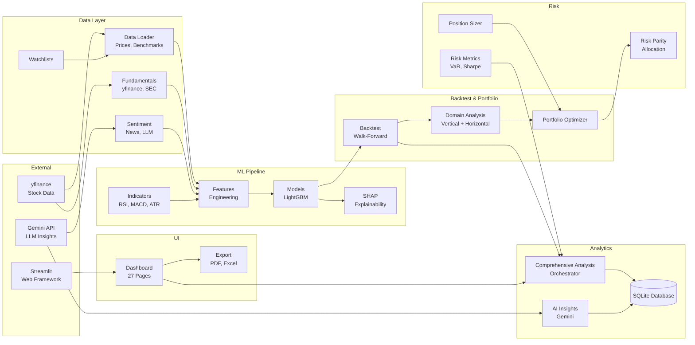

# Module Summaries - midterm_stock_planner

**Purpose**: Quick reference for module responsibilities and capabilities

**Last Updated**: 2026-03-15
**Version**: 3.11.2

---

## Overview

midterm_stock_planner is a stock ranking and portfolio optimization system organised into 19 main modules:

```
midterm-stock-planner/
├── src/
│   ├── app/                       # Web dashboard, CLI, UI (22,578 LOC)
│   ├── analytics/                 # Analysis engine, database, AI (11,632 LOC)
│   ├── analysis/                  # Domain analysis, portfolio optimization (2,995 LOC)
│   ├── sentiment/                 # Multi-source sentiment analysis (2,517 LOC)
│   ├── risk/                      # Risk metrics, parity, sizing (1,977 LOC)
│   ├── fundamental/               # Fundamental data fetching (1,487 LOC)
│   ├── regression/                # Feature regression testing (~2,000 LOC)
│   ├── backtest/                  # Walk-forward backtesting (~1,200 LOC)
│   ├── features/                  # Feature engineering (~1,100 LOC)
│   ├── visualization/             # Chart generation (684 LOC)
│   ├── validation/                # Data and portfolio safeguards (605 LOC)
│   ├── exceptions/                # Custom exception hierarchy (605 LOC)
│   ├── data/                      # Data loading and watchlists (545 LOC)
│   ├── config/                    # Configuration management (522 LOC)
│   ├── indicators/                # Technical indicators (449 LOC)
│   ├── explain/                   # SHAP explainability (445 LOC)
│   ├── models/                    # ML training and prediction (437 LOC)
│   └── strategies/                # Trading strategies (436 LOC)
├── scripts/                       # 55 utility scripts
├── tests/                         # 19 test files, 208+ tests
├── config/                        # config.yaml, watchlists.yaml
├── data/                          # analysis.db, benchmark.csv, sectors.json
└── output/                        # Per-run output folders
```

---

## Module Details

### App (Web Dashboard & CLI)

**Path**: `src/app/`
**Files**: 64 files (~22,578 lines)
**Purpose**: Streamlit-based web dashboard with 27 pages, CLI interface, data management, export functionality, and UI components.

**Key Components**:

#### app.py (125 LOC)
Main Streamlit entry point with page routing and session state management.

#### cli.py
Command-line interface for running backtests, scoring stocks, and generating reports without the dashboard.

#### dashboard.py (1,155 LOC)
Dashboard data loading and management layer. Handles run loading, score caching, and data transformations for the UI.

#### config.py (1,194 LOC)
Dashboard configuration including custom CSS, theme settings, navigation structure, and page definitions.

#### export.py (410 LOC)
Export functionality for PDF (via reportlab) and Excel (via openpyxl) reports. Generates professional multi-section reports.

#### Dashboard Pages (27 files, ~12,394 LOC)
- **Analysis**: overview, run_analysis, comprehensive_analysis, ai_insights, analysis_runs
- **Portfolio**: portfolio_analysis, portfolio_builder, purchase_triggers
- **Monitoring**: stock_explorer, watchlist_manager, realtime_monitoring
- **Reports**: reports, report_templates, alert_management
- **Advanced**: advanced_comparison, compare_runs, monte_carlo, event_analysis
- **Specialized**: earnings_calendar, tax_optimization, turnover_analysis
- **Admin**: fundamentals_status, performance_monitoring, data_quality, settings
- **Utility**: documentation, notifications

#### Dashboard Components (18 files)
UI building blocks: cards, charts, tables, metrics, loading indicators, lazy charts, tooltips, keyboard shortcuts, search, notifications, error handling.

#### Dashboard Utils (6 files)
- `cache.py`: Query result caching with TTL
- `retry.py`: Retry logic with exponential backoff
- `parallel.py`: Parallel processing and performance monitoring
- `data_validation.py`: Data quality checking

**Dependencies**:
- Internal: analytics, analysis, risk, data
- External: streamlit, plotly, reportlab, openpyxl

---

### Analytics (Analysis Engine)

**Path**: `src/analytics/`
**Files**: 29 files (~11,632 lines)
**Purpose**: Core analysis engine providing comprehensive portfolio analytics, database storage, AI-powered insights, and report generation.

**Key Components**:

#### ComprehensiveAnalysisRunner (comprehensive_analysis.py)
Orchestrates all analysis modules in a single run. Runs performance attribution, benchmark comparison, factor exposure, style analysis, rebalancing analysis, and more.

#### AnalysisService (analysis_service.py — 371 LOC)
Database service for saving/retrieving analysis results. Provides unified interface for all analysis types.

#### AIInsightsGenerator (ai_insights.py — 1,075 LOC)
LLM-based portfolio insights using Google Gemini API:
- Executive summary generation
- Sector analysis and rotation guidance
- Top picks analysis with explanations
- Risk assessment and warnings
- Actionable investment recommendations

#### RunManager (manager.py — 358 LOC)
Manages analysis runs: creation, listing, comparison, lifecycle management.

#### Database (database.py — 742 LOC)
SQLite database layer with SQLAlchemy ORM. Tables: runs, stock_scores, trades, portfolio_snapshots, analysis_results, ai_insights, recommendations.

#### Analysis Modules
- `performance_attribution.py` (256 LOC) — Factor, sector, selection, timing decomposition
- `benchmark_comparison.py` (213 LOC) — Alpha, beta, tracking error vs SPY/QQQ
- `factor_exposure.py` (202 LOC) — Market, size, value, momentum, quality, low vol
- `monte_carlo.py` (281 LOC) — Simulation with VaR/CVaR at multiple confidence levels
- `tax_optimization.py` (393 LOC) — Tax-loss harvesting, wash sale detection
- `turnover_analysis.py` (347 LOC) — Turnover, churn rate, holding periods
- `event_analysis.py` (270 LOC) — Performance around Fed meetings, macro events
- `earnings_calendar.py` (339 LOC) — Earnings date tracking, exposure analysis
- `realtime_monitoring.py` (310 LOC) — Portfolio alerts (drawdown, price, volume)
- `alert_system.py` (427 LOC) — Alert configuration, notification management
- `style_analysis.py` (153 LOC) — Growth vs value, large vs small cap
- `rebalancing_analysis.py` (123 LOC) — Drift, optimal rebalance frequency

**Dependencies**:
- Internal: data, models, risk, features
- External: pandas, numpy, scipy, sqlalchemy, google-generativeai

---

### Analysis (Domain Analysis & Portfolio Optimization)

**Path**: `src/analysis/`
**Files**: 4 files (~2,995 lines)
**Purpose**: Higher-level stock analysis combining vertical (within-sector) and horizontal (cross-sector) ranking, personalized portfolio construction, and AI-generated commentary.

**Key Components**:

#### DomainAnalyzer (domain_analysis.py)
Two-stage stock analysis:
- **Vertical**: Within-sector ranking using domain scores with configurable weights
- **Horizontal**: Cross-sector allocation with sector constraints and risk optimization
- Outputs: ranked candidates per sector, optimized portfolio weights

#### PortfolioOptimizer (portfolio_optimizer.py)
Personalized portfolio construction:
- `InvestorProfile` dataclass with 12+ configurable parameters
- Risk tolerance profiles: conservative (8% return), moderate (12%), aggressive (18%)
- Sector constraints, position limits, style preferences
- `get_preset_profile()` for quick configuration

#### GeminiCommentary (gemini_commentary.py)
AI-generated portfolio analysis using Google Generative AI:
- Multi-profile recommendations
- Expected return and risk assessment per profile
- Model fallback list for API reliability

**Dependencies**:
- Internal: backtest, risk, data
- External: pandas, numpy, google-generativeai

---

### Sentiment Analysis

**Path**: `src/sentiment/`
**Files**: 11 files (~2,517 lines)
**Purpose**: Multi-source sentiment analysis using NLP, LLM processing, and news aggregation to generate per-ticker daily sentiment features.

**Key Components**:

#### SentimentModel (model.py — 495 LOC)
Core sentiment classification engine. Classifies text into sentiment categories with confidence scores.

#### MultiSourceAnalyzer (multi_source.py — 397 LOC)
Aggregates sentiment from multiple data sources (news, social media, analyst reports).

#### LLMAnalyzer (llm_analyzer.py — 294 LOC)
Google Gemini-based sentiment analysis for deeper contextual understanding of financial news.

#### Aggregator (aggregator.py — 331 LOC)
Aggregates per-article sentiment to daily per-ticker sentiment scores:
- `align_to_trading_dates()` — Maps news timestamps to trading days
- `aggregate_daily_sentiment()` — Daily aggregation
- Rolling window sentiment features for ML model input

#### NewsLoader (news_loader.py — 368 LOC)
Loads and preprocesses news data from various sources.

**Dependencies**:
- Internal: data
- External: google-generativeai, pandas

---

### Risk Management

**Path**: `src/risk/`
**Files**: 5 files (~1,977 lines)
**Purpose**: Comprehensive risk analysis, portfolio risk metrics, position sizing, and risk parity allocation.

**Key Components**:

#### RiskMetrics (metrics.py — 374 LOC)
Core risk calculations:
- Sharpe ratio, Sortino ratio
- Maximum drawdown (depth and duration)
- Value at Risk (VaR) at configurable confidence levels
- Conditional VaR (Expected Shortfall)
- Calmar ratio, information ratio

#### PortfolioAnalyzer (portfolio_analyzer.py — 397 LOC)
Portfolio-level risk analysis:
- Concentration metrics (HHI, Effective N)
- Beta exposure analysis (Low/Med/High breakdown)
- Risk tilt classification
- Correlation analysis

#### PositionSizer (position_sizer.py — 339 LOC)
Position sizing methods:
- Equal weight
- Volatility-weighted
- Score-weighted
- Kelly criterion
- ATR-based

#### RiskParityAllocator (risk_parity.py — 843 LOC)
Risk parity portfolio construction:
- Inverse volatility weighting
- Full risk parity with equal risk contribution
- Vol-capped sizing
- Beta-adjusted allocation
- Sector constraints

**Dependencies**:
- Internal: data
- External: pandas, numpy, scipy

---

### Fundamental Data

**Path**: `src/fundamental/`
**Files**: 5 files (~1,487 lines)
**Purpose**: Fundamental data fetching from multiple sources with aggregation.

**Key Components**:

#### FundamentalDataFetcher (fetcher.py — 445 LOC)
Base fetcher using yfinance for PE, PB, ROE, margins, market cap, dividend yield.

#### MultiSourceFundamentalsFetcher (multi_source.py — 419 LOC)
Aggregates data from multiple providers with parallel download support (configurable max_workers).

#### SECFilingsDownloader & SECFilingParser (sec_filings.py — 505 LOC)
SEC EDGAR filing download and parsing for quarterly/annual reports.

**Dependencies**:
- Internal: None (foundational module)
- External: yfinance, requests, pandas

---

### Backtesting Engine

**Path**: `src/backtest/`
**Files**: 3 files (~1,200 lines)
**Purpose**: Walk-forward backtesting with realistic transaction costs, 4h rebalancing, multiprocessing, and comprehensive performance tracking including per-window feature importance.

**Key Components**:

#### RollingWalkForwardBacktest (rolling.py)
Core backtest implementation:
- Rolling train/test window management (265 windows, 7d step, 3yr train, 6mo test)
- 11-core multiprocessing with copy-on-write data sharing (`_MP_SHARED`)
- Model training per window (LightGBM with silent logger)
- Stock ranking and selection (top_n / top_pct)
- Position sizing and rebalancing (4h frequency)
- Transaction cost modelling
- Per-window IC and Rank IC computation
- **Tier 1 Multi-Method Feature Importance** (per-window):
  1. LightGBM gain-based importance (free)
  2. Marginal IC per feature via Spearman correlation (free, model-free)
  3. Optional TreeSHAP on test sets (`compute_shap=True`, ~15 min)
- Aggregated importance mean/std in BacktestResults.metrics
- Overfitting detection (train/test Sharpe ratio)
- Portfolio return normalization for overlapping windows

#### BacktestResults
Result bundle containing returns, positions, trades, metrics, window results, and feature importance.

**Dependencies**:
- Internal: features, models, data, risk
- External: pandas, numpy, lightgbm, shap (optional)

---

### Feature Regression Testing

**Path**: `src/regression/`
**Files**: 7 files (~2,000 lines)
**Purpose**: Systematic feature evaluation framework — adds features one-by-one to a baseline, measures marginal contribution with statistical significance, and tunes parameters via Bayesian optimization.

**Key Components**:

#### RegressionOrchestrator (orchestrator.py)
Runs sequential feature addition tests:
- Baseline → +feature1 → +feature2 → ... → model tuning
- Per-step: tune params → run walk-forward backtest → compute metrics → significance test → log
- Reads feature importance directly from BacktestResults (multi-method)

#### FeatureRegistry (feature_registry.py)
Registry of 14 feature specs (returns, volatility, volume, valuation, RSI, MACD, Bollinger, ATR, ADX, OBV, gap, momentum, mean_reversion, sentiment) with column resolution.

#### Metrics (metrics.py)
- METRICS_REGISTRY with PRIMARY/SECONDARY/GUARD classification
- `compute_extended_metrics()` — full metric computation
- `compute_marginal_significance()` — paired t-tests, bootstrap CIs, Diebold-Mariano test
- `compute_feature_contribution()` — marginal Sharpe, IC, importance pct

#### FeatureParamTuner / ModelParamTuner (tuning.py)
Bayesian optimization via skopt (gp_minimize with Expected Improvement). Per-feature param search + model hyperparameter tuning.

#### RegressionReporter (reporting.py)
JSON/Markdown/CSV report generation with feature leaderboard and guard metric status.

#### Database (database.py)
SQLite storage: `regression_tests`, `regression_steps`, `feature_contributions` tables.

**Dependencies**:
- Internal: backtest, features, config, models
- External: pandas, numpy, scipy, scikit-optimize

---

### Feature Engineering

**Path**: `src/features/`
**Files**: 4 files (~1,100 lines)
**Purpose**: Compute features for ML model training from price, fundamental, sentiment, and cross-asset data.

**Key Components**:
- `engineering.py` — Core features (returns, volatility, volume, valuation), sentiment merge, `compute_features_selective()` for regression testing
- `gap_features.py` — Overnight/gap features (QuantaAlpha-inspired): overnight_gap_pct, gap_vs_true_range, gap_acceptance_score, gap_acceptance_vol_weighted
- `cross_asset.py` — Cross-asset/macro features: gold/silver ratio z-score, DXY momentum, real yield proxy, NVDA peer momentum, sector breadth, QQQ relative strength

**Key Functions**:
- `compute_all_features()` — Technical and fundamental features
- `compute_all_features_extended()` — Includes gap, momentum, mean reversion features
- `add_gap_features()` — Gap/overnight features (robust under regime shifts)
- `get_feature_columns()` — Feature column management
- `make_training_dataset()` — Prepare training data with forward return labels

**Dependencies**:
- Internal: indicators, data
- External: pandas, numpy

---

### Technical Indicators

**Path**: `src/indicators/`
**Files**: 2 files (~449 lines)
**Purpose**: Technical indicator calculations for feature engineering.

**Indicators Implemented**:
- **Momentum**: RSI, MACD, Stochastic oscillator
- **Trend**: ADX, moving averages (SMA, EMA)
- **Volatility**: Bollinger Bands, ATR
- **Volume**: On-balance volume (OBV)
- Supports rolling window calculations

**Dependencies**:
- Internal: None (foundational module)
- External: pandas, numpy

---

### ML Models

**Path**: `src/models/`
**Files**: 3 files (~437 lines)
**Purpose**: Machine learning model training, prediction, and ranking.

**Key Components**:

#### trainer.py (232 LOC)
- `train_lgbm_regressor()` — LightGBM training with validation
- `ModelConfig` and `ModelMetadata` dataclasses
- Evaluation metrics: MSE, MAE, R-squared

#### predictor.py (205 LOC)
- Model loading and inference
- SHAP explanation generation
- Stock ranking by predicted score

**Dependencies**:
- Internal: features
- External: lightgbm, shap, scikit-learn

---

## Module Relationships



**Data Flow**:
1. Price/fundamental/sentiment data loaded from yfinance, SEC, news sources
2. Feature engineering computes technical indicators and ML features
3. LightGBM trained and predicts stock scores per walk-forward window
4. Backtest selects top stocks, applies position sizing, tracks returns
5. Domain analysis ranks within sectors, portfolio optimizer allocates cross-sector
6. Comprehensive analysis runs all analytics modules on backtest results
7. Results stored in SQLite database and displayed on Streamlit dashboard

---

## Quick Reference

| Module | Primary Responsibility | Key APIs | Complexity |
|--------|----------------------|----------|------------|
| app | Web dashboard, CLI, UI | Page routing, data loading | HIGH |
| analytics | Analysis engine, database | ComprehensiveAnalysisRunner, AnalysisService | HIGH |
| analysis | Domain analysis, optimization | DomainAnalyzer, PortfolioOptimizer | MEDIUM |
| sentiment | Sentiment scoring | SentimentModel, LLMAnalyzer | MEDIUM |
| risk | Risk metrics, allocation | RiskMetrics, RiskParityAllocator | MEDIUM |
| fundamental | Data fetching | MultiSourceFundamentalsFetcher | MEDIUM |
| backtest | Walk-forward backtest | run_walk_forward_backtest() | HIGH |
| regression | Feature regression testing | RegressionOrchestrator, FeatureRegistry | HIGH |
| features | Feature computation | compute_all_features(), cross_asset | MEDIUM |
| indicators | Technical indicators | RSI, MACD, ADX, ATR, Bollinger | LOW |
| models | ML training/prediction | train_lgbm_regressor(), Predictor | MEDIUM |
| visualization | Charts | ChartGenerator, PerformanceVisualizer | LOW |
| validation | Safeguards | Portfolio and data validation | LOW |

---

## Related Documentation

- **Full Context**: [AGENT_PROMPT.md](AGENT_PROMPT.md) — Comprehensive system prompt
- **Terminology**: [glossary.md](glossary.md) — Domain terminology
- **API Reference**: [../docs/api-documentation.md](../docs/api-documentation.md)
- **Design Documentation**: [../docs/design.md](../docs/design.md)
- **Project README**: [../README.md](../README.md) — Setup and usage instructions

---

**Last Updated**: 2026-03-15
**Version**: 3.11.2
