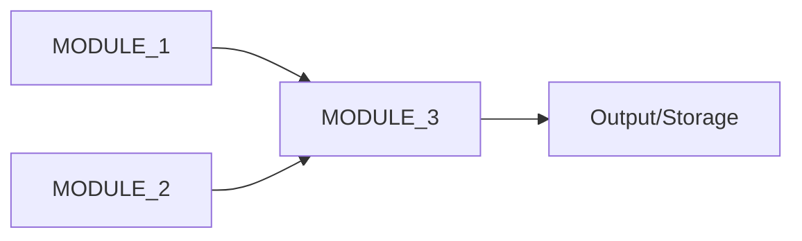

# Module Summaries - [PROJECT_NAME]

**Purpose**: Quick reference for module responsibilities and capabilities

**Last Updated**: [DATE]

---

## Overview

[PROJECT_NAME] consists of [NUM_MODULES] main modules organized by functional responsibility:

```
[PROJECT_ROOT]/[SOURCE_DIR]/
├── [module_1]/        # [One-line description]
├── [module_2]/        # [One-line description]
├── [module_3]/        # [One-line description]
└── [module_n]/        # [One-line description]
```

---

## Module Details

### [MODULE_1]
**Path**: `[SOURCE_DIR]/[module_1]/`
**Files**: [N] files (~[LOC] lines)
**Purpose**: [Detailed purpose description]

**Key Components**:
- **[Component/Class A]**: [What it does]
- **[Component/Class B]**: [What it does]
- **[Component/Class C]**: [What it does]

**Main Functions**:
1. `[function_name]()` - [Description]
2. `[function_name]()` - [Description]

**Dependencies**:
- Internal: [module_x], [module_y]
- External: [package_a], [package_b]

**Documentation**: [Link to API reference doc]

---

### [MODULE_2]
**Path**: `[SOURCE_DIR]/[module_2]/`
**Files**: [N] files (~[LOC] lines)
**Purpose**: [Detailed purpose description]

**Key Components**:
- **[Component/Class A]**: [What it does]
- **[Component/Class B]**: [What it does]

**Main Functions**:
1. `[function_name]()` - [Description]
2. `[function_name]()` - [Description]

**Dependencies**:
- Internal: None (base module)
- External: [package_a], [package_b]

**Documentation**: [Link to API reference doc]

---

### [MODULE_3]
**Path**: `[SOURCE_DIR]/[module_3]/`
**Files**: [N] files (~[LOC] lines)
**Purpose**: [Detailed purpose description]

**Key Components**:
- **[Component/Class A]**: [What it does]

**Main Functions**:
1. `[function_name]()` - [Description]
2. `[function_name]()` - [Description]

**Dependencies**:
- Internal: [module_1], [module_2]
- External: [package_a]

**Documentation**: [Link to API reference doc]

---

## Module Relationships



**Data Flow**:
1. [MODULE_1] provides [data/functionality]
2. [MODULE_2] processes [data type]
3. [MODULE_3] combines and outputs [result]

---

## Quick Reference

| Module | Primary Responsibility | Key APIs | Complexity |
|--------|----------------------|----------|------------|
| [MODULE_1] | [Responsibility] | [API count] | [LOW/MED/HIGH] |
| [MODULE_2] | [Responsibility] | [API count] | [LOW/MED/HIGH] |
| [MODULE_3] | [Responsibility] | [API count] | [LOW/MED/HIGH] |

---

## Common Usage Patterns

### Pattern 1: [COMMON_TASK]
```[language]
from [project].[module] import [Component]

# [Example code showing common usage]
result = Component.method(params)
```

### Pattern 2: [COMMON_TASK]
```[language]
# [Example code]
```

---

## Related Documentation

- **API Reference**: [Link to full API documentation]
- **User Guides**: [Link to user guides]
- **Design Documentation**: [Link to architecture docs]
- **Examples**: [Link to example code]

---

**Last Updated**: [DATE]
**Version**: [VERSION]
