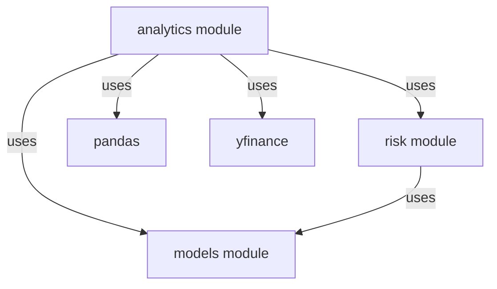
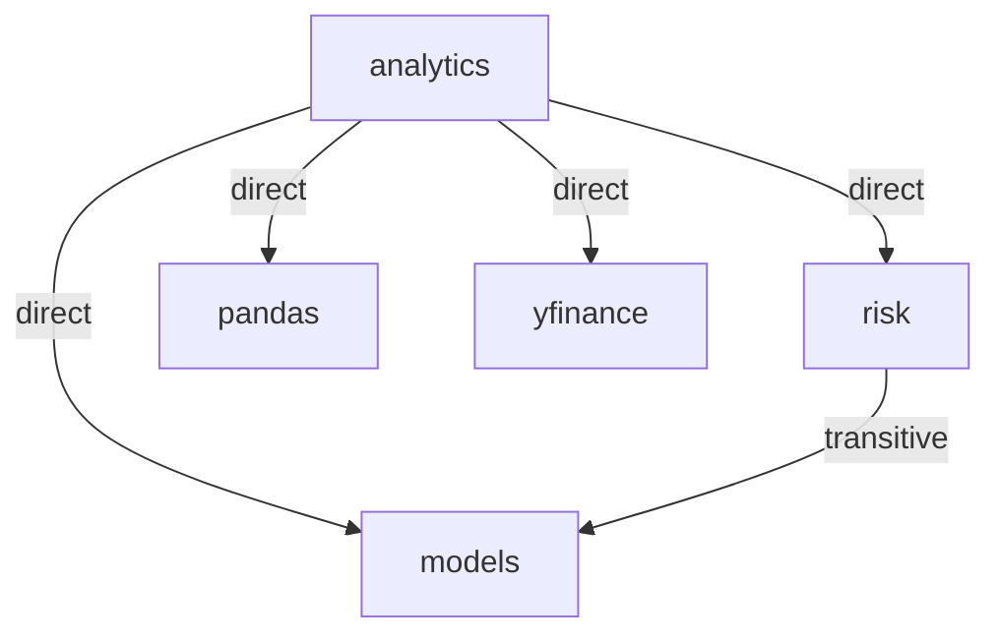
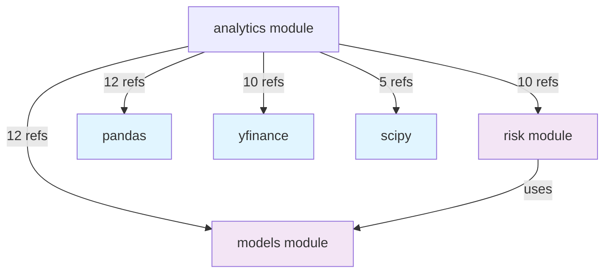
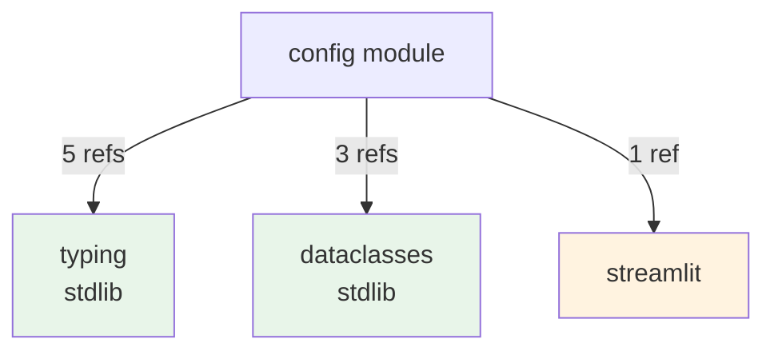

# Skill: Find Dependencies

**Purpose**: Map dependencies between modules and identify external package requirements to understand the project's dependency graph and detect potential circular dependencies.

**Category**: code_exploration

---

## Prerequisites

- Familiarity with Python import statements
- Access to the midterm_stock_planner codebase
- Read [`../../knowledgebase/AGENT_PROMPT.md`](../../knowledgebase/AGENT_PROMPT.md) for project context
- Understanding of internal module structure (see [analyze_module.md](analyze_module.md))

---

## Inputs

### Required
- **module_path**: Absolute path to module directory (e.g., `/Users/antiwong/Documents/code/my_code/stock_all/midterm-stock-planner/src/midterm_stock_planner/analytics/`)
- **module_name**: Name of the module being analyzed (e.g., `analytics`, `backtest`, `risk`, `models`)

### Optional
- **include_external**: Include external package dependencies (default: `true`)
- **detect_circular**: Detect circular dependencies (default: `true`)
- **output_format**: Format for dependency graph (default: `mermaid`)
  - `mermaid`: Mermaid diagram format
  - `list`: Simple list format
  - `json`: JSON structure format

---

## Process

### Step 1: Extract Import Statements

List all Python files in the module and extract import statements.

**Using Glob tool**:
```
Pattern: <module_path>/**/*.py
```

**For each file, identify imports**:
- Read the first 50-100 lines of each file to capture import statements
- Look for both `import` and `from ... import` statements
- Note the line number where imports occur (typically top of file)

**Take Note Of**:
- Total file count
- Total import count
- Distribution of imports per file

---

### Step 2: Categorize Dependencies

Classify each import as:

#### Internal Dependencies (within project)
- **Same package**: `from .module import Class` or `from . import module`
  - Pattern: Starts with `.` or relative imports
  - Example: `from .ranking import RankingEngine` (in models package)

- **Other modules**: `from midterm_stock_planner.module import Class` or direct imports
  - Pattern: Starts with `midterm_stock_planner`
  - Example: `from midterm_stock_planner.models import StockRanker` (in analytics module)

#### External Dependencies (third-party libraries)
- Standard library: `import os`, `import json`, etc.
  - Pattern: No dots, not `midterm_stock_planner`
  - Examples: `os`, `sys`, `json`, `dataclasses`

- Third-party: `import pandas`, `from yfinance import ...`
  - Pattern: Installed packages
  - Examples: `pandas`, `lightgbm`, `yfinance`, `streamlit`

**Create a categorized list**:
```
Module: analytics

Internal Dependencies:
  - models (from midterm_stock_planner.models import StockRanker)
  - risk (from midterm_stock_planner.risk import RiskManager)

External Dependencies (Third-party):
  - pandas (import pandas as pd)
  - yfinance (from yfinance import download)
  - lightgbm (from lightgbm import LGBMRegressor)

External Dependencies (Standard library):
  - math
  - typing
```

---

### Step 3: Analyze Import Depth

For each internal dependency, determine if it's:
- **Direct**: Directly imported in current module
- **Indirect**: Used by other modules that this module depends on

**Document the depth**:
```
analytics dependencies:
├─ models (direct)
├─ risk (direct)
│  └─ models (indirect - used by risk)
└─ yfinance (external)
```

---

### Step 4: Build Dependency Graph

Create a visual representation of dependencies.

**Using Mermaid format**:


**Key elements**:
- Boxes for modules
- Arrows for dependencies
- Different colors for internal vs external
- Edge labels showing type (uses, extends, imports)

---

### Step 5: Detect Circular Dependencies

Check for circular dependencies that could cause import issues.

**Search for cycles**:
1. For each internal dependency, trace what it depends on
2. If a module depends (directly or indirectly) on a module that depends on it, there's a cycle
3. Document each cycle found

**Example of circular dependency**:
```
Module A imports Module B
Module B imports from Module A
→ Circular dependency detected
```

**Common patterns**:
- Bidirectional imports (A <-> B)
- Cycles through multiple modules (A -> B -> C -> A)
- Module importing from its own subpackage through parent

**Take Note Of**:
- Cycles through `__init__.py` files
- Lazy imports (imports inside functions) that break cycles
- Conditional imports

---

### Step 6: Count and Summarize

Create a dependency summary table.

**Dependency Count**:
```
Module: analytics

Total Imports: 45
Internal Dependencies: 2 modules
External Dependencies: 4 packages
Circular Dependencies: 0

Internal Breakdown:
- models: 8 imports
- risk: 6 imports

External Breakdown:
- pandas: 12 imports
- yfinance: 10 imports
- lightgbm: 8 imports
- dataclasses: 1 import (stdlib)
```

**Metrics**:
- **Fan-in**: How many modules depend on this module
- **Fan-out**: How many modules this module depends on
- **Coupling**: Total internal dependency count

---

### Step 7: Create Dependency Map

Generate a structured dependency map for the module.

**Dependency Map Template**:
```markdown
# Dependency Map: [module_name]

## Overview
- **Total Imports**: [Count]
- **Internal Dependencies**: [Count] modules
- **External Dependencies**: [Count] packages
- **Circular Dependencies**: [Count] cycles

## Internal Dependencies
### Direct Dependencies
- **models**: [X files import, Y total references]
  - Used in: [Files]
  - Purpose: [Why is it needed]

- **risk**: [X files import, Y total references]
  - Used in: [Files]
  - Purpose: [Why is it needed]

### Dependency Depth
```
module
├─ models (imported by X files)
├─ risk (imported by Y files)
│  └─ models (transitive)
└─ backtest (imported by Z files)
```

## External Dependencies
### Third-Party Packages
- **pandas** [usage count]
  - For: Data manipulation, DataFrame handling
  - Files: [List files]

- **yfinance** [usage count]
  - For: Stock data retrieval, market data access
  - Files: [List files]

- **lightgbm** [usage count]
  - For: Machine learning model training and prediction
  - Files: [List files]

### Standard Library
- **typing** [usage count]
  - For: Type hints
- **math** [usage count]
  - For: Mathematical operations

## Circular Dependencies
[None detected] or [List cycles if found]

## Dependency Graph


## Critical Dependencies
- **High impact**: [Dependencies used by many modules]
- **Must-have**: [Core dependencies that must be installed]

## Optional Dependencies
- [Dependencies used for specific features]

## Notes
- [Any import order requirements]
- [Lazy imports or conditional imports noted]
- [Version compatibility notes]
```

---

## Outputs

### Primary
- **Dependency Map**: Structured dependency document for the module
- **Dependency Graph**: Mermaid diagram showing module relationships
- **Circular Dependency Report**: List of any cycles detected

### Secondary
- **Dependency Summary**: Count and categorization of all imports
- **Import Inventory**: Detailed list of all imports by file
- **External Package List**: Requirements for setup.py/pyproject.toml

---

## Examples

### Example 1: Find Dependencies for analytics Module

**Input**:
- module_path: `/Users/antiwong/Documents/code/my_code/stock_all/midterm-stock-planner/src/midterm_stock_planner/analytics/`
- module_name: `analytics`
- include_external: `true`
- detect_circular: `true`

**Process**:
1. List files: `returns.py`, `ranking.py`, `sector_analysis.py`, ... (7 files)
2. Extract imports from each file
3. Categorize:
   - Internal: models, risk
   - External: pandas, numpy, scipy, lightgbm
4. Analyze usage:
   - models: Used in 4 files for StockRanker, FeatureEngine
   - risk: Used in 5 files for RiskManager queries
   - pandas: Used in 5 files for DataFrame operations
   - yfinance: Used in 6 files for market data
   - scipy: Used in 2 files for statistical operations
5. Check for cycles: None found
6. Create graph and summary

**Output**:
```markdown
# Dependency Map: analytics

## Overview
- **Total Imports**: 38
- **Internal Dependencies**: 2 modules (models, risk)
- **External Dependencies**: 4 packages (pandas, yfinance, scipy, lightgbm)
- **Circular Dependencies**: 0

## Internal Dependencies

### Direct Dependencies
- **models**: 12 references across 4 files
  - Used in: returns.py, ranking.py, sector_analysis.py
  - Purpose: Core data structures (StockRanker, FeatureEngine, Portfolio)

- **risk**: 10 references across 5 files
  - Used in: ranking.py, sector_analysis.py, returns.py
  - Purpose: Risk assessment and position sizing (RiskManager, VaR, Drawdown)

### Dependency Depth
```
analytics
├─ models (no further deps)
└─ risk
   └─ models (shared internal dep)
```

## External Dependencies

### Third-Party Packages
- **pandas**: 12 references
  - For: Data manipulation, DataFrame operations, time series handling
  - Critical for: All data processing and analysis

- **yfinance**: 10 references
  - For: Stock price retrieval, market data access (Ticker, download)
  - Critical for: Data ingestion, price history lookups

- **scipy**: 5 references
  - For: Statistical functions (stats module), scientific computing
  - Used in: sector_analysis.py for efficient statistical calculations

- **lightgbm**: 3 references
  - For: Gradient boosting model training and prediction
  - Used in: ranking.py for stock ranking models

## Circular Dependencies
None detected.

## Dependency Graph


## Critical Dependencies
- **pandas**: Required for all data operations
- **yfinance**: Required for market data retrieval
- **models**: Core internal module with StockRanker, FeatureEngine classes
- **risk**: Required for risk assessment queries

## External Package Requirements
```
pandas>=1.5
yfinance>=0.2
scipy>=1.0
```

## Notes
- No circular dependencies detected
- All internal dependencies are direct and necessary
- scipy.stats is used only for statistical test optimization
- Consider scipy as optional dependency if stats functions can be replaced
```

---

### Example 2: Find Dependencies for config Module

**Input**:
- module_path: `/Users/antiwong/Documents/code/my_code/stock_all/midterm-stock-planner/src/midterm_stock_planner/config/`
- module_name: `config`
- include_external: `true`
- detect_circular: `true`

**Process**:
1. List files: `settings.py`, `constants.py`, `paths.py`, `logging_config.py`, ... (12 files)
2. Extract imports:
   - Internal: None (config is base module)
   - External: typing, dataclasses, pathlib (custom)
3. Analyze usage:
   - typing: 5 files (type hints)
   - dataclasses: 3 files (data classes)
4. Check for cycles: None (base module)

**Output**:
```markdown
# Dependency Map: config

## Overview
- **Total Imports**: 8
- **Internal Dependencies**: 0 modules
- **External Dependencies**: 2 packages
- **Circular Dependencies**: 0

## Internal Dependencies
None - config is a base module with no internal dependencies.

## External Dependencies

### Standard Library
- **typing**: 5 references
  - For: Type hints (List, Dict, Optional, Tuple, Union)
  - Files: settings.py, constants.py, paths.py, logging_config.py, defaults.py

- **dataclasses**: 3 references
  - For: Data class decorator (@dataclass)
  - Files: settings.py, defaults.py, paths.py

### Third-Party
- **streamlit**: 1 reference
  - For: UI configuration helpers (st.cache_data settings)
  - File: settings.py (used in dashboard config method)

## Circular Dependencies
None detected.

## Dependency Graph


## Critical Dependencies
- None (config is self-contained)

## Optional Dependencies
- **streamlit**: Only used for one dashboard configuration helper
  - Could be replaced with plain dict config if CLI-only usage is needed

## Notes
- No external dependencies on other midterm_stock_planner modules
- Minimal third-party dependencies (very portable)
- Good candidate for reuse in other projects
- typing imports are for development/IDE support only (no runtime impact)
```

---

## Validation

- [ ] All Python files in module identified
- [ ] All import statements extracted from each file
- [ ] Each import categorized as internal or external
- [ ] Internal imports categorized as same-package or cross-module
- [ ] External imports categorized as stdlib or third-party
- [ ] All imports with usage counts documented
- [ ] Dependency graph created (if applicable)
- [ ] Circular dependencies detected and documented
- [ ] Summary table created with total counts
- [ ] Dependency map created with all required sections
- [ ] No imports missed in the analysis

---

## Related Skills

### Prerequisites
- [`analyze_module.md`](analyze_module.md) - Understand module structure before mapping dependencies

### Follow-ups
- [`../documentation/generate_api_docs.md`](../documentation/generate_api_docs.md) - Use dependency info in API documentation
- [`../project_management/manage_queries.md`](../project_management/manage_queries.md) - Track dependencies in project queries
- Create requirements file based on external dependencies

### Alternatives
- [`trace_data_flow.md`](trace_data_flow.md) - Follow data flow rather than imports

---

**Last Updated**: 2026-02-20
**Version**: 1.1
