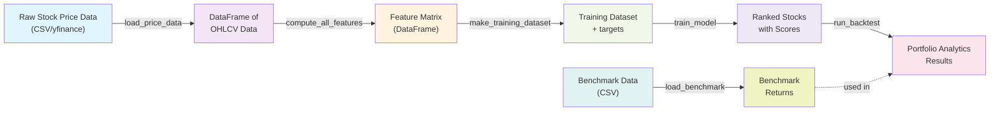

# Skill: Trace Data Flow

**Purpose**: Understand how data flows through the processing pipeline from input sources to final outputs, identifying all transformations and bottlenecks across multiple modules.

**Category**: code_exploration

---

## Prerequisites

- Familiarity with module structure (see [`analyze_module.md`](analyze_module.md))
- Understanding of data classes in the `config` module (AppConfig, InvestorProfile, BacktestConfig)
- Knowledge of processing pipeline architecture (data → features → models → backtest → analytics)
- Access to the midterm_stock_planner codebase

---

## Inputs

### Required
- **data_type**: Type of data to trace (e.g., `stock_prices`, `features`, `rankings`)
- **start_point**: Entry point module name (e.g., `data`)
- **end_point**: Exit point module name (e.g., `analytics`)

### Optional
- **focus_module**: Specific module to deep-dive (e.g., `features`)
- **include_branches**: Include alternate code paths (default: `false`)
- **output_format**: Output format (default: `mermaid`)
  - `mermaid`: Flow diagram
  - `text`: Text description
  - `both`: Both diagram and description

---

## Process

### Step 1: Identify Entry Points

Determine where data enters the system.

**For Stock Price Data Example**:
- Module: `data`
- Entry functions: `load_price_data()`, `load_fundamental_data()`
- Input format: Raw stock price data (CSV, Parquet, or yfinance API)
- Input structure: Tabular records with date, ticker, open, high, low, close, volume, etc.

**Process**:
1. Use Grep tool to find entry functions
   - Pattern: `def load_*`, `def fetch_*`, `def read_*`
2. Read entry function signatures
3. Document:
   - Function name and file location
   - Input parameters and types
   - Raw data structure

**Example Search**:
```bash
grep -r "^def load_" src/midterm_stock_planner/data/
grep -r "^def fetch_" src/midterm_stock_planner/data/
```

---

### Step 2: Trace Initial Processing

Follow data from entry point through first transformation.

**For Stock Price Data Example**:
- Module: `data`
- Processing steps:
  1. `load_price_data()` reads raw CSV/Parquet or fetches from yfinance
  2. Parses fields: date, ticker, open, high, low, close, volume, adj_close
  3. Validates data (e.g., check for missing dates, duplicate tickers)
  4. Creates intermediate DataFrame with MultiIndex (date, ticker)
  5. Returns structured OHLCV DataFrame

**Process**:
1. Read entry point function (first 50-100 lines)
2. Identify function calls within it
3. For each called function:
   - Determine what transformation it performs
   - What data structure it creates/modifies
   - Where the result goes
4. Document transformation steps in sequence

**Template**:
```
Entry Point: load_price_data(price_path)
├─ Step 1: Read and parse raw CSV/Parquet
│  └─ Output: raw DataFrame
├─ Step 2: Validate records (check missing dates, NaNs)
│  └─ Output: cleaned DataFrame
└─ Step 3: Set MultiIndex and sort
   └─ Output: DataFrame of OHLCV data (date × ticker)
```

---

### Step 3: Map Data Structure Transformations

Document how data is transformed as it moves between modules.

**For Stock Price Data Example**:
- **After data**: DataFrame of OHLCV data
  ```python
  DataFrame (MultiIndex: date × ticker):
                        open    high     low   close   volume   adj_close
  (2024-01-02, AAPL)  185.50  186.20  184.90  185.80  50123400  185.80
  (2024-01-02, MSFT)  375.10  376.80  374.50  376.00  22456700  376.00
  (2024-01-03, AAPL)  185.90  187.10  185.60  186.50  48765200  186.50
  ...
  ```

- **After features**: Feature matrix (DataFrame)
  ```python
  DataFrame (MultiIndex: date × ticker):
                        return_21d  return_63d  volatility_20d  rsi_14  macd  adx  volume_ratio  ...
  (2024-01-02, AAPL)    0.052       0.121       0.185          55.3    1.2   28.5  1.15          ...
  (2024-01-02, MSFT)    0.038       0.095       0.142          62.1    2.5   32.1  0.92          ...
  ...
  ```

- **After models**: Ranked stocks with scores
  ```python
  DataFrame (MultiIndex: date × ticker):
                        predicted_score  rank  percentile  target
  (2024-01-02, AAPL)    0.72            3     0.85        0.052
  (2024-01-02, MSFT)    0.68            5     0.75        0.038
  (2024-01-02, NVDA)    0.81            1     0.95        0.121
  ...
  ```

- **After analytics**: Portfolio analytics results
  ```python
  {
    "portfolio_metrics": {
      "total_return": 0.342,
      "annualized_return": 0.156,
      "sharpe_ratio": 1.24,
      "max_drawdown": -0.182,
      ...
    },
    "period_returns": pd.Series([0.02, -0.01, 0.03, ...]),
    "holdings_history": pd.DataFrame(...),
    "turnover_stats": {...}
  }
  ```

**Process**:
1. For each module in the pipeline:
   - Read the main processing function (e.g., `compute_all_features()`, `run_backtest()`)
   - Identify what data structures are created/modified
   - Note what new columns are added to existing DataFrames
   - Track what objects are created/returned
2. Document state transformations step-by-step

---

### Step 4: Identify Function Call Chains

Trace how functions call each other to transform data.

**For Stock Analysis - Complete Call Chain**:

```
Main entry:
  run_analysis(config, price_path, benchmark_path)
    ↓
  load_price_data(price_path)
    ├─ read_csv_or_parquet()  → raw DataFrame
    ├─ validate_price_data()
    └─ set_multiindex()  → DataFrame of OHLCV data
    ↓
  compute_all_features(prices_df, config)
    ├─ compute_return_features(prices_df, periods)
    │  ├─ compute_momentum_returns()
    │  └─ compute_relative_returns()
    ├─ compute_volatility_features(prices_df, windows)
    │  ├─ compute_rolling_volatility()
    │  └─ compute_atr()
    ├─ compute_technical_indicators(prices_df)
    │  ├─ compute_rsi()
    │  ├─ compute_macd()
    │  └─ compute_adx()
    └─ return feature_matrix DataFrame
    ↓
  make_training_dataset(feature_matrix, horizon_days)
    ├─ compute_forward_returns()
    ├─ create_target_column()
    └─ return training_df, feature_cols
    ↓
  train_model(training_df, feature_cols, config)
    ├─ split_train_test(training_df)
    ├─ fit_lightgbm(X_train, y_train)
    │  ├─ cross_validate()
    │  └─ select_best_params()
    ├─ predict_scores(model, X_test)
    └─ return model, predictions
    ↓
  run_backtest(predictions, prices_df, config)
    ├─ walk_forward_split(predictions, config)
    │  ├─ for each rebalance date:
    │  ├─ select_top_stocks(scores, top_pct)
    │  └─ compute_period_returns()
    ├─ compute_portfolio_returns()
    └─ return backtest_results
    ↓
  compute_analytics(backtest_results, benchmark_df)
    ├─ compute_performance_metrics()
    │  ├─ compute_sharpe_ratio()
    │  ├─ compute_max_drawdown()
    │  └─ compute_annualized_return()
    ├─ compute_risk_metrics()
    │  ├─ compute_volatility()
    │  ├─ compute_beta()
    │  └─ compute_value_at_risk()
    ├─ compute_turnover_stats()
    └─ return dict[str, Any]
```

**Process**:
1. Start with main entry point function
2. For each function call:
   - Read the function to understand what it does
   - Identify its internal function calls
   - Document parameter passing (what data is passed in)
   - Document return value (what data comes out)
3. Build a hierarchical call chain
4. Annotate with data type transformations

---

### Step 5: Document Bottlenecks and Performance Points

Identify operations that process data inefficiently.

**Common Bottlenecks to Look For**:

1. **yfinance API Rate Limiting**
   - Example: Fetching OHLCV data for 500+ tickers sequentially
   - Impact: O(n) API calls with rate limit delays
   - Location: data loading functions

2. **Large Feature Matrix Computation**
   - Example: Computing rolling indicators across all tickers and dates
   - Impact: O(n_tickers x n_dates x n_features) operations
   - Solution: Vectorized pandas/numpy operations, parallel computation

3. **Walk-Forward Backtest Retraining**
   - Example: Retraining LightGBM model at each rebalance period
   - Impact: O(n_periods x training_time)
   - Solution: Incremental learning, caching trained models

4. **Unnecessary Recomputation**
   - Example: Computing same features multiple times without caching
   - Impact: Wasted CPU cycles
   - Solution: Cache computed feature matrices to Parquet

**Process**:
1. For each module, identify expensive operations:
   - Read function that processes largest datasets
   - Look for loops and nested loops
   - Check for repeated function calls
2. Note data structure sizes at each step:
   - Number of tickers, dates, features
   - Memory usage implications
3. Document potential optimization points

**Example Documentation**:
```
Module: features
Bottleneck 1: Technical Indicator Computation
  - Location: features/engineering.py::compute_all_features()
  - Issue: Rolling window computations across all tickers (O(n_tickers * n_dates * n_windows))
  - Data volume: 500 tickers x 2,500 trading days x 20+ features
  - Current approach: Sequential per-ticker computation
  - Potential improvement: Vectorized groupby operations, parallel processing

Bottleneck 2: Feature Matrix Memory
  - Location: features/engineering.py multiple functions
  - Issue: Full feature matrix held in memory for all tickers/dates
  - Data volume: ~500 tickers x 2,500 dates x 50 features = 62.5M cells
  - Potential improvement: Chunked processing, float32 downcasting
```

---

### Step 6: Create Data Flow Diagram

Generate a Mermaid diagram showing data flow through modules.

**Mermaid Format Example**:



**Process**:
1. List all modules in order (data → features → models → backtest → analytics)
2. For each module:
   - Input data structure(s)
   - Output data structure(s)
   - Key transformation step(s)
3. Show parallel flows (e.g., benchmark loading)
4. Use consistent styling

---

### Step 7: Validate and Document Flow

Create a comprehensive data flow document.

**Template**:

```markdown
# Data Flow: [data_type] Through Processing Pipeline

## Overview
- **Start**: [entry point description]
- **End**: [exit point description]
- **Total modules**: [count]
- **Total function calls**: [count]

## Data Structure Transformations

### Stage 1: Data Loading
- **Module**: data
- **Input**: [raw format]
- **Output**: [data structure]
- **Key transformations**: [list]

### Stage 2: Feature Engineering
- **Module**: features
- **Input**: [previous output]
- **Output**: Feature matrix (DataFrame)
- **Key transformations**: [list]

### Stage 3: Model Training and Prediction
- **Module**: models
- **Input**: Feature matrix (DataFrame)
- **Output**: Ranked stocks with scores
- **Key transformations**: [list]

### Stage 4: Walk-Forward Backtest
- **Module**: backtest
- **Input**: Ranked stocks with scores
- **Output**: Backtest results (portfolio returns, holdings)
- **Key transformations**: [list]

### Stage 5: Portfolio Analytics
- **Module**: analytics
- **Input**: Backtest results
- **Output**: Portfolio analytics results
- **Key transformations**: [list]

## Call Chain
[Detailed call chain as documented in Step 4]

## Bottlenecks and Performance Notes
[List from Step 5]

## Data Flow Diagram
[Mermaid diagram]
```

---

## Outputs

### Primary
- **Data Flow Diagram**: Mermaid diagram showing module-to-module data flow (PNG, SVG, or embedded markdown)
- **Flow Documentation**: Detailed textual description of all transformations
- **Call Chain**: Complete function call hierarchy with parameter/return types

### Secondary
- **Bottleneck Analysis**: Performance issues and optimization opportunities
- **Transformation Summary**: Quick reference of data structure changes at each stage
- **Call Graph**: Visual representation of function dependencies

---

## Examples

### Example 1: Trace Stock Analysis Data Flow

**Input**:
- data_type: `stock_prices`
- start_point: `data`
- end_point: `analytics`
- output_format: `both`

**Process**:

1. **Entry Points** (data module):
   ```
   load_price_data() in data/loader.py
   - Input: CSV/Parquet file path (or yfinance tickers)
   - Output: DataFrame of OHLCV data
   ```

2. **Data Transformation - Data Loading**:
   ```
   Raw stock price data (CSV):
   date,ticker,open,high,low,close,volume,adj_close
   2024-01-02,AAPL,185.50,186.20,184.90,185.80,50123400,185.80
   2024-01-02,MSFT,375.10,376.80,374.50,376.00,22456700,376.00

   ↓ load_price_data()

   DataFrame of OHLCV data (MultiIndex: date × ticker):
                         open    high     low   close   volume   adj_close
   (2024-01-02, AAPL)  185.50  186.20  184.90  185.80  50123400  185.80
   (2024-01-02, MSFT)  375.10  376.80  374.50  376.00  22456700  376.00
   ```

3. **Data Transformation - Features**:
   ```
   DataFrame of OHLCV data

   ↓ compute_all_features()

   Feature matrix (DataFrame, MultiIndex: date × ticker):
                         return_21d  return_63d  volatility_20d  rsi_14  macd  adx  volume_ratio  ...
   (2024-01-02, AAPL)    0.052       0.121       0.185          55.3    1.2   28.5  1.15          ...
   (2024-01-02, MSFT)    0.038       0.095       0.142          62.1    2.5   32.1  0.92          ...
   ```

4. **Data Transformation - Models**:
   ```
   Feature matrix (DataFrame)

   ↓ train_and_predict()
     ├─ make_training_dataset()
     ├─ fit_lightgbm()

   Ranked stocks with scores:
                         predicted_score  rank  percentile  target
   (2024-01-02, AAPL)    0.72            3     0.85        0.052
   (2024-01-02, MSFT)    0.68            5     0.75        0.038
   (2024-01-02, NVDA)    0.81            1     0.95        0.121
   ```

5. **Data Transformation - Backtest**:
   ```
   Ranked stocks with scores

   ↓ run_backtest()
     ├─ walk_forward_split()
     ├─ select_top_stocks()
     ├─ compute_period_returns()

   Backtest results:
   {
     "portfolio_returns": pd.Series([0.02, -0.01, 0.03, ...]),
     "holdings_history": pd.DataFrame(
       columns=["date", "ticker", "weight", "return"],
       ...
     ),
     "rebalance_dates": ["2024-01-02", "2024-02-01", ...],
     "turnover": [0.15, 0.22, ...]
   }
   ```

6. **Data Transformation - Analytics**:
   ```
   Backtest results

   ↓ compute_analytics()
     ├─ compute_performance_metrics()
     ├─ compute_risk_metrics()
     ├─ compute_turnover_stats()

   Portfolio analytics results:
   {
     "portfolio_metrics": {
       "total_return": 0.342,
       "annualized_return": 0.156,
       "sharpe_ratio": 1.24,
       "max_drawdown": -0.182,
       "calmar_ratio": 0.857,
       "sortino_ratio": 1.68,
       ...
     },
     "risk_metrics": {
       "annualized_volatility": 0.126,
       "beta": 0.85,
       "value_at_risk_95": -0.021,
       "tracking_error": 0.045,
       ...
     },
     "turnover_stats": {
       "avg_monthly_turnover": 0.18,
       "max_turnover": 0.45,
       ...
     },
     "benchmark_comparison": {
       "excess_return": 0.042,
       "information_ratio": 0.93,
       ...
     }
   }
   ```

7. **Complete Call Chain**:
   ```
   run_analysis()
     → load_price_data()
       → read_csv_or_parquet()
       → validate_price_data()
       → set_multiindex()
     → compute_all_features()
       → compute_return_features()
         → compute_momentum_returns()
         → compute_relative_returns()
       → compute_volatility_features()
         → compute_rolling_volatility()
         → compute_atr()
       → compute_technical_indicators()
         → compute_rsi()
         → compute_macd()
         → compute_adx()
     → make_training_dataset()
       → compute_forward_returns()
       → create_target_column()
     → train_and_predict()
       → split_train_test()
       → fit_lightgbm()
         → cross_validate()
         → select_best_params()
       → predict_scores()
     → run_backtest()
       → walk_forward_split()
         → for each rebalance date:
           → select_top_stocks()
           → compute_period_returns()
       → compute_portfolio_returns()
     → compute_analytics()
       → compute_performance_metrics()
         → compute_sharpe_ratio()
         → compute_max_drawdown()
         → compute_annualized_return()
       → compute_risk_metrics()
         → compute_volatility()
         → compute_beta()
         → compute_value_at_risk()
       → compute_turnover_stats()
   ```

8. **Data Flow Diagram**:
   ```mermaid
   graph LR
       A["Raw Stock Price Data<br/>(CSV/yfinance)"] -->|load_price_data| B["DataFrame of<br/>OHLCV Data"]
       B -->|compute_all<br/>_features| C["Feature Matrix<br/>(DataFrame)"]
       C -->|make_training<br/>_dataset| D["Training Dataset<br/>+ targets"]
       D -->|train_and<br/>_predict| E["Ranked Stocks<br/>with Scores"]
       E -->|run_backtest| F["Portfolio<br/>Returns"]
       F -->|compute_performance<br/>_metrics| G["Performance<br/>Metrics"]
       F -->|compute_risk<br/>_metrics| H["Risk<br/>Metrics"]
       F -->|compute_turnover<br/>_stats| I["Turnover<br/>Stats"]

       BENCH["Benchmark Data<br/>(CSV)"] -->|load_benchmark| BENCHRET["Benchmark<br/>Returns"]
       BENCHRET -.->|used in| G
       BENCHRET -.->|used in| H

       G --> OUTPUT["Combined<br/>Analytics Results"]
       H --> OUTPUT
       I --> OUTPUT

       style A fill:#e1f5ff
       style B fill:#f3e5f5
       style C fill:#fff3e0
       style D fill:#f1f8e9
       style E fill:#ede7f6
       style F fill:#fce4ec
       style G fill:#f8bbd0
       style H fill:#c5cae9
       style I fill:#d1c4e9
       style OUTPUT fill:#dcedc1
       style BENCH fill:#e0f2f1
       style BENCHRET fill:#f0f4c3
   ```

9. **Bottlenecks**:
   ```
   Bottleneck 1: yfinance API Rate Limiting
   - Location: data/loader.py::fetch_price_data()
   - Complexity: O(n_tickers) API calls with rate limit delays
   - Data volume: ~500 tickers with 10+ years of daily data
   - Issue: Sequential API calls with rate limiting per ticker
   - Optimization: Batch downloads, local caching to Parquet

   Bottleneck 2: Feature Matrix Computation
   - Location: features/engineering.py::compute_all_features()
   - Complexity: O(n_tickers x n_dates x n_features)
   - Data volume: ~500 tickers x 2,500 dates x 50 features = 62.5M cells
   - Issue: Rolling window computations across large DataFrames
   - Optimization: Vectorized groupby, parallel processing, float32 downcasting

   Bottleneck 3: Walk-Forward Model Retraining
   - Location: backtest/rolling.py::run_backtest()
   - Issue: LightGBM retrained at each rebalance period
   - Data volume: ~10 rebalance periods x full model training
   - Optimization: Incremental learning, warm-start from previous model
   ```

**Output Files**:
- `data_flow_stock_analysis.md` - Complete flow documentation
- `data_flow_stock_analysis.png` - Mermaid diagram
- `stock_analysis_call_chain.txt` - Call hierarchy

---

### Example 2: Trace Feature Engineering Data Flow (Variant)

**Input**:
- data_type: `features`
- start_point: `data`
- end_point: `models`
- focus_module: `features`

**Key Differences**:
- Focus on feature computation pipeline (technical indicators, fundamental ratios)
- Different feature sets depending on configuration (with/without fundamentals, sentiment)
- Additional preprocessing steps (e.g., feature normalization, cross-sectional ranking)
- Ends at model training rather than full analytics

**Output**:
Similar structure to Example 1, but focusing on:
- Feature-specific computation chains
- Rolling window and cross-sectional operations
- Feature engineering transformations

---

## Validation Checklist

### Data Transformations
- [ ] All entry points identified (data module functions)
- [ ] Input data format documented (raw file format)
- [ ] All intermediate data structures documented
- [ ] All output data structures documented
- [ ] Column-by-column transformations traced
- [ ] Data type changes recorded (e.g., string → float, wide → long)

### Function Call Chain
- [ ] Main entry point identified
- [ ] All function calls documented in order
- [ ] Parameters passed at each step identified
- [ ] Return values at each step identified
- [ ] Module boundaries clearly marked
- [ ] Call hierarchy shows 2+ levels of nesting

### Bottleneck Analysis
- [ ] All nested loops identified
- [ ] Algorithmic complexity analyzed (O notation)
- [ ] Data volumes estimated at each stage
- [ ] Performance-critical operations flagged
- [ ] Optimization suggestions proposed
- [ ] At least 2 bottlenecks identified and documented

### Data Flow Diagram
- [ ] All modules shown (data, features, models, backtest, analytics)
- [ ] All major data structures shown
- [ ] Transformations between stages clear
- [ ] Parallel flows shown (e.g., benchmark loading)
- [ ] Input/output data types labeled
- [ ] Mermaid syntax valid (renders without errors)
- [ ] Consistent styling and layout

### Documentation Quality
- [ ] All steps clearly explained
- [ ] Examples included for complex transformations
- [ ] Abbreviations defined (e.g., "OHLCV", "RSI", "MACD")
- [ ] Related files and modules linked
- [ ] Ready for team reference/onboarding
- [ ] Formatting consistent with other skills

---

## Related Skills

### Prerequisites
- [`analyze_module.md`](analyze_module.md) - Understand module structure first
- [`../knowledgebase/AGENT_PROMPT.md`](../../knowledgebase/AGENT_PROMPT.md) - Understand project context

### Follow-ups
- [`../documentation/generate_api_docs.md`](../documentation/generate_api_docs.md) - Document APIs at each transformation point
- [`../documentation/generate_component_design.md`](../documentation/generate_component_design.md) - Create detailed design docs for bottleneck modules
- [`../optimization/identify_performance_improvements.md`](../optimization/identify_performance_improvements.md) - Optimize identified bottlenecks

### Related
- [`summarize_functions.md`](summarize_functions.md) - Quick summary of functions in a module
- [`analyze_module.md`](analyze_module.md) - Detailed module structure analysis
- [`../testing/test_data_flow.md`](../testing/test_data_flow.md) - Create tests validating data transformations

---

**Last Updated**: 2026-02-20
**Version**: 1.1
