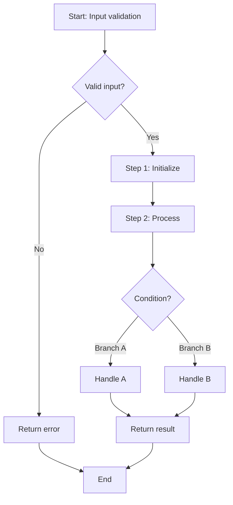

# Skill: Generate Algorithm Design Document

**Purpose**: Create comprehensive algorithm design documentation following design folder structure and formatting guidelines.

**Category**: documentation

---

## Prerequisites

- Read [`../../prompt/documentation_guidelines.md`](../../prompt/documentation_guidelines.md) for project structure and formatting standards
- Algorithm is implemented or well understood conceptually
- Familiarity with Markdown syntax and Mermaid flowchart syntax
- Module context and design folder already established

---

## Inputs

### Required
- **algorithm_name**: Name of the algorithm (e.g., `walk_forward`, `risk_parity`, `sharpe_ratio`)
- **module_name**: Module containing the algorithm (used in Document ID)
- **algorithm_description**: 2-3 paragraph explanation of what the algorithm does
- **inputs**: List of input parameters with types and descriptions
- **outputs**: Output type and description
- **pseudocode**: Step-by-step algorithm description

### Optional
- **complexity_analysis**: Time and space complexity (default: "To be determined")
- **config_parameters**: Configuration options with defaults and ranges
- **error_cases**: Error handling scenarios
- **related_algorithms**: Other related algorithms or components
- **mermaid_flowchart**: Flowchart representation of algorithm logic

---

## Process

### Step 1: Create Algorithm Design File

Create the algorithm design file in the correct location.

**File Path**: `doc/design/2_component_designs/algorithms/[algorithm].md`

**Naming Rules**:
- Use `snake_case` for filenames
- Filename matches algorithm name (e.g., `walk_forward.md`, `risk_parity.md`, `sharpe_ratio.md`)

**Example**:
- Algorithm "Walk-Forward Validation" → `walk_forward.md`
- Algorithm "Risk Parity Allocation" → `risk_parity.md`
- Algorithm "Cross-Sectional Stock Ranking" → `cross_sectional_stock_ranking.md`

---

### Step 2: Create Document Header

Write the document header with metadata.

**Template**:
```markdown
# [Algorithm Full Name] Algorithm Design

**Document ID**: [MODULE]-CD-ALG-[ABBREV]-001
**Version**: 1.0
**Date**: [TODAY_DATE]
**Classification**: Internal
```

**Document ID Format**:
- `[MODULE]`: Module name in uppercase (e.g., `MSP`)
- `CD`: Component Design (fixed)
- `ALG`: Algorithm (fixed)
- `[ABBREV]`: 1-4 letter abbreviation of algorithm name (e.g., `WF` for Walk-Forward, `RP` for Risk Parity, `SR` for Sharpe Ratio)
- `-001`: Version number (always -001 for new documents)

**Examples**:
- `MSP-CD-ALG-WF-001` for Walk-Forward Validation in MSP module
- `MSP-CD-ALG-RP-001` for Risk Parity Allocation in MSP module
- `MSP-CD-ALG-SR-001` for Sharpe Ratio Calculation in MSP module

---

### Step 3: Write Overview Section

Write comprehensive overview of the algorithm.

**Template**:
```markdown
## 1. Overview

### 1.1 Purpose

[1-2 paragraph explanation of what this algorithm computes and why it is important]

### 1.2 Scope

This algorithm:
- [Key capability 1]
- [Key capability 2]
- [Key capability 3]
- [Limitations or constraints]
```

**Guidelines**:
- Purpose: Start with clear statement of what problem the algorithm solves
- Scope: Use bullet points to list what algorithm does and doesn't do
- Keep it accessible (avoid jargon without definition)

**Example for Risk Parity Allocation**:
```markdown
## 1. Overview

### 1.1 Purpose

The Risk Parity Allocation algorithm constructs portfolio weights such that each asset contributes equally to the overall portfolio risk. It uses the covariance matrix of asset returns to determine optimal weights, ensuring diversified risk exposure across all holdings rather than concentrating risk in a few positions.

### 1.2 Scope

This algorithm:
- Computes the asset covariance matrix from historical returns
- Calculates marginal risk contributions for each asset
- Optimizes portfolio weights to equalize risk contributions
- Enforces position constraints (e.g., max weight, long-only)
- Returns optimized portfolio weight vector
```

---

### Step 4: Write Inputs and Outputs Table

Create a structured I/O table.

**Template**:
```markdown
## 2. Inputs and Outputs

| Input | Output | Description |
|-------|--------|-------------|
| **param_1** (`type`) | **output_name** (`type`) | Description |
| **param_2** (`type`, optional) | | Description. Default: `value` |
| ... | ... | ... |
```

**Table Guidelines**:
- Left column: All inputs with types in parentheses
- Middle column: All outputs with types in parentheses
- Right column: Descriptions and default values
- Mark optional parameters with `(optional)` or note default values
- Group related inputs (e.g., all return data inputs together)

**Example for Risk Parity Allocation**:
```markdown
## 2. Inputs and Outputs

| Input | Output | Description |
|-------|--------|-------------|
| **returns** (`pd.DataFrame`) | **weights** (`np.ndarray`) | Historical asset returns matrix (T x N) |
| **covariance_matrix** (`np.ndarray`, optional) | | Precomputed covariance matrix; computed from returns if not provided |
| **risk_budgets** (`np.ndarray`, optional) | | Target risk contribution per asset. Default: equal (1/N) |
| **max_position_weight** (`float`, default=0.20) | | Maximum weight for any single position |
| **long_only** (`bool`, default=True) | | Whether to enforce non-negative weights |
```

---

### Step 5: Write Algorithm Description

Write detailed algorithm steps with pseudocode.

**Template**:
```markdown
## 3. Algorithm

**Steps**:

1. **Step Name**:
   ```python
   # Pseudocode for this step
   for item in items:
       result = compute(item)
       if result > threshold:
           process(result)
   ```

2. **Step Name**:
   ```python
   # More pseudocode
   value = calculate(input_a, input_b)
   ```

**Performance**: O(complexity) where [variable definitions]
```

**Guidelines**:
- Use numbered steps with clear names
- Each step should be self-contained and logically coherent
- Pseudocode should be Python-like and readable
- Include variable definitions in pseudocode (e.g., "n_assets = covariance_matrix.shape[0]")
- State complexity at the end in Big-O notation

**Example for Risk Parity Allocation**:
```markdown
## 3. Algorithm

**Steps**:

1. **Compute Covariance Matrix**:
   ```python
   if covariance_matrix is None:
       covariance_matrix = returns.cov().values

   n_assets = covariance_matrix.shape[0]
   ```

2. **Calculate Risk Contributions**:
   ```python
   def risk_contribution(weights, cov_matrix):
       portfolio_vol = sqrt(weights @ cov_matrix @ weights)
       marginal_risk = cov_matrix @ weights
       risk_contrib = weights * marginal_risk / portfolio_vol
       return risk_contrib
   ```

3. **Optimize Weights via Minimization**:
   ```python
   def objective(weights, cov_matrix, risk_budgets):
       rc = risk_contribution(weights, cov_matrix)
       rc_normalized = rc / rc.sum()
       return sum((rc_normalized - risk_budgets) ** 2)

   initial_weights = np.ones(n_assets) / n_assets
   result = minimize(objective, initial_weights,
                     args=(covariance_matrix, risk_budgets),
                     method='SLSQP', constraints=constraints)
   ```

4. **Enforce Position Constraints**:
   ```python
   weights = result.x
   weights = np.clip(weights, 0 if long_only else -1, max_position_weight)
   weights = weights / weights.sum()  # re-normalize
   ```

**Performance**: O(N² × I) where N = number of assets, I = optimizer iterations
```

---

### Step 6: Add Mermaid Flowchart (Optional)

For complex algorithms, add a flowchart to visualize logic.

**Template**:
```markdown
### 3.1 Flowchart


```

**Guidelines**:
- Use `flowchart TD` (top-down) layout
- Use camelCase or snake_case for node IDs (no spaces)
- Make logic flow clear and easy to follow
- Include decision points (diamonds) for conditionals
- Link to relevant steps in the algorithm description

---

### Step 7: Write Configuration Parameters Section

Document any configurable parameters.

**Template**:
```markdown
## 4. Configuration Parameters

| Parameter | Default | Range | Effect |
|-----------|---------|-------|--------|
| **param_1** | `value` | min-max | Description of effect |
| **param_2** | `value` | min-max | Description of effect |

**Typical Values**:
- **Scenario 1**: `param_1 = X`, `param_2 = Y`
- **Scenario 2**: `param_1 = A`, `param_2 = B`
```

**Guidelines**:
- List all configurable parameters
- Provide sensible defaults
- Specify valid ranges
- Explain the effect of each parameter
- Provide scenario-specific recommendations (e.g., conservative vs aggressive)

**Example for Risk Parity Allocation**:
```markdown
## 4. Configuration Parameters

| Parameter | Default | Range | Effect |
|-----------|---------|-------|--------|
| **lookback_period** | `252` | 60-756 days | Historical window for covariance estimation; longer = smoother |
| **rebalance_frequency** | `21` | 1-63 days | Trading days between portfolio rebalances |
| **max_position_weight** | `0.20` | 0.05-1.0 | Maximum allocation to any single asset |
| **risk_free_rate** | `0.05` | 0.0-0.15 | Annual risk-free rate for excess return calculations |

**Typical Values**:
- **Conservative**: `lookback_period = 504`, `max_position_weight = 0.10`
- **Balanced**: `lookback_period = 252`, `max_position_weight = 0.20`
- **Aggressive**: `lookback_period = 126`, `max_position_weight = 0.40`
```

---

### Step 8: Write Error Handling Section

Document error cases and handling strategies.

**Template**:
```markdown
## 5. Error Handling

| Error Case | Condition | Handling | Recovery |
|------------|-----------|----------|----------|
| **Error 1** | When this occurs | How it's handled | Recovery action |
| **Error 2** | When this occurs | How it's handled | Recovery action |
```

**Guidelines**:
- List all foreseeable error conditions
- Explain what triggers each error
- Describe how the algorithm handles it
- Explain recovery or fallback behavior
- Note impacts on result quality

**Example for Risk Parity Allocation**:
```markdown
## 5. Error Handling

| Error Case | Condition | Handling | Recovery |
|------------|-----------|----------|----------|
| **Singular covariance matrix** | Highly correlated or insufficient data | Add small regularization (shrinkage) | Use Ledoit-Wolf shrinkage estimator |
| **Insufficient data** | Fewer rows than assets in returns | Raise ValueError with message | Require minimum lookback_period > n_assets |
| **Negative weights** | Optimizer returns negative values when long_only=True | Clip to zero and re-normalize | Tighten solver bounds |
| **Convergence failure** | Optimizer fails to converge | Return equal-weight portfolio as fallback | Log warning, increase max iterations |
| **All-NaN column** | Asset has no valid return data | Drop asset from universe | Re-run with reduced asset set |
```

---

### Step 9: Write Related Algorithms and Components

Link to dependent and related components.

**Template**:
```markdown
## 6. Related

- **Components**: [Component Name](../component_name.md) (uses/used-by description)
- **Algorithms**: [Algorithm Name](algorithm_name.md) (related algorithm description)
```

**Guidelines**:
- List parent components that use this algorithm
- List dependent algorithms or utilities
- Explain relationship (uses, feeds into, related to, etc.)
- Use relative paths to other design documents

**Example for Risk Parity Allocation**:
```markdown
## 6. Related

- **Components**: [Portfolio Construction](../portfolio_construction.md)
- **Algorithms**: [Walk-Forward Validation](walk_forward.md) (validates allocation strategy out-of-sample)
- **Algorithms**: [Sharpe Ratio Calculation](sharpe_ratio.md) (evaluates risk-adjusted portfolio performance)
```

---

### Step 10: Add Document Footer

Add footer with status and metadata.

**Template**:
```markdown
---

**Document Status**: ✅ Complete
**Last Updated**: [DATE]
**Next Review Date**: [DATE + 6 MONTHS]
**Version**: 1.0
**Classification**: Internal
```

**Guidelines**:
- Status: "✅ Complete", "🚧 In Progress", "⏸️ On Hold"
- Last Updated: Today's date in YYYY-MM-DD format
- Next Review: 6 months from today
- Version: Always 1.0 for new documents
- Classification: Internal, Confidential, Public (default: Internal)

---

## Outputs

### Primary
- **File**: `doc/design/2_component_designs/algorithms/[algorithm_name].md`
- **Content**: Complete algorithm design document with:
  - Document header (ID, version, date, classification)
  - Overview (purpose and scope)
  - Inputs and Outputs table
  - Algorithm description with pseudocode
  - Mermaid flowchart (if applicable)
  - Configuration parameters table
  - Error handling table
  - Related components and algorithms
  - Document footer with status and metadata

### Secondary
- **File added to git**: Stage the new file for commit
- **Algorithm index updated**: Add entry to `doc/design/2_component_designs/algorithms/README.md`

---

## Examples

### Example 1: Create Algorithm Design for Walk-Forward Validation

**Input**:
- algorithm_name: `walk_forward`
- module_name: `MSP`
- algorithm_description: "Walk-forward validation performs rolling out-of-sample testing of stock ranking models by training on expanding or sliding windows and evaluating predictions on subsequent periods, ensuring model robustness over different market regimes."
- inputs: returns_df, ranking_model, n_splits, train_window, test_window
- outputs: list of out-of-sample performance metrics per fold
- pseudocode: Rolling window split, train model, predict and evaluate

**Process**:
1. Create file: `doc/design/2_component_designs/algorithms/walk_forward.md`
2. Write header: Document ID `MSP-CD-ALG-WF-001`
3. Write overview (rolling cross-validation for stock ranking models)
4. Write I/O table (returns_df, ranking_model inputs; fold metrics list output)
5. Write algorithm steps:
   - Step 1: Generate rolling train/test date splits
   - Step 2: Train ranking model on training window
   - Step 3: Generate predictions on test window
   - Step 4: Evaluate predictions against realized returns
6. Add Mermaid flowchart showing rolling window logic
7. Add configuration (train_window, test_window, step_size)
8. Add error handling (insufficient data, empty test set, model fit failure)
9. Link to related algorithms (sharpe_ratio, risk_parity)

**Output**:
File created at `doc/design/2_component_designs/algorithms/walk_forward.md` (~200-250 lines).

---

### Example 2: Create Algorithm Design for Risk Parity Allocation

**Input**:
- algorithm_name: `risk_parity`
- module_name: `MSP`
- algorithm_description: "Constructs portfolio weights such that each asset contributes equally to total portfolio risk, using covariance estimation and constrained optimization to achieve diversified risk exposure."
- inputs: returns, covariance_matrix, risk_budgets, max_position_weight, long_only
- outputs: optimized portfolio weight vector (np.ndarray)
- pseudocode: Compute covariance, calculate risk contributions, optimize weights

**Process**:
1. Create file: `doc/design/2_component_designs/algorithms/risk_parity.md`
2. Write header: Document ID `MSP-CD-ALG-RP-001`
3. Write overview (equal risk contribution portfolio construction)
4. Write I/O table (returns, covariance_matrix inputs; weights array output)
5. Write algorithm steps:
   - Step 1: Compute or validate covariance matrix
   - Step 2: Define risk contribution function
   - Step 3: Optimize weights to equalize risk contributions
   - Step 4: Enforce position constraints and re-normalize
   - Step 5: Validate output weights sum to 1.0
   - Step 6: Return final weight vector
6. Add Mermaid flowchart showing covariance → risk contribution → optimization → constraints
7. Add configuration (lookback_period, max_position_weight, rebalance_frequency)
8. Add error handling (singular matrix, convergence failure, insufficient data)
9. Link to walk_forward and portfolio_construction

**Output**:
File created at `doc/design/2_component_designs/algorithms/risk_parity.md` (~250-300 lines).

---

## Validation

### Document Structure
- [ ] File created at `doc/design/2_component_designs/algorithms/[algorithm_name].md`
- [ ] Filename is `snake_case` matching algorithm name
- [ ] File path follows folder structure from documentation_guidelines.md

### Document ID
- [ ] Document ID format is correct: `[MODULE]-CD-ALG-[ABBREV]-001`
- [ ] MODULE is in uppercase (e.g., MSP)
- [ ] ALG identifier is present
- [ ] Abbreviation is 1-4 letters
- [ ] Version suffix is `-001`

### Content Requirements
- [ ] Header section includes Document ID, Version, Date, Classification
- [ ] Overview section with Purpose and Scope subsections
- [ ] Inputs and Outputs table with all parameters and types
- [ ] Algorithm section with numbered steps
- [ ] Each algorithm step includes pseudocode
- [ ] Complexity analysis included (Big-O notation)
- [ ] Configuration Parameters section with table
- [ ] Configuration table has columns: Parameter, Default, Range, Effect
- [ ] Error Handling section with table
- [ ] Error table has columns: Error Case, Condition, Handling, Recovery
- [ ] Related section with links to components and algorithms
- [ ] Document footer with status, dates, version, classification

### Pseudocode Quality
- [ ] Pseudocode is Python-like and readable
- [ ] Variable names are clear and descriptive
- [ ] Control flow (if/else, loops) is explicit
- [ ] All inputs used in pseudocode match I/O table
- [ ] All outputs produced in pseudocode are documented

### Mermaid Flowchart (if present)
- [ ] Flowchart uses `flowchart TD` syntax
- [ ] Node IDs use camelCase or snake_case (no spaces)
- [ ] Logic flow matches algorithm steps
- [ ] Decision points are clear (diamond shapes)
- [ ] All branches are connected to end node

### Formatting
- [ ] Markdown formatting is correct (headers, tables, code blocks)
- [ ] All code blocks have language identifier (python)
- [ ] All links use relative paths
- [ ] No broken links to related documents
- [ ] Tables are properly formatted with alignment

### Completeness
- [ ] Algorithm description is clear and understandable
- [ ] All configuration parameters have sensible defaults
- [ ] All foreseeable error cases are documented
- [ ] Related components and algorithms are identified
- [ ] Document can be read independently (no missing context)

---

## Related Skills

### Prerequisites
- [`../../prompt/documentation_guidelines.md`](../../prompt/documentation_guidelines.md) - Design folder structure and formatting standards
- Understanding of the algorithm being documented (read implementation or design)

### Follow-ups
- Update `doc/design/2_component_designs/algorithms/README.md` - Add entry to algorithm index
- Create or update component design - Document the component that uses this algorithm
- Add algorithm to glossary - If terminology is complex

### Related
- [`generate_component_design.md`](generate_component_design.md) - Design component that uses this algorithm
- [`add_docstrings.md`](add_docstrings.md) - Add algorithm docstrings to source code
- [`../validation/validate_design_docs.md`](../validation/validate_design_docs.md) - Validate design documentation completeness

---

**Last Updated**: 2026-02-20
**Version**: 1.0
